<div align="center">

```
 ██╗   ██╗███╗   ██╗██╗████████╗██╗  ██╗██████╗
 ██║   ██║████╗  ██║██║╚══██╔══╝██║  ██║╚════██╗
 ██║   ██║██╔██╗ ██║██║   ██║   ███████║ █████╔╝
 ██║   ██║██║╚██╗██║██║   ██║   ╚════██║██╔═══╝
 ╚██████╔╝██║ ╚████║██║   ██║        ██║███████╗
  ╚═════╝ ╚═╝  ╚═══╝╚═╝   ╚═╝        ╚═╝╚══════╝
   >> SYSMON FORENSICS // ULTRAVNC BACKDOOR <<
```

### 🛰️ HTB Sherlock — **Unit42** · DFIR Investigation Report


*Tracing a backdoored UltraVNC dropper from first execution to self-termination — in under 2 seconds of log time.*

</div>

---

## 📡 // 00 · MISSION BRIEF

| Field | Value |
|---|---|
| **Lab** | Unit42 (Sherlock) |
| **Created by** | CyberJunkie |
| **Released** | 4 April 2024 |
| **Rating** | ⭐ 4.7 (342 reviews) |
| **Artifact** | `unit42.zip` (25 KB) · SHA1 `1D8AC45395551187EAF23793CE525056C4136D6E` |
| **Inspiration** | Palo Alto **Unit 42** research on an UltraVNC campaign using a backdoored UltraVNC build to keep access to victims |
| **Scope** | Initial-access stage of the campaign |
| **Solved** | 01 Oct 2026 · Player **#8437** |

**Goal:** use Sysmon logs to identify the malicious process, what it dropped, how it hid, where it called out, and when it died.

---

## 🧭 // 01 · TABLE OF CONTENTS

1. [Lab setup](#-02--lab-setup)
2. [Sysmon theory](#-03--sysmon-theory)
3. [Investigation walkthrough (Tasks 1–8)](#-04--investigation-walkthrough)
4. [Attack timeline](#-05--attack-timeline)
5. [Malware analysis (VirusTotal)](#-06--malware-analysis)
6. [IOCs](#-07--indicators-of-compromise)
7. [MITRE ATT&CK mapping](#-08--mitre-attck-mapping)
8. [Detection engineering](#-09--detection-engineering)
9. [Evidence gaps & notes](#-10--evidence-gaps--notes)
10. [Lessons learned](#-11--lessons-learned)
11. [Repo layout](#-12--repo-layout)

---

## 🧪 // 02 · LAB SETUP

| Item | Value |
|---|---|
| SIEM | Splunk Enterprise (Administrator) |
| Index | `htb_sysmon` |
| Sourcetype | `WinEventLog:Microsoft-Windows-Sysmon/Operational` |
| Source | `Microsoft-Windows-Sysmon-Operational.evtx` |
| Victim host | `DESKTOP-887GK2L` |
| Victim user | `DESKTOP-887GK2L\CyberJunkie` |
| Victim IP | `172.17.79.132` |
| Time range | All time |
| Supplement | VirusTotal (hash lookup) |

The `.evtx` was ingested into Splunk, then every question was answered by filtering on `EventCode`.

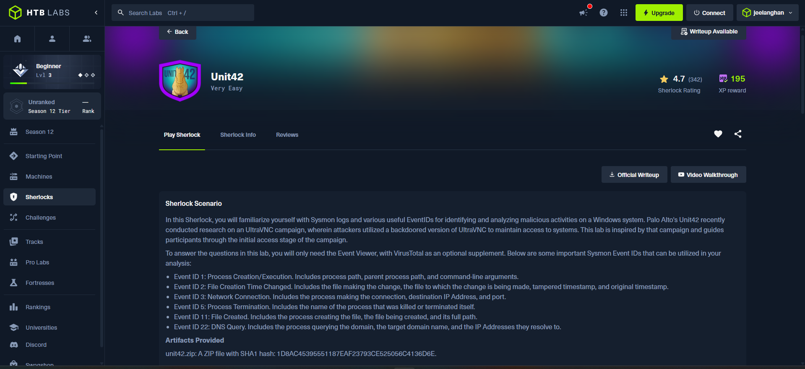

---

## 🧠 // 03 · SYSMON THEORY

**Sysmon (System Monitor)** is a Microsoft Sysinternals service and driver. It installs once and keeps logging detailed system activity to the Windows Event Log, so it survives reboots. The path is `Applications and Services Logs → Microsoft → Windows → Sysmon → Operational`.

Plain Windows logs say *"a process started."* Sysmon says **which binary, its full command line, its parent, its hashes (MD5/SHA1/SHA256/IMPHASH), the user, the integrity level, and the working directory.** That is what makes it so useful for threat hunting and DFIR.

### 🔑 Event IDs used in this lab

| Event ID | Name | What it records | Why it mattered here |
|:-:|---|---|---|
| **1** | Process Create | Image path, command line, parent process, hashes, user, integrity level | Found the malicious process and its hashes |
| **2** | File Creation Time Changed | The process that changed it, target file, **new** and **previous** creation time | Caught **timestomping** |
| **3** | Network Connection | Process, source/destination IP and port, protocol | Found the C2 / connectivity-check IP |
| **5** | Process Terminated | Image of the process that ended | Showed the dropper killing itself |
| **11** | File Create | Process creating the file, target filename, creation time | Counted file drops, located `once.cmd` |
| **22** | DNS Query | Process, queried domain, resolved IPs, status | Revealed `www.example.com` and the delivery domain |

### 📚 Full Sysmon Event ID reference (good for exams & hunting)

| ID | Event | ID | Event |
|:-:|---|:-:|---|
| 1 | Process creation | 16 | Sysmon configuration change |
| 2 | File creation time changed | 17 | Pipe created |
| 3 | Network connection | 18 | Pipe connected |
| 4 | Sysmon service state changed | 19 | WMI event filter |
| 5 | Process terminated | 20 | WMI event consumer |
| 6 | Driver loaded | 21 | WMI consumer-to-filter binding |
| 7 | Image (DLL) loaded | 22 | DNS query |
| 8 | CreateRemoteThread | 23 | File delete (archived) |
| 9 | RawAccessRead | 24 | Clipboard change |
| 10 | ProcessAccess (e.g. LSASS reads) | 25 | Process tampering |
| 11 | File create | 26 | File delete (logged) |
| 12 | Registry object create/delete | 27 | File block executable |
| 13 | Registry value set | 28 | File block shredding |
| 14 | Registry key/value rename | 29 | File executable detected |
| 15 | File stream created (ADS / Mark-of-the-Web) | 255 | Sysmon error |

### ⏱️ Concept: Timestomping (T1070.006)

Every NTFS file has timestamps (created, modified, accessed). Attackers **rewrite the creation time to an older date** so the file blends in with old, legitimate files and drops out of "recently created" triage. Sysmon Event ID 2 exposes the tampering by logging both the **new** (fake) and **previous** (real) times.

### 🎭 Concept: Masquerading & double extensions (T1036)

Malware imitates something harmless: a fake installer name, a fake vendor string, or a **double extension** like `Preventivo24.02.14.exe.exe`. Here the Italian lure words (*Preventivo* = quote/estimate, *Fattura* = invoice) mimic business documents.

### 🌐 Concept: Why malware queries `example.com`

`example.com` is a reserved, always-up dummy domain. Malware often queries it to check **"do I have working internet?"** before calling the real C2, or to detect sandboxes that fake DNS answers.

---

## 🔍 // 04 · INVESTIGATION WALKTHROUGH

### ✅ Task 1 — How many Event logs have Event ID 11?

```spl
index=htb_sysmon EventCode=11
```

**Answer: `56`**. Splunk reported `56 events`, with a burst of file creation visible on the timeline.

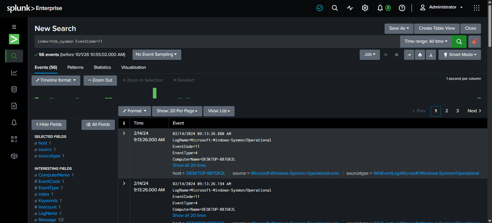

---

### ✅ Task 2 — What is the malicious process that infected the victim's system?

```spl
index=htb_sysmon EventCode=1
```

**Answer: `C:\Users\CyberJunkie\Downloads\Preventivo24.02.14.exe.exe`**

Extracted from the Event ID 1 record:

| Field | Value |
|---|---|
| Local log time | 02/14/2024 09:11:56.559 AM |
| UtcTime | 2024-02-14 03:41:56.538 |
| Technique tag | `T1204` — User Execution |
| Image | `...\Downloads\Preventivo24.02.14.exe.exe` |
| FileVersion | `1.1.2` |
| Description / Product | `Photo and vn Installer` / `Photo and vn` |
| Company | `Photo and Fax Vn` |
| **OriginalFileName** | **`Fattura 2 2024.exe`** (differs from the on-disk name, a red flag) |
| CurrentDirectory | `C:\Users\CyberJunkie\Downloads\` |
| User / Integrity | `DESKTOP-887GK2L\CyberJunkie` / Medium |
| SHA1 | `18A24AA0AC052D31FC5B56F5C0187041174FFC61` |
| MD5 | `32F35B78A3DC5949CE3C99F2981DEF6B` |
| SHA256 | `0CB44C4F8273750FA40497FCA81E850F73927E70B13C8F80CDCFEE9D1478E6F3` |

> 💡 A user-writable folder, a double extension, and a mismatched `OriginalFileName`: three classic dropper signs in a single event.

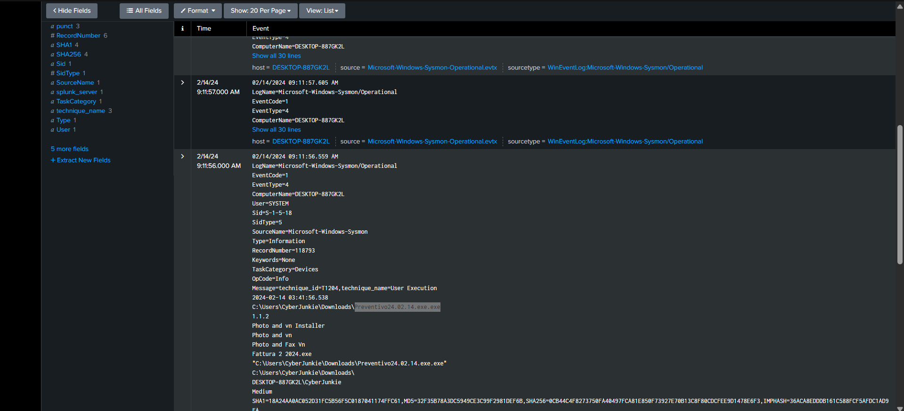

---

### ✅ Task 3 — Which cloud drive was used to distribute the malware?

**Answer: `dropbox`**

The delivery came from a cloud file-sharing service, a common way to bypass email attachment filters because the domain has good reputation. See [Evidence gaps](#-10--evidence-gaps--notes) for how to back this with a log screenshot.

Supporting analysis of the dropper hash is in [section 06](#-06--malware-analysis).

---

### ✅ Task 4 — What was the timestamp changed to for the PDF file?

```spl
index=htb_sysmon EventCode=2 pdf
```

**Answer: `2024-01-14 08:10:06`**

| Field | Value |
|---|---|
| Technique tag | `T1070.006` — Timestomp |
| Process | `Preventivo24.02.14.exe.exe` |
| Target file | `C:\Users\CyberJunkie\AppData\Roaming\Photo and Fax Vn\Photo and vn 1.1.2\install\F97891C\TempFolder\~.pdf` |
| **New creation time (fake)** | `2024-01-14 08:10:06.029` |
| **Previous creation time (real)** | `2024-02-14 03:41:58.404` |

The file was back-dated by **one month** to look old.

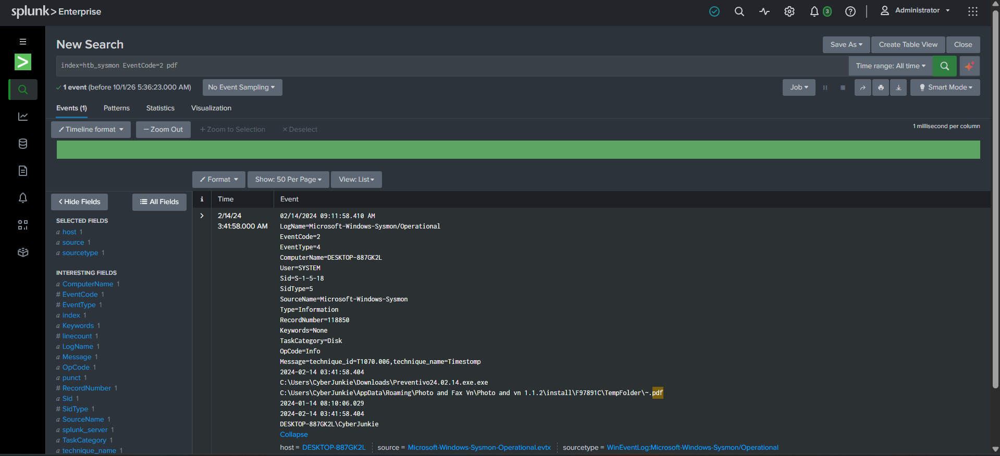

---

### ✅ Task 5 — Where was `once.cmd` created on disk?

```spl
index=htb_sysmon EventCode=11 once.cmd
```

**Answer:**
```
C:\Users\CyberJunkie\AppData\Roaming\Photo and Fax Vn\Photo and vn 1.1.2\install\F97891C\WindowsVolume\Games\once.cmd
```

| Field | Value |
|---|---|
| Event | Event ID 11, RecordNumber `118846` |
| Creator | `Preventivo24.02.14.exe.exe` |
| Created | 2024-02-14 03:41:58.404 |

The malware unpacked a full fake install tree under `%APPDATA%\Roaming`, a place users can write to without admin rights.

The search returned a second event that mentions `C:\Windows\system32\msiexec.exe` and `C:\Games\once.cmd`. It is partly truncated in the screenshot (14 lines omitted), but it suggests an installer-style (MSI) component touching the same script.

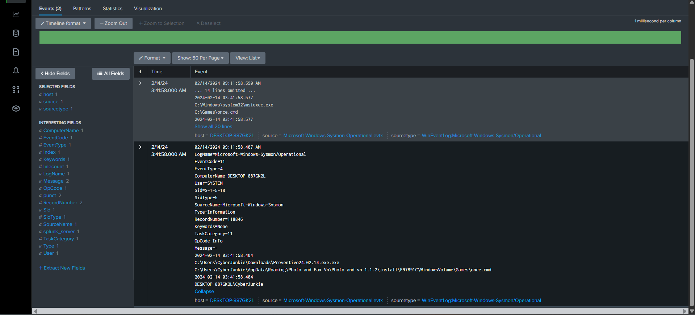

---

### ✅ Task 6 — Which dummy domain did the malware try to connect to?

```spl
index=htb_sysmon EventCode=22
```

**Answer: `www.example.com`**

| Field | Value |
|---|---|
| RecordNumber | `118906` |
| UtcTime | 2024-02-14 03:41:56.955 |
| QueryName | `www.example.com` |
| QueryStatus | `0` (success) |
| QueryResults | `::ffff:93.184.216.34; 199.43.135.53; 2001:500:8f::53; 199.43.133.53; 2001:500:8d::53;` |
| Process | `Preventivo24.02.14.exe.exe` |

This was a connectivity check, made less than half a second after the process started. Note that the search returned **3 DNS events** in total.

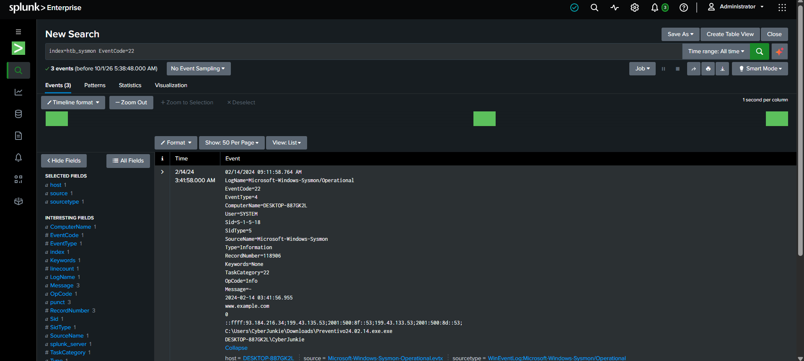

---

### ✅ Task 7 — Which IP did the malicious process try to reach?

```spl
index=htb_sysmon EventCode=3
```

**Answer: `93.184.216.34`**

| Field | Value |
|---|---|
| Technique tag | `T1036` — Masquerading |
| RecordNumber | `118910` |
| UtcTime | 2024-02-14 03:41:57.159 |
| Protocol | `tcp` |
| Source IP | `172.17.79.132` |
| **Destination IP** | **`93.184.216.34`** |

This is the same IP that `www.example.com` resolved to in Task 6. The DNS lookup and the TCP connection line up.

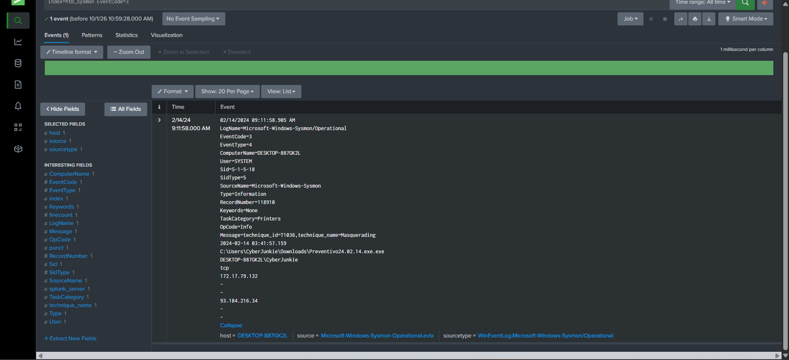

---

### ✅ Task 8 — When did the malicious process terminate itself?

```spl
index=htb_sysmon EventCode=5
```

**Answer: `2024-02-14 03:41:58`**

| Field | Value |
|---|---|
| RecordNumber | `118907` |
| UtcTime | 2024-02-14 03:41:58.795 |
| Image | `Preventivo24.02.14.exe.exe` |

The dropper deleted itself from memory after planting the backdoored UltraVNC payload. Classic "drop, hide, vanish" behavior.

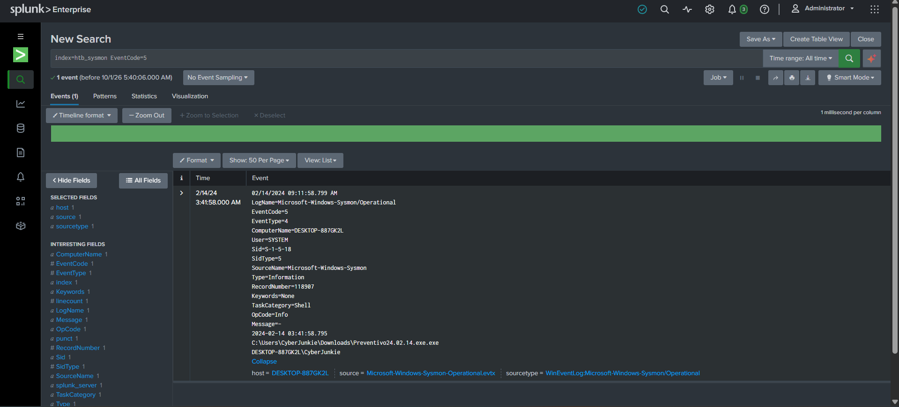

---

### 🏁 Completion

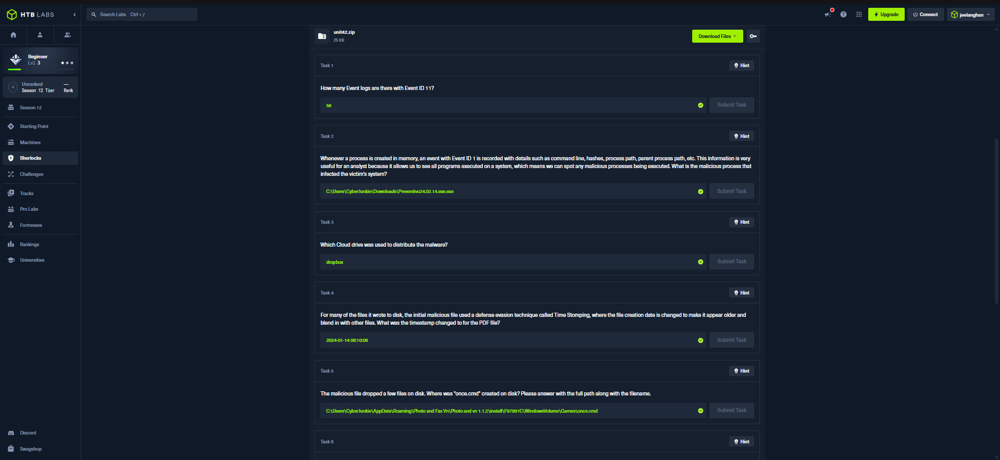
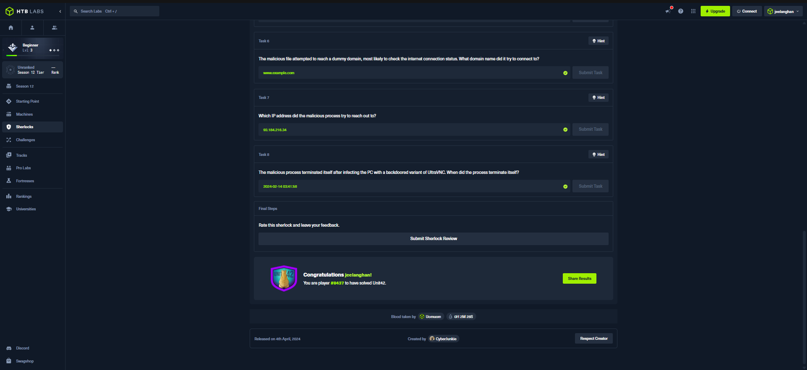


---

## ⏳ // 05 · ATTACK TIMELINE

All times are **UTC** (`UtcTime` field). The whole attack unfolded in roughly **2.3 seconds**.

```mermaid
timeline
    title Unit42 — Attack Timeline (2024-02-14, UTC)
    03:41:56.538 : EID 1 · Dropper executed (Preventivo24.02.14.exe.exe)
    03:41:56.955 : EID 22 · DNS query www.example.com
    03:41:57.159 : EID 3 · TCP connection to 93.184.216.34
    03:41:58.404 : EID 11 · once.cmd written · EID 2 · PDF timestomped
    03:41:58.795 : EID 5 · Dropper terminates itself
```

| UTC time | Event ID | Action |
|---|:-:|---|
| 03:41:56.538 | 1 | User runs the dropper from `Downloads` |
| 03:41:56.955 | 22 | Internet connectivity check via DNS |
| 03:41:57.159 | 3 | Outbound TCP to `93.184.216.34` |
| 03:41:58.404 | 11 | Drops `once.cmd` in fake install tree |
| 03:41:58.404 | 2 | Timestomps `~.pdf` back to 2024-01-14 |
| 03:41:58.795 | 5 | Process terminates itself |

> 🕒 **Time zone note:** the raw log lines show `09:11:xx AM` while the `UtcTime` field shows `03:41:xx`. That is a **+05:30** offset between the host's local time and UTC. Splunk also displayed both formats in different screenshots. Always check which one you are reading before answering time questions.

---

## 🦠 // 06 · MALWARE ANALYSIS

The dropper's SHA256 was looked up on VirusTotal.

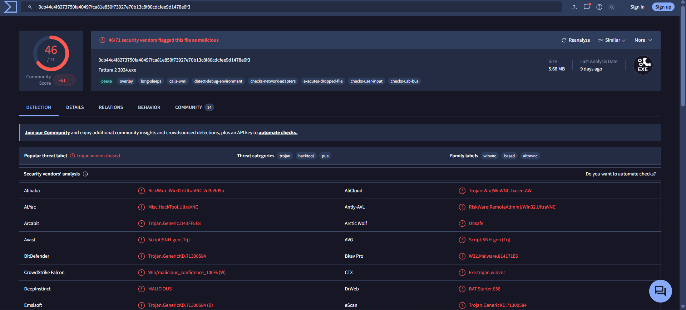

| Property | Value |
|---|---|
| **Detection ratio** | **46 / 71** vendors flag it malicious |
| File name | `Fattura 2 2024.exe` (matches `OriginalFileName`) |
| Size | 5.68 MB |
| Type | PE32 executable (`peexe`, has `overlay`) |
| Threat label | `trojan.winvnc/based` |
| Categories | trojan · hacktool · pua |
| Family labels | winvnc · based · ultravnc |
| Community score | −61 |

**Behavior tags:** `long-sleeps` · `calls-wmi` · `detect-debug-environment` · `checks-network-adapters` · `executes-dropped-file` · `checks-user-input` · `checks-usb-bus`

These are anti-analysis and sandbox-evasion behaviors (sleeping, debugger checks, hardware checks) plus a payload that executes dropped files.

**Sample vendor verdicts**

| Vendor | Verdict |
|---|---|
| Alibaba | RiskWare:Win32/UltraVNC.2d3a9d9a |
| AliCloud | Trojan:Win/WinVNC-based.AW |
| ALYac | Misc.HackTool.UltraVNC |
| Antiy-AVL | RiskWare[RemoteAdmin]/Win32.UltraVNC |
| BitDefender | Trojan.GenericKD.71300584 |
| CrowdStrike Falcon | Win/malicious_confidence_100% (W) |
| DeepInstinct | MALICIOUS |
| Avast / AVG | Script:SNH-gen [Trj] |

**Takeaway:** UltraVNC is a legitimate remote-desktop tool. Attackers repackage it with a backdoor so they get **hidden, persistent remote control** of the victim, which is why the labels mix "RiskWare" with "Trojan."

---

## 🚨 // 07 · INDICATORS OF COMPROMISE

| Type | Indicator |
|---|---|
| File path | `C:\Users\CyberJunkie\Downloads\Preventivo24.02.14.exe.exe` |
| Original filename | `Fattura 2 2024.exe` |
| SHA256 | `0CB44C4F8273750FA40497FCA81E850F73927E70B13C8F80CDCFEE9D1478E6F3` |
| SHA1 | `18A24AA0AC052D31FC5B56F5C0187041174FFC61` |
| MD5 | `32F35B78A3DC5949CE3C99F2981DEF6B` |
| Dropped script | `...\Photo and Fax Vn\Photo and vn 1.1.2\install\F97891C\WindowsVolume\Games\once.cmd` |
| Dropped decoy | `...\install\F97891C\TempFolder\~.pdf` (timestomped to 2024-01-14 08:10:06) |
| Install directory | `%APPDATA%\Photo and Fax Vn\` |
| Fake vendor/product | `Photo and Fax Vn` / `Photo and vn Installer` v1.1.2 |
| Domain | `www.example.com` (connectivity check) |
| IP | `93.184.216.34` |
| Delivery channel | Dropbox |

> ⚠️ `example.com` and its IP are benign on their own. They are only meaningful **in context** (which process queried them, and how soon after launch).

---

## 🎯 // 08 · MITRE ATT&CK MAPPING

| Tactic | Technique | Evidence |
|---|---|---|
| Execution | **T1204** User Execution | Sysmon tagged the Event ID 1 record directly |
| Defense Evasion | **T1036** Masquerading | Fake installer name, double extension, tagged on Event ID 3 |
| Defense Evasion | **T1070.006** Indicator Removal: Timestomp | Event ID 2 on `~.pdf` |
| Command & Control | **T1219** Remote Access Software *(inferred)* | Backdoored UltraVNC family |
| Initial Access | **T1566 / T1105** *(inferred)* | Cloud-drive delivery (Dropbox) |

The first three come from the technique tags in the Sysmon config rules (`technique_id=...`); the last two are my inference from the lab scenario.

---

## 🛡️ // 09 · DETECTION ENGINEERING

Ideas to turn this investigation into alerts:

```spl
# 1) Double-extension executables launched from user folders
index=htb_sysmon EventCode=1
| regex Image="(?i)\.(pdf|doc|docx|xls|xlsx|jpg|png|exe)\.exe$"
| table _time host User Image OriginalFileName

# 2) OriginalFileName does not match the on-disk filename
index=htb_sysmon EventCode=1
| eval onDisk=lower(replace(Image,".*\\\\",""))
| where lower(OriginalFileName)!=onDisk
| table _time host Image OriginalFileName

# 3) Timestomping by user-launched processes
index=htb_sysmon EventCode=2
| table _time Image TargetFilename CreationUtcTime PreviousCreationUtcTime

# 4) Process that queries DNS, connects out, then terminates within seconds
index=htb_sysmon (EventCode=22 OR EventCode=3 OR EventCode=5)
| stats values(EventCode) AS codes min(_time) AS first max(_time) AS last by Image
| eval lifetime=last-first
| where lifetime<5 AND mvcount(codes)=3

# 5) Quick event-ID overview (great first step in any Sysmon dataset)
index=htb_sysmon | stats count by EventCode | sort - count
```

**Hardening tips:** block executables from `Downloads` and `%APPDATA%` with AppLocker/WDAC, show file extensions in Explorer, restrict cloud-drive downloads where possible, and alert on unsigned binaries named like invoices or quotes.

---

## 🧩 // 10 · EVIDENCE GAPS & NOTES

Being honest about what the screenshots do and do not show:

- **Task 3 (Dropbox):** the answer was accepted, but there is no log screenshot showing it. The query to capture is `index=htb_sysmon EventCode=22` and look at the other two DNS events for a `dropbox` domain (the search returned 3 events, and only the `example.com` one is captured). Add that screenshot as `images/04b_task3_eventid22_dropbox_dns.png`.
- **Destination port (Task 7):** the port field is not visible in the Event ID 3 screenshot. Expand the full event and add it to the IOC table.
- **IMPHASH:** the value is cut off at the screenshot edge (`36ACA8EDDDB161C588FCF5AFDC1AD9...`). Copy the full value from the raw event if you want it in the IOCs.
- **`msiexec.exe` / `C:\Games\once.cmd` event:** partly truncated in the Task 5 screenshot, so its exact Event ID is unconfirmed.
- **MITRE rows marked *inferred*:** not tagged in the logs; reasoned from the scenario.

---

## 💡 // 11 · LESSONS LEARNED

1. **Start with `stats count by EventCode`.** It tells you what telemetry you actually have.
2. **Pivot on hashes.** One SHA256 on VirusTotal turned "suspicious installer" into "UltraVNC-based trojan, 46/71" in seconds.
3. **Correlate events.** DNS (22) → network (3) → file drops (11/2) → termination (5) tell one story when joined by process and time.
4. **Compare `Image` vs `OriginalFileName`.** Cheap, high-signal masquerading check.
5. **Watch the time zones.** Local time and UTC differ by 5h30m in this dataset.
6. **Short-lived processes matter.** The whole attack lasted about 2 seconds; the process was gone before anyone could look.

---

## 🗂️ // 12 · REPO LAYOUT

```
HTB_Unit42_Evidence/
├── README.md
└── images/
    ├── 01_sherlock_scenario.png
    ├── 02_task1_eventid11_file_created_count_56.png
    ├── 03_task2_eventid1_malicious_process.png
    ├── 04_task3_support_virustotal_ultravnc_detection.png
    ├── 05_task4_eventid2_timestomp_pdf.png
    ├── 06_task5_eventid11_once_cmd_path.png
    ├── 07_task6_eventid22_dns_example_com.png
    ├── 08_task7_eventid3_network_connection_ip.png
    ├── 09_task8_eventid5_process_termination.png
    ├── 10_htb_solved_badge.png
    ├── 11_htb_answers_tasks_1-5.png
    └── 12_htb_answers_tasks_6-8_completion.png
```

---

<div align="center">

**🛰️ Case closed · 8/8 tasks · 195 XP**

*Investigated by `jeelanghan` · Hack The Box*

`// end of transmission //`

</div>

> **Disclaimer:** This write-up is for educational purposes, based on a retired HTB Sherlock. No live systems were involved.
