<div align="center">

```
 ██╗      ██████╗  ██████╗      ██╗ █████╗ ███╗   ███╗███╗   ███╗███████╗██████╗
 ██║     ██╔═══██╗██╔════╝      ██║██╔══██╗████╗ ████║████╗ ████║██╔════╝██╔══██╗
 ██║     ██║   ██║██║  ███╗     ██║███████║██╔████╔██║██╔████╔██║█████╗  ██████╔╝
 ██║     ██║   ██║██║   ██║██   ██║██╔══██║██║╚██╔╝██║██║╚██╔╝██║██╔══╝  ██╔══██╗
 ███████╗╚██████╔╝╚██████╔╝╚█████╔╝██║  ██║██║ ╚═╝ ██║██║ ╚═╝ ██║███████╗██║  ██║
 ╚══════╝ ╚═════╝  ╚═════╝  ╚════╝ ╚═╝  ╚═╝╚═╝     ╚═╝╚═╝     ╚═╝╚══════╝╚═╝  ╚═╝
       >> WINDOWS EVENT LOG FORENSICS // SHARPHOUND · FIREWALL · PERSISTENCE <<
```

### 🛰️ HTB Sherlock — **LogJammer** · DFIR Investigation Report


*Rebuilding one user's 25 minutes of suspicious activity from five Windows event logs.*

</div>

---

## 📡 // 00 · MISSION BRIEF

| Field | Value |
|---|---|
| **Lab** | LogJammer (Sherlock) |
| **Rating** | ⭐ 4.6 (140 reviews) |
| **Artifact** | `logjammer.zip` (~1 MB, five `.evtx` files) |
| **Scenario** | You are a **junior DFIR consultant** at *Forela-Security*. They set a technical assessment to test your **Windows Event Log analysis** |
| **Solved** | 01 Oct 2026 · Player **#3894** |
| **Tasks** | 12 |

**Goal:** reconstruct what the user `CyberJunkie` did on the machine: when they logged in, what they downloaded, which security controls they touched, what persistence they planted, and which logs they cleared.

---

## 🧭 // 01 · TABLE OF CONTENTS

1. [Lab setup](#-02--lab-setup)
2. [Windows Event Log theory](#-03--windows-event-log-theory)
3. [Investigation walkthrough (Tasks 1–12)](#-04--investigation-walkthrough)
4. [Attack timeline](#-05--attack-timeline)
5. [Attack narrative](#-06--attack-narrative)
6. [IOCs](#-07--indicators-of-compromise)
7. [MITRE ATT&CK mapping](#-08--mitre-attck-mapping)
8. [Detection engineering](#-09--detection-engineering)
9. [Evidence gaps & notes](#-10--evidence-gaps--notes)
10. [Lessons learned](#-11--lessons-learned)
11. [Repo layout](#-12--repo-layout)

---

## 🧪 // 02 · LAB SETUP

The five `.evtx` files were loaded into Splunk with a **Directory Monitor** input.

| Setting | Value |
|---|---|
| Input type | Directory Monitor |
| Source path | `J:\logjammer\Event-Logs` |
| Source type | Automatic |
| App context | search |
| Index | `htb_logjammer_jeel` |
| Evidence host | `DESKTOP-887GK2L` |
| Time range | All time |

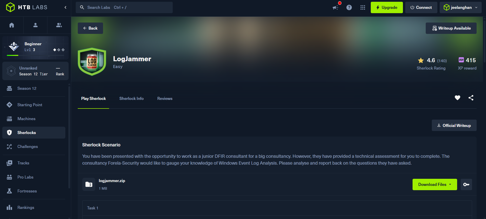
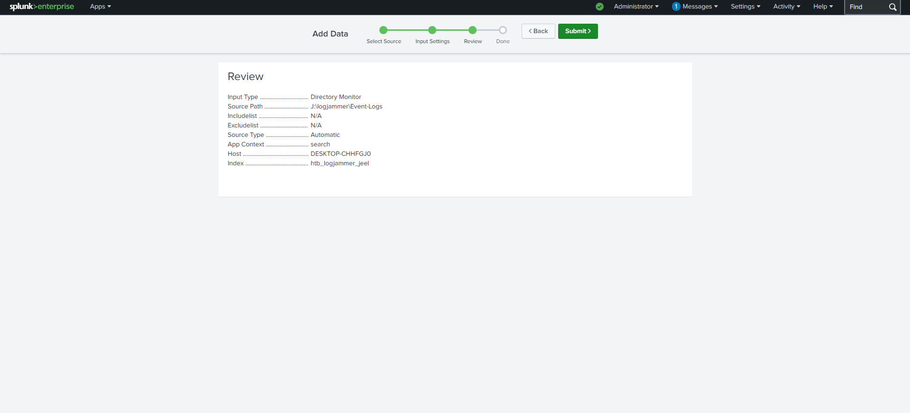

**Dataset overview:** `index=htb_logjammer_jeel` returned **4,252 events** across **5 sources / 5 sourcetypes**:

| Log file | Sourcetype | Used for |
|---|---|---|
| `Security.evtx` | `WinEventLog:Security` | Logons, audit policy, scheduled tasks |
| `System.evtx` | `WinEventLog:System` | Log-clear events |
| `Powershell-Operational.evtx` | `WinEventLog:Microsoft-Windows-PowerShell/Operational` | PowerShell commands |
| `Windows Defender-Operational.evtx` | `WinEventLog:Microsoft-Windows-Windows Defender/Operational` | Malware detection and action |
| Windows Firewall log (`...Firewall With Advanced Security/Firewall`) | `WinEventLog:Microsoft-Windows-Windows Firewall With Advanced Security/Firewall` | Firewall rule changes |

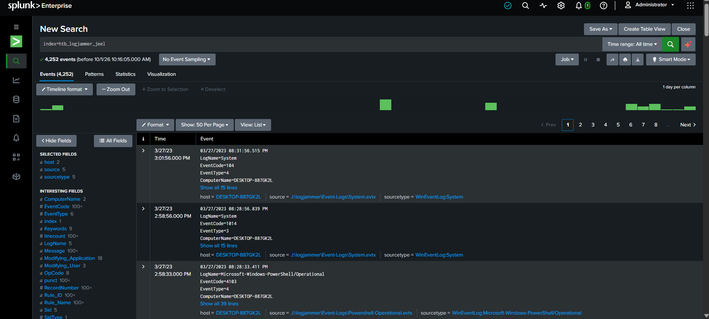

---

## 🧠 // 03 · WINDOWS EVENT LOG THEORY

> 📝 **Heads-up:** unlike *Unit42*, this lab uses **native Windows Event Logs, not Sysmon**. The concepts are the same (event IDs filter the evidence) but the IDs and fields differ.

### 🗄️ What are Windows Event Logs?

Windows records activity as structured events in `.evtx` files. Each event has an **Event ID**, a **channel** (log name), a timestamp, a user SID and a message. The most useful channels in DFIR are:

| Channel | Typical content |
|---|---|
| **Security** | Logons, privilege use, audit-policy and scheduled-task changes |
| **System** | Services, drivers, log clearing, system errors |
| **Application** | Application errors and messages |
| **PowerShell/Operational** | PowerShell engine and script block logging |
| **Windows Defender/Operational** | Detections and remediation actions |
| **Windows Firewall With Advanced Security** | Firewall rule and profile changes |

### 🔑 Event IDs used in this lab

| Event ID | Log | Meaning | Task |
|:-:|---|---|:-:|
| **4624** | Security | An account was successfully logged on | 1 |
| **2004** | Firewall | A rule was **added** to the firewall exception list | 2–3 |
| **4719** | Security | System **audit policy** was changed | 4 |
| **4698** | Security | A **scheduled task** was created | 5–7 |
| **1116** | Defender | Malware or PUA **detected** | 8–9 |
| **1117** | Defender | Defender **took action** (quarantine/remove) | 10 |
| **4104** | PowerShell | **Script block** text logged | 11 |
| **104** | System | An event **log was cleared** | 12 |

### 📚 Extended reference (handy for hunting)

| Area | Event ID | Meaning |
|---|:-:|---|
| Logon | 4625 | Failed logon |
| Logon | 4634 / 4647 | Logoff / user-initiated logoff |
| Logon | 4672 | Special privileges assigned (admin-level logon) |
| Logon | 4648 | Logon with explicit credentials |
| Process | 4688 | Process created (needs command-line auditing) |
| Accounts | 4720 / 4726 | User account created / deleted |
| Accounts | 4732 | Member added to a local group |
| Scheduled tasks | 4699 / 4700 / 4701 / 4702 | Task deleted / enabled / disabled / updated |
| Audit | **1102** | **Security** log cleared (System log clears are **104**) |
| Services | 7045 | New service installed (System) |
| Firewall | 2005 / 2006 | Rule modified / deleted |
| Defender | 1118 / 1119 | Remediation failed (non-critical / critical) |
| Defender | 5001 / 5007 | Real-time protection disabled / configuration changed |
| PowerShell | 4103 | Module/pipeline execution logging |

### 🚪 Concept: Logon types (Event 4624)

| Type | Name | Meaning |
|:-:|---|---|
| **2** | Interactive | Sitting at the keyboard (this lab) |
| 3 | Network | SMB shares, remote access |
| 4 | Batch | Scheduled tasks |
| 5 | Service | A service starting |
| 7 | Unlock | Workstation unlocked |
| 9 | NewCredentials | `runas /netonly` |
| 10 | RemoteInteractive | RDP |
| 11 | CachedInteractive | Offline domain credentials |

### 🔗 Concept: Elevated token & linked logon IDs

With UAC, an admin's interactive logon creates **two** sessions: a filtered one and a full-privilege **elevated** one. Windows records two 4624 events joined by **Linked Logon ID**. That is why this lab shows pairs of events with the same timestamp (for example `0x25F28` linked to `0x25F9F`).

### 🕒 Concept: Local time vs UTC

The raw event text is rendered in the **analyst machine's local time**, while Splunk's `_time` column shows **UTC**. In the screenshots the raw line reads `08:07:09 PM` while Splunk shows `2:37:09 PM`, a **+05:30** gap. The lab asks for answers in **UTC**, so read the Splunk time column.

### 🧷 Concept: Scheduled tasks as persistence

Attackers use scheduled tasks (T1053.005) to re-run a script at a trigger (boot, logon, interval). Event **4698** logs the task's full XML: name, author, trigger, command and arguments. It only appears if the audit subcategory **Other Object Access Events** is enabled, which ties directly to Task 4.

### 🛡️ Concept: Defender detection vs action

Defender writes two linked events: **1116** ("I detected something") and **1117** ("I did something about it"). The **Action** field shows the result (Quarantine, Remove, Allow...). Always read both.

### 🧬 Concept: PowerShell Script Block Logging (4104)

When enabled, PowerShell logs the **full text of every script block** it compiles. It is one of the best sources for seeing what an attacker typed, even if the script file is later deleted.

### 🧹 Concept: Log clearing (anti-forensics, T1070.001)

Clearing logs removes evidence. Windows leaves its own trace: **1102** (Security log) or **104** (any other log, written in System). Clearing a log is a strong sign of an attempt to hide earlier activity.

### 🐕 Concept: SharpHound & BloodHound

**SharpHound** is the collector for **BloodHound**, which maps Active Directory relationships (users, groups, computers, sessions, permissions) into attack paths. Red teams use it legitimately; attackers use it to find the shortest route to Domain Admin. Defender flags it as `HackTool:MSIL/SharpHound!MSR`.

---

## 🔍 // 04 · INVESTIGATION WALKTHROUGH

### ✅ Task 1 — When did `cyberjunkie` first successfully log in? (UTC)

```spl
index=htb_logjammer_jeel sourcetype="WinEventLog:Security" EventCode=4624 cyberjunkie
```

**Answer: `27/03/2023 14:37:09`**

The search returned **4 events**, in two pairs (each pair is a filtered/elevated logon):

| Splunk time (UTC) | Logon ID |
|---|---|
| **2:37:09 PM** | `0x25F28`, `0x25F9F` |
| 2:38:32 PM | `0x22B1AF`, `0x22B1DF` |

First logon, expanded:

| Field | Value |
|---|---|
| RecordNumber | `13058` |
| Raw (local) time | 03/27/2023 08:07:09.879 PM |
| Keywords | Audit Success |
| Logon Type | `2` (Interactive) |
| Elevated Token | Yes |
| Impersonation Level | Impersonation |
| New Logon account | `DESKTOP-887GK2L\CyberJunkie` |
| Account SID | `S-1-5-21-3393683511-3463148672-371912004-1001` |
| Logon ID / Linked ID | `0x25F28` / `0x25F9F` |
| Process | `C:\Windows\System32\svchost.exe` (PID `0x570`) |

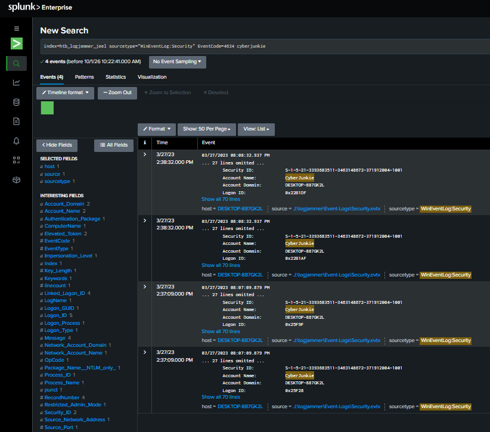
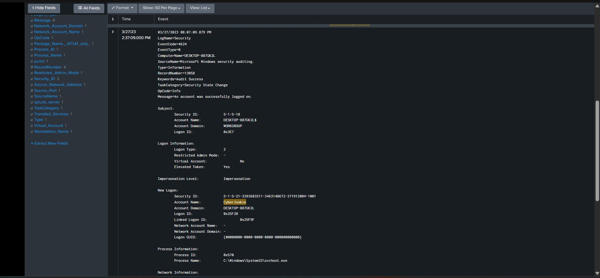

---

### ✅ Task 2 & 3 — Name and direction of the firewall rule added

```spl
index=htb_logjammer_jeel sourcetype="WinEventLog:Microsoft-Windows-Windows Firewall With Advanced Security/Firewall" added Modifying_User="S-1-5-21-3393683511-3463148672-371912004-1001"
```

**Task 2 answer: `Metasploit C2 Bypass`**
**Task 3 answer: `Outbound`**

The search returned 29 events for this user. The first (Event ID 2004):

| Field | Value |
|---|---|
| UTC time | 2:44:43 PM (raw 08:14:43.415 PM) |
| RecordNumber | `1120` |
| Message | A rule has been added to the Windows Defender Firewall exception list |
| Rule ID | `{11109293-FB68-4969-93F9-7F75A9032570}` |
| **Rule Name** | **`Metasploit C2 Bypass`** |
| Origin | Local |
| Active | Yes |
| **Direction** | **Outbound** |
| Profiles | Private, Domain, Public |
| **Action** | **Allow** |
| Protocol | TCP |
| Security Options | None |

> 🚩 The name says it all. An **outbound allow-all-profiles** rule built to let **Metasploit command-and-control** traffic leave the machine unblocked.

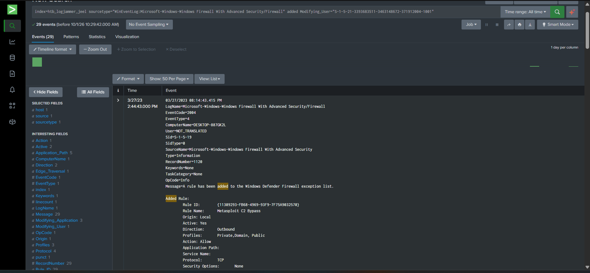

---

### ✅ Task 4 — Subcategory of the changed audit policy

```spl
index=htb_logjammer_jeel source="J:\\logjammer\\Event-Logs\\Security.evtx" EventCode=4719
```

**Answer: `Other Object Access Events`**

| Field | Value |
|---|---|
| UTC time | 2:50:03 PM (raw 08:20:03.721 PM) |
| RecordNumber | `13102` |
| Message | System audit policy was changed |
| Changed by | `DESKTOP-887GK2L$` (SYSTEM, `S-1-5-18`), Logon ID `0x3E7` |
| Category | Object Access |
| **Subcategory** | **Other Object Access Events** |
| Subcategory GUID | `{0CCE9227-69AE-11D9-BED3-505054503030}` |
| Change | **Success Added** |

> 💡 This subcategory is what makes Windows log scheduled-task events (4698). It was enabled **about 78 seconds before** the task was created in Task 5. Note it *adds* success auditing rather than disabling it, so here it enables visibility instead of hiding activity.

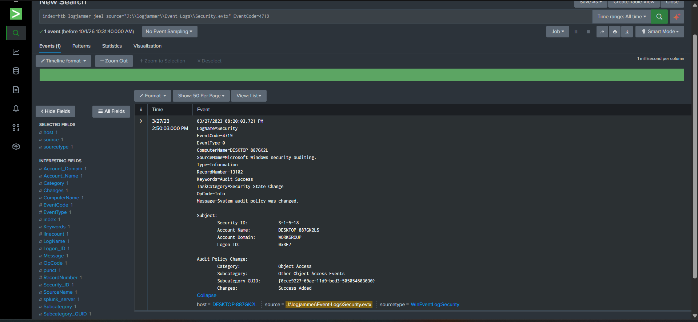

---

### ✅ Task 5 — Name of the scheduled task

```spl
index=htb_logjammer_jeel source="J:\\logjammer\\Event-Logs\\Security.evtx" EventCode=4698 cyberjunkie
```

**Answer: `HTB-AUTOMATION`**

| Field | Value |
|---|---|
| UTC time | 2:51:21 PM (raw 08:21:21.481 PM) |
| RecordNumber | `13103` |
| Message | A scheduled task was created |
| Created by | `CyberJunkie` (SID ...`-1001`), Logon ID `0x25F28` |
| **Task Name** | **`\HTB-AUTOMATION`** |
| Task author | `DESKTOP-887GK2L\CyberJunkie` |
| Task XML date | `2023-03-27T07:51:21` |

The Logon ID `0x25F28` ties the task straight back to the logon from Task 1.

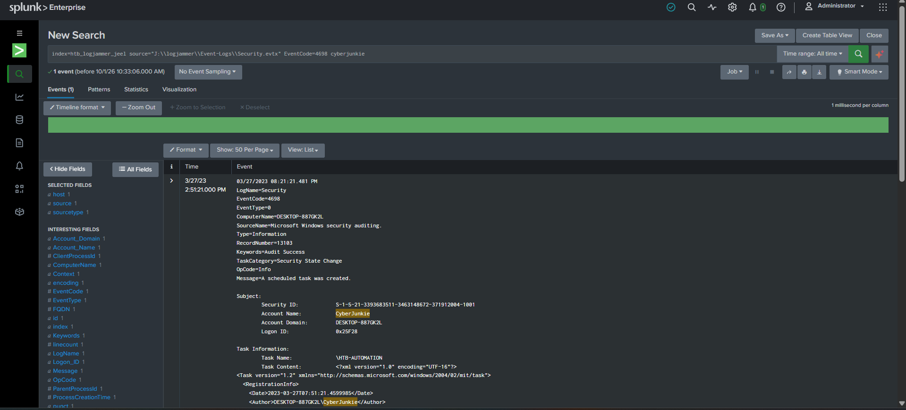

---

### ✅ Task 6 & 7 — Scheduled file path and command arguments

Same Event ID 4698, scrolled to the task XML `<Exec>` block.

**Task 6 answer: `C:\Users\CyberJunkie\Desktop\Automation-HTB.ps1`**
**Task 7 answer: `-A cyberjunkie@hackthebox.eu`**

```xml
<Exec>
  <Command>C:\Users\CyberJunkie\Desktop\Automation-HTB.ps1</Command>
  <Arguments>-A cyberjunkie@hackthebox.eu</Arguments>
</Exec>
```

| Other information | Value |
|---|---|
| ProcessCreationTime | `4222124650660162` |
| ClientProcessId | `9320` |
| ParentProcessId | `6112` |

> 🕒 The XML `Date` (`07:51:21`) equals `14:51:21 UTC` minus 7 hours, which suggests the task was created on a machine set to **UTC−7**. Dates inside embedded XML are stored as written and not converted like the event header.

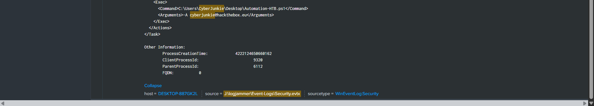

---

### ✅ Task 8 & 9 — Tool flagged by antivirus and its full path

```spl
index=htb_logjammer_jeel sourcetype="WinEventLog:Microsoft-Windows-Windows Defender/Operational" EventCode=1116
```

**Task 8 answer: `Sharphound`**
**Task 9 answer: `C:\Users\CyberJunkie\Downloads\SharpHound-v1.1.0.zip`**

139 events were returned. The first (Event ID 1116):

| Field | Value |
|---|---|
| UTC time | 2:42:34 PM (raw 08:12:34.292 PM) |
| RecordNumber | `441` |
| Message | Defender detected malware or other potentially unwanted software |
| **Threat name** | **`HackTool:MSIL/SharpHound!MSR`** |
| Threat ID | `2147814944` |
| Severity / Category | High / Tool |
| Path | `containerfile:_C:\Users\CyberJunkie\Downloads\SharpHound-v1.1.0.zip` → inner `SharpHound.exe` |
| Web origin | A GitHub release asset (`objects.githubusercontent.com`) |
| Detection Origin / Type | Internet / Concrete |
| Detection Source | Downloads and attachments |
| User | `DESKTOP-887GK2L\CyberJunkie` |
| Process | PID `3532` |

> 🔎 The download URL's signed timestamp reads `20230327T144228Z`, so the file was fetched at about **14:42:28 UTC**, roughly 6 seconds before Defender caught it.

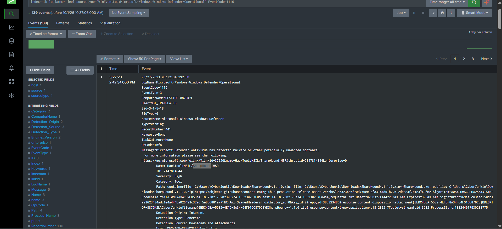
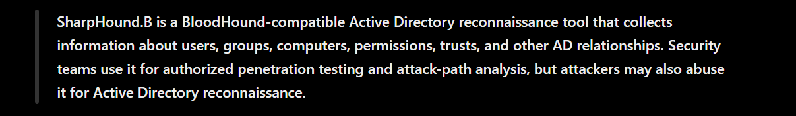

---

### ✅ Task 10 — Action taken by the antivirus

```spl
index=htb_logjammer_jeel sourcetype="WinEventLog:Microsoft-Windows-Windows Defender/Operational" EventCode=1117
```

**Answer: `Quarantine`**

71 events were returned. First at **2:42:48 PM UTC** (raw 08:12:48), about **14 seconds** after the detection.

| Field | Value |
|---|---|
| RecordNumber | `443` |
| Threat | `HackTool:MSIL/SharpHound!MSR` |
| User | `NT AUTHORITY\SYSTEM` |
| **Action** | **Quarantine** |
| Action status | No additional actions required |
| Error code | `0x80508023` |
| Signature versions | AV `1.385.1261.0`, engine `1.1.20100.6` |

> ℹ️ `0x80508023` ("could not find the malware on this device") is common after a successful quarantine, because the file is no longer at its original path when Defender re-checks.

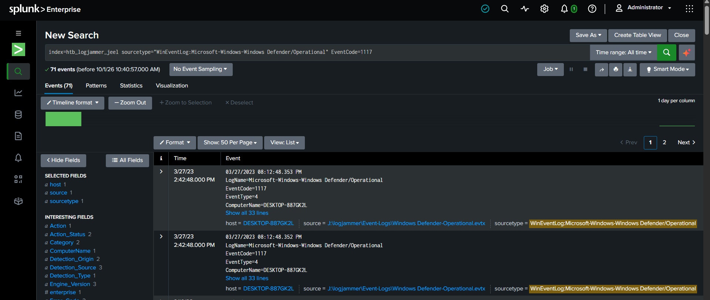
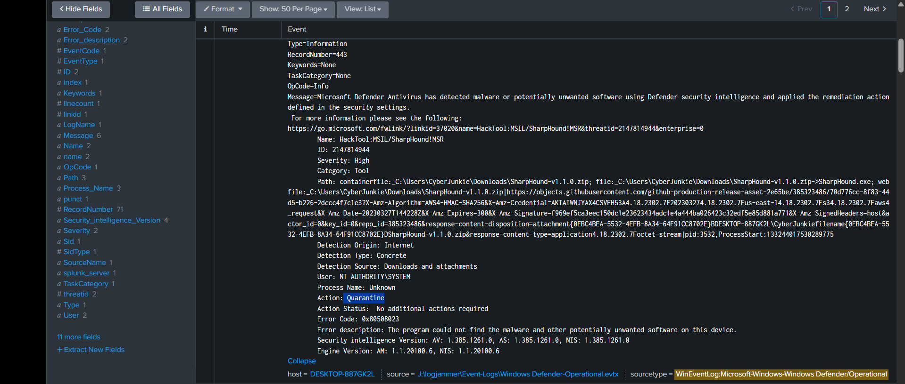

---

### ✅ Task 11 — PowerShell command executed by the user

```spl
index=htb_logjammer_jeel sourcetype="WinEventLog:Microsoft-Windows-PowerShell/Operational" EventCode=4104
```

**Answer: `Get-FileHash -Algorithm md5 .\Desktop\Automation-HTB.ps1`**

381 script-block events were returned. The relevant one:

| Field | Value |
|---|---|
| UTC time | 2:58:33 PM (raw 08:28:33.364 PM) |
| RecordNumber | `571` |
| Task category | Execute a Remote Command |
| Message | Creating Scriptblock text (1 of 1) |
| **Script block** | **`Get-FileHash -Algorithm md5 .\Desktop\Automation-HTB.ps1`** |
| ScriptBlock ID | `b4fcf72f-abdc-4a84-923f-8e06a758000b` |
| User SID | `...-1001` (CyberJunkie) |

The user hashed the **same script** the scheduled task runs, which is typical for checking integrity or sharing the file's hash.

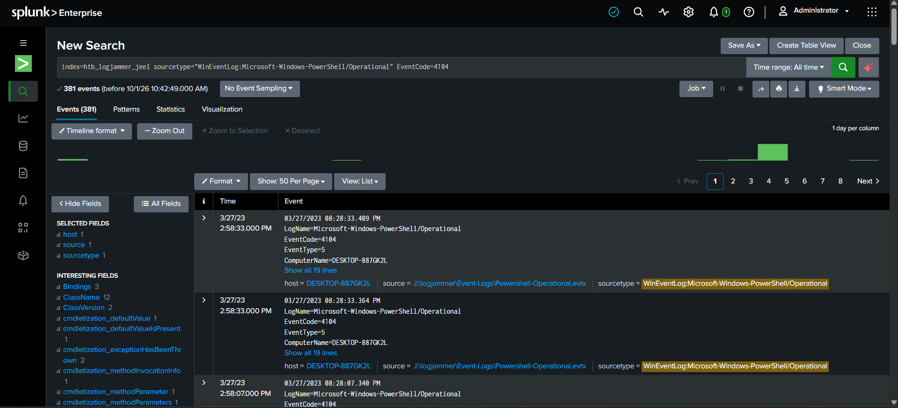
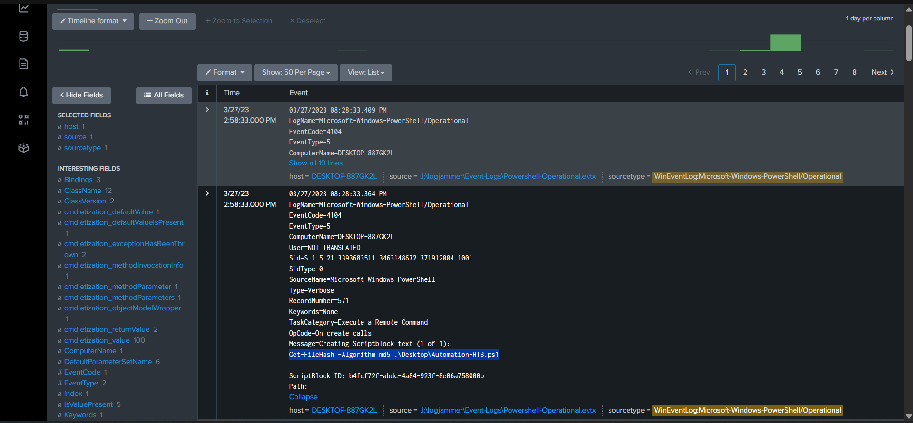

---

### ✅ Task 12 — Which event log file was cleared?

```spl
index=htb_logjammer_jeel EventCode=104
```

**Answer: `Microsoft-Windows-Windows Firewall With Advanced Security/Firewall`**

| Field | Value |
|---|---|
| UTC time | 3:01:56 PM (raw 08:31:56.515 PM) |
| Log | System |
| Source | `Microsoft-Windows-Eventlog` |
| RecordNumber | `2186` |
| Task category | Log clear |
| User SID | `...-1001` (CyberJunkie) |
| Message | The Windows Firewall With Advanced Security/Firewall log file was cleared |

The user cleared **the very log that recorded their `Metasploit C2 Bypass` rule**, a textbook cover-up.

> The search returned **15** events in total, so filter by user SID and date; older 104 events from earlier days are noise.

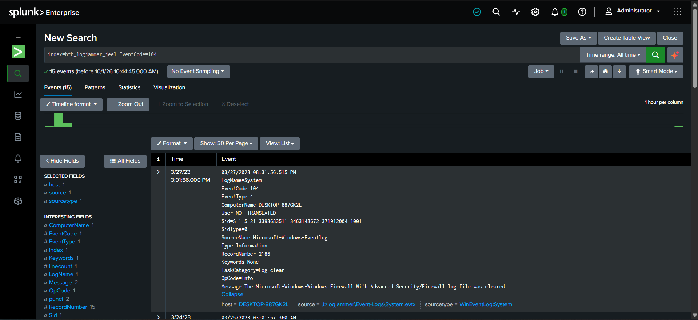

---

### 🏁 Completion

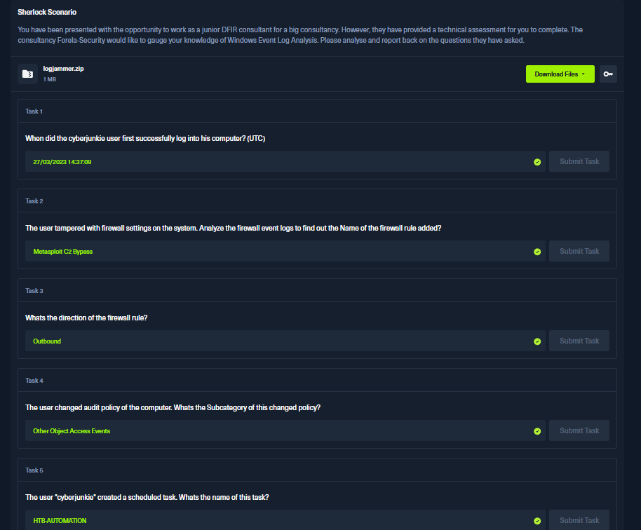
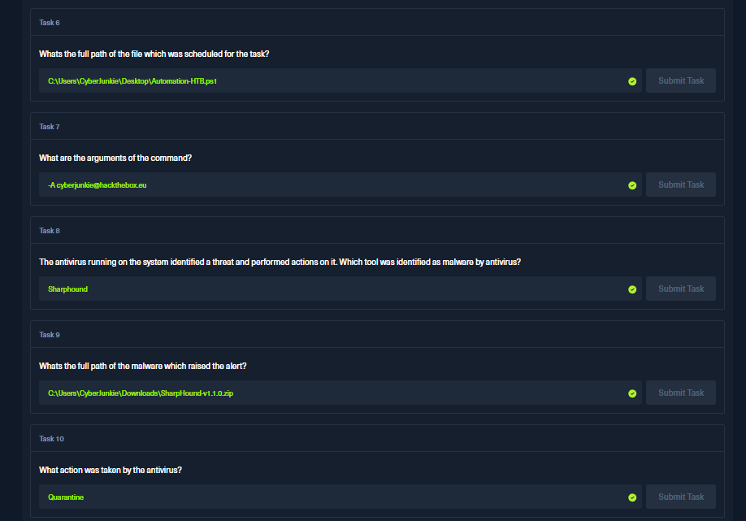
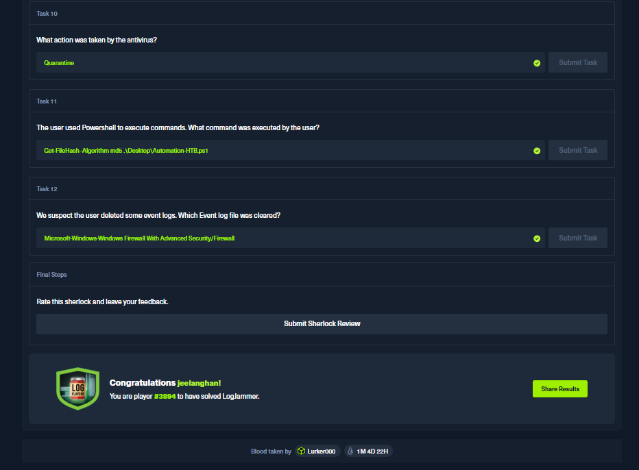
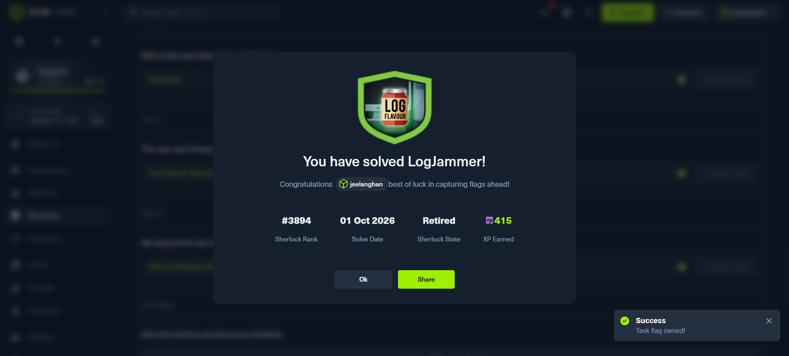

---

## ⏳ // 05 · ATTACK TIMELINE

All times **UTC** (Splunk time column), 27 March 2023.

```mermaid
timeline
    title LogJammer — Timeline (2023-03-27, UTC)
    14:37:09 : 4624 · CyberJunkie logs on (Type 2, elevated)
    14:42:34 : 1116 · Defender detects SharpHound-v1.1.0.zip
    14:42:48 : 1117 · Defender quarantines it
    14:44:43 : 2004 · Firewall rule "Metasploit C2 Bypass" added
    14:50:03 : 4719 · Audit policy changed (Other Object Access Events)
    14:51:21 : 4698 · Scheduled task HTB-AUTOMATION created
    14:58:33 : 4104 · PowerShell Get-FileHash on Automation-HTB.ps1
    15:01:56 : 104 · Firewall log cleared
```

| UTC | Event ID | Log | Action |
|---|:-:|---|---|
| 14:37:09 | 4624 | Security | First interactive logon |
| 14:42:28 | n/a | n/a | SharpHound download (from the signed URL timestamp) |
| 14:42:34 | 1116 | Defender | SharpHound detected |
| 14:42:48 | 1117 | Defender | Quarantined |
| 14:44:43 | 2004 | Firewall | Outbound allow rule added |
| 14:50:03 | 4719 | Security | Audit subcategory enabled |
| 14:51:21 | 4698 | Security | Scheduled task created |
| 14:58:33 | 4104 | PowerShell | `Get-FileHash` on the task script |
| 15:01:56 | 104 | System | Firewall log cleared |

Total span: about **24 minutes** from logon to log clearing.

---

## 📖 // 06 · ATTACK NARRATIVE

1. **Foothold:** `CyberJunkie` logs on interactively with an elevated token.
2. **Recon tooling:** downloads **SharpHound** from GitHub to map Active Directory. Defender catches and quarantines it within seconds.
3. **Opening a path out:** adds an **outbound allow rule** named `Metasploit C2 Bypass` across all profiles.
4. **Persistence:** enables extra auditing, then creates the scheduled task **`HTB-AUTOMATION`** to run `Automation-HTB.ps1 -A cyberjunkie@hackthebox.eu`.
5. **Verification:** hashes the script with PowerShell.
6. **Cover-up:** clears the **Firewall** event log to erase the evidence of the rule.

---

## 🚨 // 07 · INDICATORS OF COMPROMISE

| Type | Indicator |
|---|---|
| User account | `DESKTOP-887GK2L\CyberJunkie` (`S-1-5-21-3393683511-3463148672-371912004-1001`) |
| Malware / tool | `HackTool:MSIL/SharpHound!MSR` (ID `2147814944`) |
| Downloaded file | `C:\Users\CyberJunkie\Downloads\SharpHound-v1.1.0.zip` → `SharpHound.exe` |
| Download source | GitHub release asset (`objects.githubusercontent.com`) |
| Firewall rule | `Metasploit C2 Bypass`, ID `{11109293-FB68-4969-93F9-7F75A9032570}`, Outbound, Allow, TCP, all profiles |
| Scheduled task | `\HTB-AUTOMATION` |
| Task payload | `C:\Users\CyberJunkie\Desktop\Automation-HTB.ps1` |
| Task arguments | `-A cyberjunkie@hackthebox.eu` |
| PowerShell command | `Get-FileHash -Algorithm md5 .\Desktop\Automation-HTB.ps1` |
| Cleared log | `Microsoft-Windows-Windows Firewall With Advanced Security/Firewall` |
| Logon IDs | `0x25F28`, `0x25F9F`, `0x22B1AF`, `0x22B1DF` |

---

## 🎯 // 08 · MITRE ATT&CK MAPPING

| Tactic | Technique | Evidence |
|---|---|---|
| Persistence / Execution | **T1053.005** Scheduled Task | Event 4698, `HTB-AUTOMATION` |
| Execution | **T1059.001** PowerShell | Event 4104 script block |
| Defense Evasion | **T1562.004** Disable or Modify System Firewall | Event 2004, `Metasploit C2 Bypass` |
| Defense Evasion | **T1070.001** Clear Windows Event Logs | Event 104, firewall log cleared |
| Discovery | **T1087 / T1482 / T1069** AD discovery *(inferred)* | SharpHound is an AD collector |
| Resource Development | **T1588.002** Obtain Capabilities: Tool *(inferred)* | SharpHound pulled from GitHub |
| Command & Control | **T1105** Ingress Tool Transfer *(inferred)* | Download from the internet |

Rows marked *inferred* come from the nature of the tool or event, not from an explicit tag in the logs.

---

## 🛡️ // 09 · DETECTION ENGINEERING

```spl
# 1) Logon timeline for a user (note elevated pairs)
index=htb_logjammer_jeel sourcetype="WinEventLog:Security" EventCode=4624 Account_Name=CyberJunkie
| table _time Logon_ID Linked_Logon_ID Logon_Type Elevated_Token
| sort _time

# 2) Firewall rules added, with who/what changed them
index=htb_logjammer_jeel sourcetype="WinEventLog:Microsoft-Windows-Windows Firewall With Advanced Security/Firewall" EventCode=2004
| table _time Rule_Name Direction Action Profiles Modifying_User Modifying_Application

# 3) New scheduled tasks and what they execute
index=htb_logjammer_jeel EventCode=4698
| rex "Task Name:\s+(?<task>\S+)"
| rex "<Command>(?<command>[^<]+)</Command>"
| rex "<Arguments>(?<args>[^<]+)</Arguments>"
| table _time Account_Name task command args

# 4) Defender: detections and the action taken, side by side
index=htb_logjammer_jeel sourcetype="WinEventLog:Microsoft-Windows-Windows Defender/Operational" (EventCode=1116 OR EventCode=1117)
| table _time EventCode Name Severity Path Action

# 5) Any log clearing (Security = 1102, others = 104)
index=htb_logjammer_jeel (EventCode=104 OR EventCode=1102)
| table _time LogName EventCode Message

# 6) Sensible dataset overview
index=htb_logjammer_jeel | stats count by source, sourcetype | sort - count
```

**Alert ideas:** firewall rule names containing `bypass`, `c2`, or `metasploit`; any 4698 whose command lives under a user profile; 1116/1117 pairs for HackTool categories; **any 104/1102**, which should be rare enough to page someone; and a firewall change followed within minutes by a log clear.

**Hardening tips:** forward logs off-host in real time so clearing doesn't erase them, enable PowerShell script block logging via GPO, restrict who can edit firewall rules, and monitor scheduled-task creation.

---

## 🧩 // 10 · EVIDENCE GAPS & NOTES

- **Firewall rule details:** the screenshot ends at *Security Options*. Remote/local ports, remote addresses and the application path are not visible. Expand the full event and add them to the IOC table.
- **Task 1 events:** the search matched 4 events (2 logon pairs). The screenshots expand only the first; the second pair (2:38:32 PM) is listed by Logon ID only.
- **Firewall search count:** the query matched 29 events. Only the first is shown; the others are further rule changes by the same user.
- **Time zones:** raw text is local (+05:30), Splunk shows UTC, and the task XML is stored at UTC−7. All three appear in the screenshots.
- **MITRE rows marked *inferred*** are reasoned, not log-tagged.

---

## 💡 // 11 · LESSONS LEARNED

1. **Pivot on the user SID.** `...-1001` links the firewall rule, task, PowerShell and log-clear events to one person.
2. **Logon IDs tie sessions together.** `0x25F28` appears in the first logon *and* the scheduled-task event.
3. **Read 1116 and 1117 as a pair.** Detection and action tell the full story.
4. **Know your audit subcategories.** No *Other Object Access Events*, no 4698.
5. **Anti-forensics leaves its own trace.** Clearing a log creates event 104 or 1102.
6. **Always convert time zones** before answering UTC questions.
7. **Names are clues.** A rule called `Metasploit C2 Bypass` tells you the intent before you read a single field.

---

## 🗂️ // 12 · REPO LAYOUT

```
HTB_LogJammer_Evidence/
├── README.md
└── images/
    ├── 01_logjammer_scenario_overview.png
    ├── 02_splunk_data_ingestion_directory_monitor.png
    ├── 03_splunk_index_overview_4252_events.png
    ├── 04_task1_eventid4624_logon_search.png
    ├── 05_task1_eventid4624_logon_detail.png
    ├── 06_task2-3_eventid2004_firewall_rule_metasploit_c2_bypass.png
    ├── 07_task4_eventid4719_audit_policy_change.png
    ├── 08_task5_eventid4698_scheduled_task_created.png
    ├── 09_task6-7_eventid4698_task_command_arguments.png
    ├── 10_task8-9_defender_eventid1116_sharphound_detection.png
    ├── 11_task8_support_sharphound_description.png
    ├── 12_task10_defender_eventid1117_search.png
    ├── 13_task10_defender_eventid1117_quarantine_action.png
    ├── 14_task11_powershell_eventid4104_search.png
    ├── 15_task11_powershell_eventid4104_get_filehash.png
    ├── 16_task12_eventid104_log_cleared.png
    ├── 17_htb_solved_badge.png
    ├── 18_htb_answers_tasks_1-5.png
    ├── 19_htb_answers_tasks_6-10.png
    └── 20_htb_answers_tasks_10-12_completion.png
```

---

<div align="center">

**🛰️ Case closed · 12/12 tasks · 415 XP**

*Investigated by `jeelanghan` · Hack The Box*

`// end of transmission //`

</div>

> **Disclaimer:** This write-up is for educational purposes, based on a retired HTB Sherlock. No live systems were involved.
