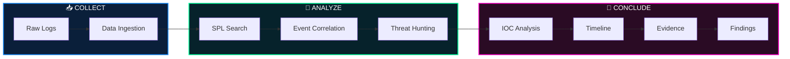

<div align="center">


<br>


<br>

### *"Turning raw security telemetry into actionable intelligence."*

[`MISSION`](#-01--mission) &nbsp;·&nbsp; [`PIPELINE`](#-02--pipeline) &nbsp;·&nbsp; [`CASE FILES`](#-03--case-files) &nbsp;·&nbsp; [`EVENT IDs`](#-04--event-id-cheat-sheet) &nbsp;·&nbsp; [`SPL TOOLKIT`](#-05--spl-toolkit) &nbsp;·&nbsp; [`REPORT FORMAT`](#-06--report-format)


</div>

## ▌01 // MISSION

Hands-on **SIEM and security log analysis investigations** performed in **Splunk**, built around Hack The Box lab scenarios.

The goal is to mirror a real SOC workflow: take a pile of raw logs, ask the right questions in SPL, and walk out with a **timeline, IOCs, and evidence-backed findings.**

```console
analyst@soc:~$ ./investigate --tool splunk --mode hunt

[+] ingesting raw telemetry ........... OK
[+] building SPL searches ............. OK
[+] correlating events across time .... OK
[+] extracting indicators ............. OK
[+] reconstructing attacker timeline .. OK
[+] attaching evidence ................ OK

>> 2 cases analysed · 2 reports delivered · 0 loose ends
```

<div align="center"></div>

## ▌02 // PIPELINE



<div align="center"></div>

## ▌03 // CASE FILES

<table width="100%">
<tr>
<td width="50%" valign="top">

### 🕵️ CASE #01 · UNIT42


**Data source:** Windows / Sysmon logs

Investigating a suspected compromise by analysing endpoint telemetry in Splunk.

- Ingest logs and identify available data sources
- Hunt suspicious process execution and file activity
- Extract IOCs (hashes, domains, paths)
- Reconstruct the attacker timeline

**[→ Open case folder](./01-Hack-The-Box-Unit42)**

</td>
<td width="50%" valign="top">

### 🪵 CASE #02 · LOGJAMMER


**Data source:** Windows event logs

Digging through Windows event logs to reconstruct what an intruder did on the host.

- Analyse authentication and account activity
- Detect new rules, tasks, and cleared logs
- Correlate events into a sequence of actions
- Document findings with evidence

**[→ Open case folder](./02-Hack-The-Box-%20LogJammer)**

</td>
</tr>
</table>

<div align="center"></div>

## ▌04 // EVENT ID CHEAT SHEET

The Windows and Sysmon events that show up again and again in these investigations:

| Source | Event ID | Meaning | Why it matters |
|:--|:--:|:--|:--|
| Sysmon | `1` | Process created | Execution, parent/child chains |
| Sysmon | `2` | File creation time changed | Possible timestomping |
| Sysmon | `3` | Network connection | C2 and outbound traffic |
| Sysmon | `11` | File created | Dropped payloads |
| Sysmon | `22` | DNS query | Domain lookups by malware |
| Security | `4624` / `4625` | Logon success / failure | Access and brute force |
| Security | `4688` | Process created | Execution without Sysmon |
| Security | `4698` | Scheduled task created | Persistence |
| Security | `4720` | User account created | Persistence |
| Security | `1102` | Audit log cleared | Defense evasion |
| Firewall | `4946` / `4947` / `4948` | Rule added / modified / deleted | Defense evasion |

<div align="center"></div>

## ▌05 // SPL TOOLKIT

> *Field names vary by data source and add-on; adjust queries to match the lab's logs.*

<details>
<summary><b>⚙️ &nbsp;Process execution</b></summary>

```spl
index=* EventCode=1
| stats count by Image, CommandLine, ParentImage
| sort - count
```
</details>

<details>
<summary><b>🌐 &nbsp;Network connections</b></summary>

```spl
index=* EventCode=3
| stats count by Image, DestinationIp, DestinationPort
| sort - count
```
</details>

<details>
<summary><b>🔑 &nbsp;Authentication</b></summary>

```spl
index=* (EventCode=4625 OR EventCode=4624)
| stats count by EventCode, Account_Name, Source_Network_Address
| sort - count
```
</details>

<details>
<summary><b>⏱️ &nbsp;Timeline builder</b></summary>

```spl
index=* host="TARGET"
| sort 0 _time
| table _time, EventCode, Image, CommandLine
```
</details>

<div align="center"></div>

## ▌06 // REPORT FORMAT

Every case folder follows the same structure:

```text
📁 Case-Folder/
 ├── 🧭 Scenario          what we're investigating
 ├── 🔎 SPL Queries       searches used, with purpose
 ├── 📸 Evidence          screenshots of key results
 ├── 🧪 IOCs              hashes · IPs · domains · paths
 ├── ⏱️ Timeline          attacker actions in order
 ├── 🎯 MITRE Mapping     techniques observed
 └── ✅ Findings          conclusions and answers
```

## ▌07 // FOLDER MAP

```text
01-Splunk-SIEM-Investigations/
├── assets/                          banner & divider graphics
├── 01-Hack-The-Box-Unit42/          Case #01
├── 02-Hack-The-Box- LogJammer/      Case #02
└── README.md                        you are here
```

<div align="center">


```text
┌────────────────────────────────────────────────┐
│  LOGS DON'T LIE.                               │
│  ANALYSTS JUST NEED THE RIGHT QUERY.           │
└────────────────────────────────────────────────┘
```

</div>
