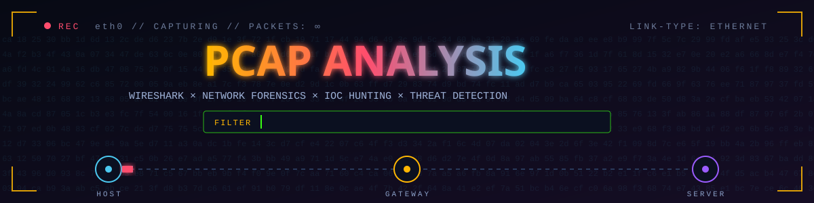
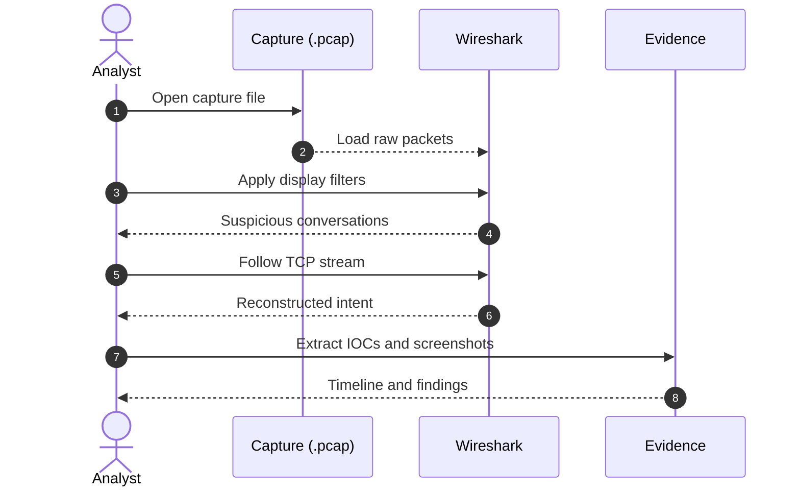

<div align="center">



<br>


<br>

### *Every packet tells a story. This is where I read between the lines.*

[`BRIEFING`](#-briefing) &nbsp;·&nbsp; [`SKILLS`](#-core-skills) &nbsp;·&nbsp; [`METHOD`](#-investigation-flow) &nbsp;·&nbsp; [`CASE FILES`](#-case-files) &nbsp;·&nbsp; [`FILTERS`](#-filter-playbook) &nbsp;·&nbsp; [`INDICATORS`](#-what-i-hunt-for)


</div>

## 📡 BRIEFING

> **Network traffic doesn't lie. It just hides in plain sight.**

This directory is a collection of hands-on investigations where raw `.pcap` captures are broken down packet by packet in **Wireshark** to expose malicious activity, abnormal behavior, and hard **Indicators of Compromise (IOCs)** buried inside the noise.

```text
 NO ASSUMPTIONS.   NO GUESSWORK.   JUST TRAFFIC, TIMESTAMPS, AND TRUTH.
```

<div align="center"></div>

## 🔍 CORE SKILLS

<table width="100%">
<tr>
<td align="center" width="33%"><h2>🦈</h2><b>Packet Analysis</b><br><sub>Filtering signal from noise at the byte level</sub></td>
<td align="center" width="33%"><h2>🌐</h2><b>Traffic Investigation</b><br><sub>Mapping conversations, sessions, and flows</sub></td>
<td align="center" width="33%"><h2>🔎</h2><b>Stream Analysis</b><br><sub>Following TCP streams to reconstruct intent</sub></td>
</tr>
<tr>
<td align="center"><h2>🕵️</h2><b>IOC Identification</b><br><sub>Pulling IPs, domains, hashes, and payloads worth flagging</sub></td>
<td align="center"><h2>⚔️</h2><b>Threat Detection</b><br><sub>Spotting C2 beacons, exfiltration, and lateral movement</sub></td>
<td align="center"><h2>📊</h2><b>Network Forensics</b><br><sub>Turning a capture file into a timeline of events</sub></td>
</tr>
</table>

<div align="center"></div>

## 🧭 INVESTIGATION FLOW



<div align="center"></div>

## 🗂️ CASE FILES

Each subfolder is a self-contained case file: a real investigation, start to finish, with methodology, findings, extracted evidence, and annotated screenshots.

<div align="center">

| No. | Case | Tooling | Output | Status |
|:--:|:--|:--|:--|:--:|
| `01` | 🌐 [**Network Analysis**](./01-Network%20Analysis) | Wireshark | IOCs · timeline · findings |  |
| `02` | 🐈 [**CyberDefenders: Tomcat**](./02-CyberDefenders-Tomcat) | Wireshark | IOCs · timeline · findings |  |

</div>

<details>
<summary><b>🌐 &nbsp;Case 01 · Network Analysis</b> &nbsp;<code>// packet-level investigation</code></summary>
<br>

Packet-level breakdown of a capture file to identify suspicious traffic and extract indicators of compromise.

- Triage the capture and map the main conversations
- Identify abnormal hosts, ports, and protocols
- Extract IOCs and supporting evidence
- Build a timeline of the network activity

</details>

<details>
<summary><b>🐈 &nbsp;Case 02 · CyberDefenders: Tomcat</b> &nbsp;<code>// blue-team lab</code></summary>
<br>

A CyberDefenders blue-team challenge: reconstruct an attack on a Tomcat web server from the packet capture alone.

- Follow the attacker's conversations with the target
- Pinpoint the malicious requests and payloads
- Extract IOCs (IPs, files, indicators of persistence)
- Document the attack path with annotated screenshots

</details>

<div align="center"></div>

## ⚡ FILTER PLAYBOOK

Display filters used again and again across these captures:

| Goal | Wireshark display filter |
|:--|:--|
| Focus on one host | `ip.addr == 192.168.1.10` |
| Traffic to or from a port | `tcp.port == 4444` |
| Port-scan signature (SYN, no ACK) | `tcp.flags.syn == 1 && tcp.flags.ack == 0` |
| Web form submissions and uploads | `http.request.method == "POST"` |
| Failed logins | `http.response.code == 401` |
| DNS lookups | `dns.qry.name` |
| Unusually long domain names | `dns.qry.name.len > 50` |
| Credentials in the clear | `http.authorization` |
| Hunt a string anywhere | `frame contains "password"` |
| Isolate one conversation | `tcp.stream eq 5` |

> 💡 **Power moves:** `Statistics → Conversations`, `Statistics → Protocol Hierarchy`, `Follow → TCP Stream`, and `File → Export Objects → HTTP`.

<div align="center"></div>

## 🎯 WHAT I HUNT FOR

| Indicator | What it looks like in a capture |
|:--|:--|
| 🔭 **Recon / port scan** | One source sending many SYNs to many ports |
| 🔨 **Brute force** | Repeated login attempts followed by `401` responses |
| 📡 **C2 beaconing** | Regular-interval connections to a rare IP or port |
| 🕳️ **DNS abuse** | Long, random-looking, or rarely seen domains |
| 📤 **Data exfiltration** | Large outbound transfers to an unusual destination |
| 🪝 **Payload delivery** | Executables or archives moving over HTTP |

<div align="center"></div>

## 📁 CASE REPORT FORMAT

```text
📁 Case-Folder/
 ├── 🧭 Scenario          what the capture is about
 ├── 🔎 Methodology       filters and steps, in order
 ├── 📸 Screenshots       annotated Wireshark evidence
 ├── 🧪 IOCs              IPs · domains · hashes · payloads
 ├── ⏱️ Timeline          events in sequence
 └── ✅ Findings          conclusions and answers
```

## 🗺️ FOLDER MAP

```text
02-PCAP-Analysis/
├── assets/                       banner & divider graphics
├── 01-Network Analysis/          Case 01
├── 02-CyberDefenders-Tomcat/     Case 02
└── README.md                     you are here
```

<div align="center">


```text
┌──────────────────────────────────────────────┐
│  CAPTURE THE TRAFFIC.                        │
│  INTERROGATE THE PACKETS.                    │
│  NAME THE THREAT.                            │
└──────────────────────────────────────────────┘
```

</div>
