# 🔴 RedLine Lab — Memory Forensics with Volatility3

> Uncovering a malware infection chain, C2 infrastructure, and stealth VPN-based exfiltration from a raw Windows memory dump.

-success)

---

## 📑 Table of Contents
- [Scenario](#-scenario)
- [Objectives](#-objectives)
- [Tools Used](#-tools-used)
- [Methodology](#-methodology)
- [Key Findings](#-key-findings)
- [Attack Chain](#-attack-chain)
- [Indicators of Compromise (IOCs)](#-indicators-of-compromise-iocs)
- [MITRE ATT&CK Mapping](#-mitre-attck-mapping)
- [Screenshots / Evidence](#-screenshots--evidence)
- [Skills Demonstrated](#-skills-demonstrated)
- [Lessons Learned](#-lessons-learned)

---

## 🧩 Scenario

A Windows host memory image (`MemoryDump.mem`) was provided for analysis after suspicious activity was flagged on an endpoint. The objective was to use **Volatility3** to reconstruct what happened on the machine — identify the malicious process, its parent/child relationships, memory protections indicating code injection, and the network infrastructure (C2 servers) the malware communicated with.

## 🎯 Objectives

- Identify the suspicious process and its child process
- Detect signs of process injection / memory tampering
- Extract network connections tied to the malicious process
- Recover attacker infrastructure (C2 IP/domain) from raw strings
- Reconstruct the full process lineage and infection timeline

## 🛠 Tools Used

| Tool | Purpose |
|---|---|
| **Volatility3** (`vol.exe`) | Memory analysis framework — process, network, and injection plugins |
| **`windows.malfind`** | Detect injected/suspicious memory regions (RWX pages) |
| **`windows.psscan`** | Scan for process objects (including hidden/terminated processes) |
| **`windows.pstree`** | Reconstruct parent-child process tree |
| **`windows.netscan`** | Extract network connection artifacts from memory |
| **`strings`** (WSL) | Extract readable ASCII/Unicode strings from the raw memory dump |
| **`egrep`** | Pattern-match extracted strings against the identified C2 IP |

## 🔍 Methodology

1. **Malware Detection (`malfind`)** — scanned the memory dump for regions with `PAGE_EXECUTE_READWRITE` protection, a strong indicator of code injection or a self-unpacking payload. This flagged `oneetx.exe` (PID 5896) with an embedded MZ/PE header sitting in writable+executable memory — not something a legitimate process should have.

2. **Network Reconstruction (`netscan`)** — pulled all network connection artifacts to correlate process activity with external IPs and ports.

3. **Process Validation (`psscan` + `pstree`)** — cross-referenced the flagged PID against the process tree to confirm parent/child lineage, executable path, and process creation times.

4. **Raw String Extraction (`strings` + `egrep`)** — since the C2 IP was already known from `netscan`, the raw memory dump was searched for every occurrence of that IP to recover additional C2 URLs/paths not visible in structured Volatility output (e.g. HTTP paths used for staging/exfiltration).

## 🧾 Key Findings

| # | Finding | Detail |
|---|---|---|
| 1 | **Suspicious process** | `oneetx.exe` (PID **5896**, PPID **8844**) |
| 2 | **Dropped from** | `C:\Users\Tammam\AppData\Local\Temp\c3912af058\oneetx.exe` (classic temp-folder malware drop location) |
| 3 | **Memory protection** | `PAGE_EXECUTE_READWRITE` on an embedded `MZ` (PE) header — indicates in-memory unpacking / code injection |
| 4 | **Child process** | `rundll32.exe` (PID **7732**) — spawned by `oneetx.exe`, a classic **living-off-the-land** technique to blend in with legitimate Windows activity |
| 5 | **C2 communication** | `oneetx.exe` → **77.91.124.20:80** (TCP, state `CLOSED`) |
| 6 | **Secondary VPN/tunnel process** | `tun2socks.exe` (PID **4628**), child of `outline.exe` (PID **6724**) — the attacker leveraged the legitimate **Outline VPN** client's tunneling binary to mask outbound traffic |
| 7 | **VPN tunnel endpoint** | `tun2socks.exe` → **38.121.43.65:443** (TCP, state `CLOSED`) |
| 8 | **Additional C2 artifacts (via `strings`)** | Multiple HTTP paths hosted on `77.91.124.20`, including `/store/games/index.php` and `/DSC01491/` — likely payload staging or panel endpoints |

## ⏱ Attack Chain

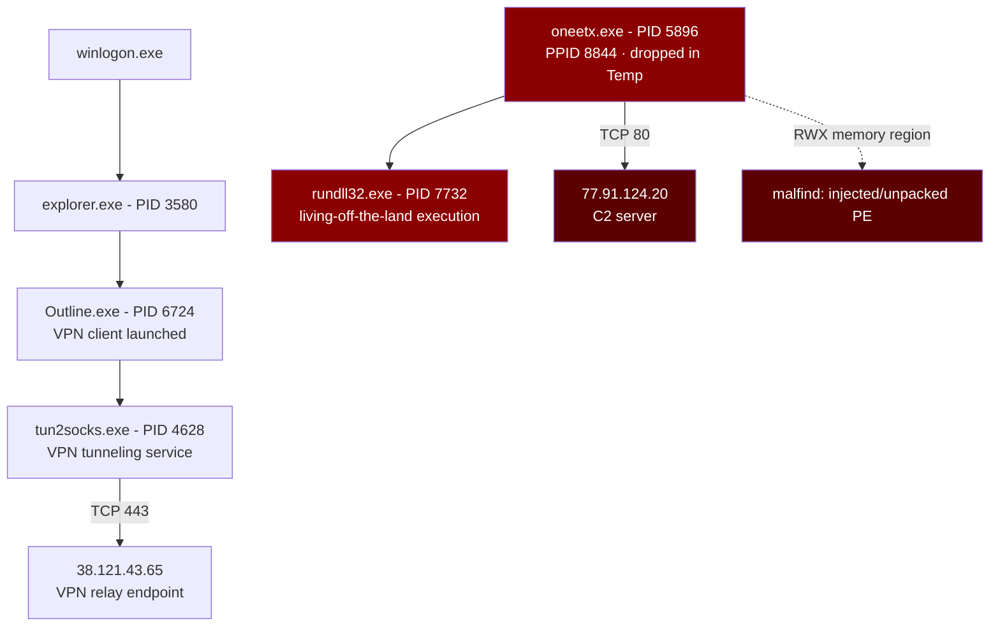

**Narrative:**
1. The attacker first established a **VPN tunnel** (`Outline.exe` → `tun2socks.exe`) to `38.121.43.65:443`, likely to mask their true origin/IP before further activity.
2. Shortly after, `oneetx.exe` appeared in a user's Temp directory — memory analysis confirms it carries a self-unpacking/injected payload (`PAGE_EXECUTE_READWRITE`).
3. `oneetx.exe` established outbound C2 communication to `77.91.124.20:80`.
4. `oneetx.exe` spawned `rundll32.exe` as a child process — a common technique to execute malicious code under a trusted Windows binary and evade basic detection.
5. Raw string analysis of the memory dump confirmed additional C2 infrastructure paths hosted on the same attacker IP.

## 🌐 Indicators of Compromise (IOCs)

| Type | Value | Notes |
|---|---|---|
| Process (malicious) | `oneetx.exe` | PID 5896, PPID 8844 |
| Process (child/LOLBin) | `rundll32.exe` | PID 7732, spawned by oneetx.exe |
| Process (VPN tunnel) | `tun2socks.exe` | PID 4628, child of Outline.exe |
| File path | `C:\Users\Tammam\AppData\Local\Temp\c3912af058\oneetx.exe` | Drop location |
| C2 IP:Port | `77.91.124.20:80` | HTTP, contacted by oneetx.exe |
| C2 URI paths | `/store/games/index.php`, `/store/games/i`, `/DSC01491/` | Recovered via `strings` + `egrep` |
| VPN relay IP:Port | `38.121.43.65:443` | HTTPS, contacted by tun2socks.exe |
| Memory artifact | `PAGE_EXECUTE_READWRITE` region w/ embedded MZ header | Detected via `windows.malfind` |

## 🗺 MITRE ATT&CK Mapping

| Tactic | Technique | ID |
|---|---|---|
| Privilege Escalation / Defense Evasion | Process Injection | [T1055](https://attack.mitre.org/techniques/T1055/) |
| Defense Evasion | System Binary Proxy Execution: Rundll32 | [T1218.011](https://attack.mitre.org/techniques/T1218/011/) |
| Command and Control | Application Layer Protocol: Web Protocols | [T1071.001](https://attack.mitre.org/techniques/T1071/001/) |
| Command and Control | Proxy / Tunneling (VPN abuse) | [T1090](https://attack.mitre.org/techniques/T1090/) |
| Defense Evasion | Masquerading (Temp-folder execution) | [T1036](https://attack.mitre.org/techniques/T1036/) |

## 🖼 Screenshots / Evidence

> All screenshots are numbered in the order the investigation was performed.

### 1. Lab Completion
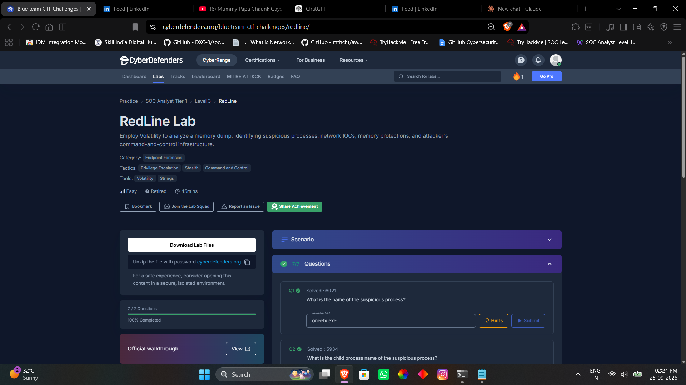
RedLine Lab marked 100% complete — all 7 questions solved.

### 2. Malfind — Command
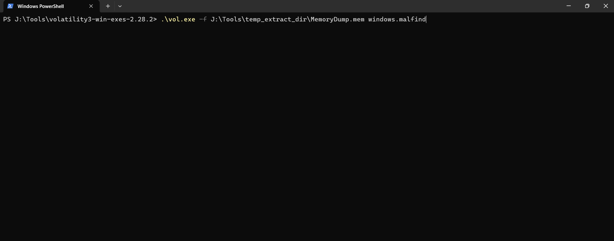
Running `windows.malfind` against `MemoryDump.mem` to scan for injected/unpacked code.

### 3. Malfind — Suspicious Output
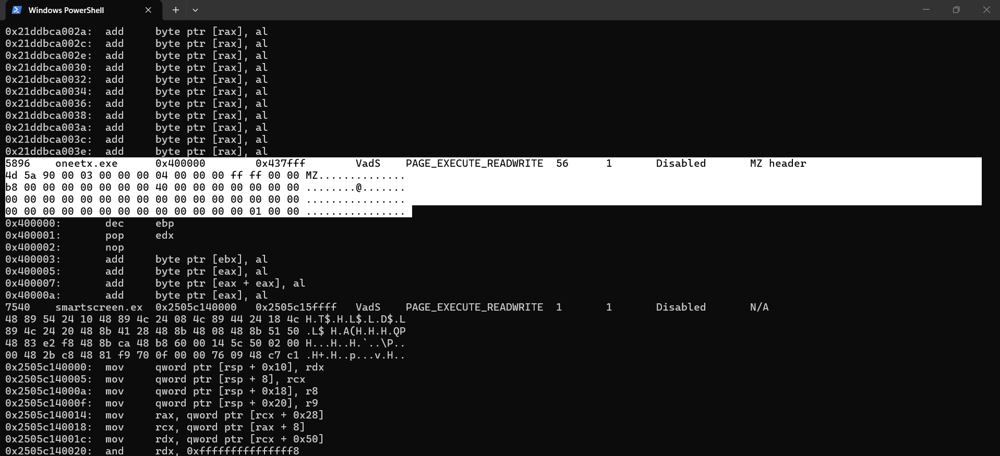
`oneetx.exe` (PID 5896) flagged with a `PAGE_EXECUTE_READWRITE` memory region containing an embedded `MZ` (PE) header — a strong indicator of code injection.

### 4. Netscan — Command Output
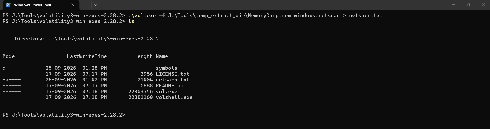
Running `windows.netscan` and saving results to `netscan.txt`.

### 5. Netscan — C2 Connection
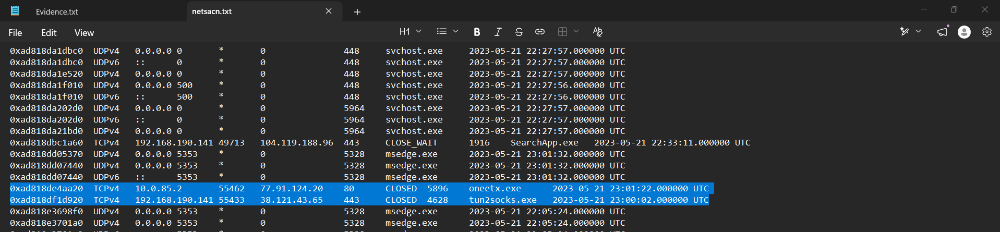
`oneetx.exe` communicating with **77.91.124.20:80**, and `tun2socks.exe` communicating with **38.121.43.65:443**.

### 6. Psscan — Command Output
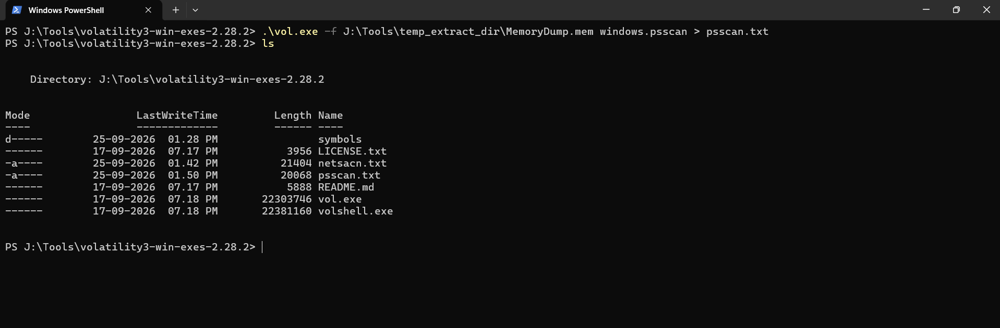
Running `windows.psscan` and saving results to `psscan.txt`.

### 7. Psscan — Process Details
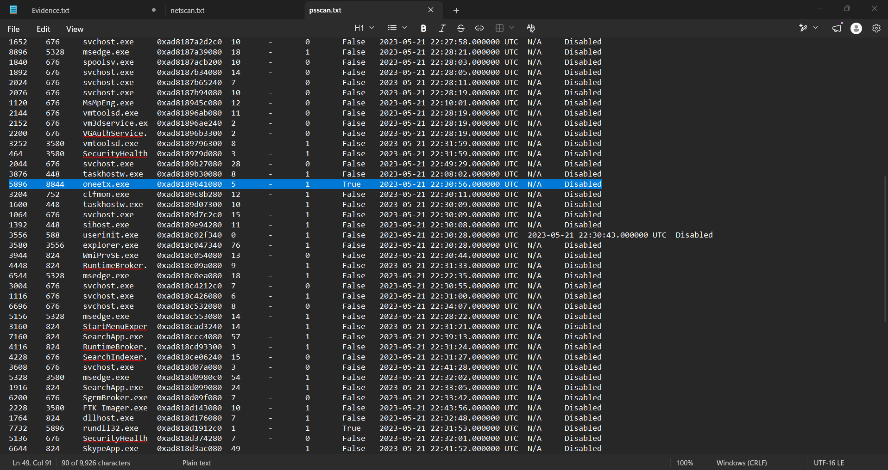
`oneetx.exe` process record confirming **PID 5896 / PPID 8844**.

### 8. Pstree — Command Output
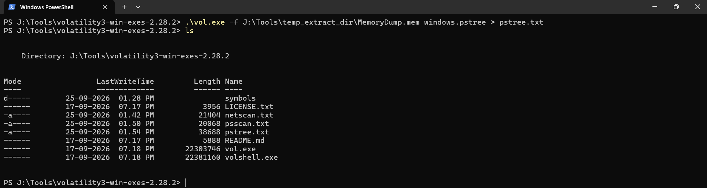
Running `windows.pstree` and saving results to `pstree.txt`.

### 9. Pstree — oneetx.exe → rundll32.exe
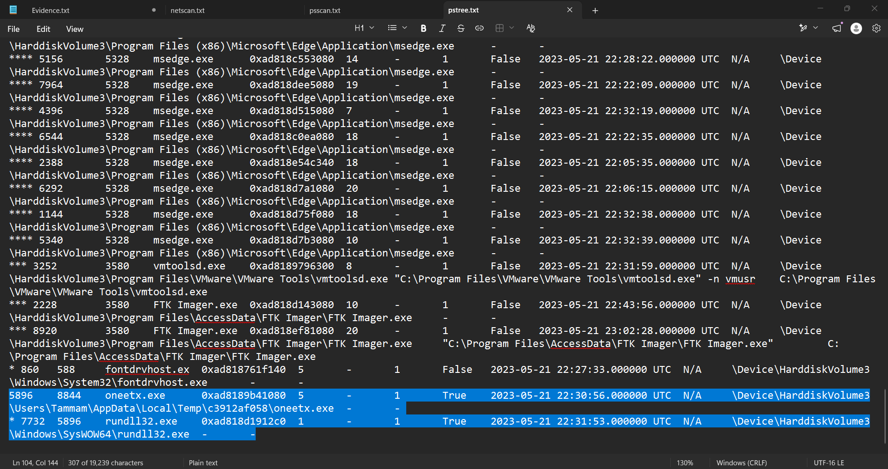
Process tree confirming `oneetx.exe` spawned `rundll32.exe` (PID 7732) as a child process.

### 10. Pstree — Outline.exe → tun2socks.exe
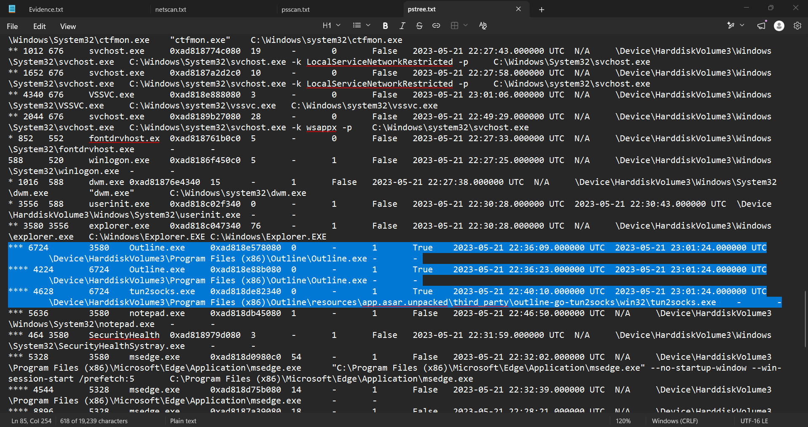
Process tree confirming `tun2socks.exe` (PID 4628) is a child of `Outline.exe` (PID 6724) — the VPN tunneling lineage.

### 11. Strings Extraction
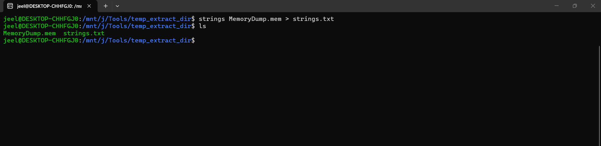
Extracting raw strings from `MemoryDump.mem` using WSL for deeper IOC recovery.

### 12. Strings — Grep for Attacker IP
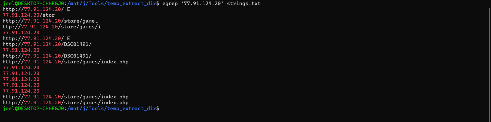
`egrep '77.91.124.20' strings.txt` surfacing additional C2 URI paths (`/store/games/index.php`, `/DSC01491/`, etc.).

### 13. Evidence Summary
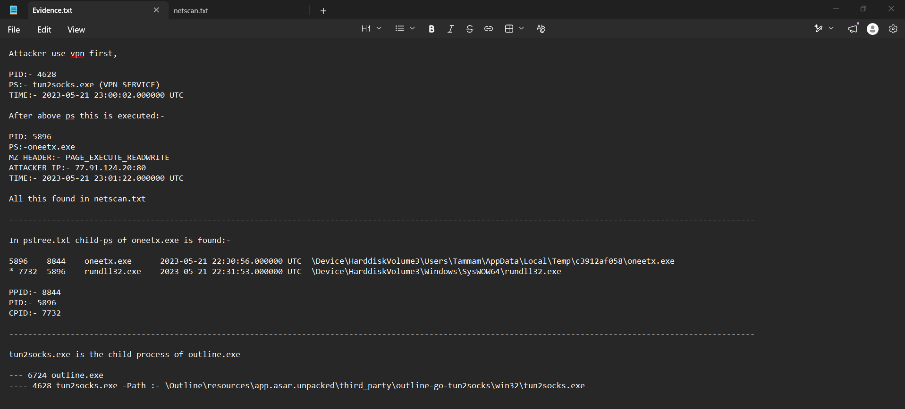
Working notes tying the attacker's VPN pivot, C2 connection, and process injection together into one timeline.

## 🧠 Skills Demonstrated

- Volatility3 memory forensics (`malfind`, `psscan`, `pstree`, `netscan`)
- Identifying process injection via memory permission analysis
- Network artifact reconstruction from a memory image
- Raw binary string extraction and IOC pivoting (`strings` + `egrep`)
- Building a full attack timeline from disparate forensic artifacts
- Mapping findings to the MITRE ATT&CK framework

## 📌 Lessons Learned

- `PAGE_EXECUTE_READWRITE` memory regions are a high-confidence signal of in-memory unpacking or injection and should always be triaged first with `malfind`.
- Legitimate software (like a VPN client's `tun2socks.exe`) can be repurposed by attackers to blend malicious tunneling traffic with expected network behavior — process lineage (`pstree`) is essential to catch this.
- Structured Volatility output alone doesn't always reveal everything — raw `strings` extraction combined with a known IOC (the C2 IP) surfaced additional attacker infrastructure paths that weren't visible in `netscan`.

---

*Part of my [SOC Portfolio](../../) — hands-on Blue Team labs covering memory forensics, PCAP analysis, and endpoint investigation.*
