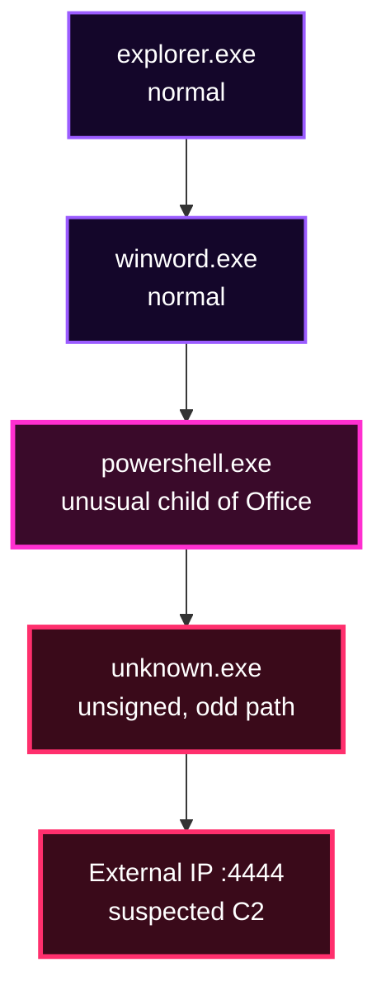

<div align="center">



<br>


<br>

### *"Attackers can avoid the disk. They can't avoid RAM."*

[`WHY RAM`](#-01--why-memory) &nbsp;·&nbsp; [`WORKFLOW`](#-02--analysis-workflow) &nbsp;·&nbsp; [`PLUGINS`](#-03--plugin-cheat-sheet) &nbsp;·&nbsp; [`RED FLAGS`](#-04--red-flags) &nbsp;·&nbsp; [`CASE FILES`](#-05--case-files)


</div>

## ◈ 01 · WHY MEMORY?

Disk forensics tells you what *was* on a machine. Memory forensics tells you what is **happening right now**: running processes, live network connections, injected code, decrypted payloads, and commands typed seconds before the dump was taken.

Fileless malware, process injection, and in-memory implants can leave **little or no trace on disk**, but they can't hide from a memory image. This directory holds my hands-on memory investigations, each documented from first plugin to final report.

> **Goal:** Load the dump. Hunt the process. Recover the evidence.

<div align="center"></div>

## ◈ 02 · ANALYSIS WORKFLOW

<table width="100%">
<tr>
<td align="center" width="20%"><h2>1️⃣</h2><b>PROFILE</b><br><sub>Identify the OS and build of the image</sub><br><br><code>windows.info</code></td>
<td align="center" width="20%"><h2>2️⃣</h2><b>PROCESSES</b><br><sub>Map the process tree, spot oddities</sub><br><br><code>pslist · pstree · psscan</code></td>
<td align="center" width="20%"><h2>3️⃣</h2><b>NETWORK</b><br><sub>Find live and closed connections</sub><br><br><code>netscan</code></td>
<td align="center" width="20%"><h2>4️⃣</h2><b>INJECTION</b><br><sub>Hunt injected or hidden code</sub><br><br><code>malfind · dlllist</code></td>
<td align="center" width="20%"><h2>5️⃣</h2><b>ARTIFACTS</b><br><sub>Recover files, commands, indicators</sub><br><br><code>cmdline · filescan</code></td>
</tr>
</table>

<div align="center"></div>

## ◈ 03 · PLUGIN CHEAT SHEET

Volatility 3 plugins used across these investigations:

| Goal | Plugin | What it reveals |
|:--|:--|:--|
| OS and build details | `windows.info` | Confirms the image is read correctly |
| Running processes | `windows.pslist` | Active process list with PIDs and parents |
| Process hierarchy | `windows.pstree` | Parent/child chains that look wrong |
| Hidden processes | `windows.psscan` | Processes unlinked from the normal list |
| Command lines | `windows.cmdline` | Arguments each process was launched with |
| Network connections | `windows.netscan` | IPs, ports, and owning processes |
| Injected code | `windows.malfind` | Executable memory regions with no backing file |
| Loaded libraries | `windows.dlllist` | Suspicious or unexpected DLLs |
| Files in memory | `windows.filescan` | File objects cached in RAM |

```bash
# typical start of every case
vol -f memory.raw windows.info
vol -f memory.raw windows.pstree
vol -f memory.raw windows.netscan
```

> *Plugin names differ slightly between Volatility 2 and 3. Adjust to the framework each lab uses.*

<div align="center"></div>

## ◈ 04 · RED FLAGS

An illustrative example of a suspicious parent/child chain:



| Red flag | Why it matters |
|:--|:--|
| 🧬 Wrong parent for a process | Office spawning PowerShell is a classic attack pattern |
| 🕳️ Executable + writable memory pages | A signature of injected code |
| 👻 Process found by `psscan` but not `pslist` | Possible hidden or terminated malicious process |
| 📡 Odd process making outbound connections | Potential C2 or exfiltration |
| 📁 Process running from a temp or user path | Legitimate system tools rarely live there |

<div align="center"></div>

## ◈ 05 · CASE FILES

<table width="100%">
<tr>
<td width="50%" valign="top">

### 🧠 CASE #01 · REVEAL


A CyberDefenders memory forensics lab: analyse a Windows memory image to trace malicious activity back to its source.

- Profile the image and map the processes
- Follow suspicious commands and connections
- Extract indicators from volatile memory
- Document the full attack story

**[→ Open case folder](./01-CyberDefenders-Reveal-Lab)**

</td>
<td width="50%" valign="top">

### 🧠 CASE #02 · REDLINE


A CyberDefenders memory forensics lab: hunt a malicious process, its network activity, and the indicators it left in RAM.

- Identify the malicious process and its origin
- Trace its network connections
- Recover artifacts and IOCs
- Report findings with evidence

**[→ Open case folder](./02-CyberDefenders-RedLine-Lab)**

</td>
</tr>
</table>

<div align="center"></div>

## ◈ 06 · REPORT FORMAT

```text
📁 Case-Folder/
 ├── 🧭 Scenario          what the memory image is about
 ├── 🔎 Plugins & Steps   commands run, in order
 ├── 📸 Screenshots       key output as evidence
 ├── 🧪 IOCs              processes · IPs · files · hashes
 ├── ⏱️ Timeline          events in sequence
 └── ✅ Findings          conclusions and answers
```

## ◈ 07 · FOLDER MAP

```text
03-Memory-Forensics/
├── assets/                          banner & divider graphics
├── 01-CyberDefenders-Reveal-Lab/    Case 01
├── 02-CyberDefenders-RedLine-Lab/   Case 02
└── README.md                        you are here
```

<div align="center">


```text
┌──────────────────────────────────────────────┐
│  LOAD THE DUMP.                              │
│  HUNT THE PROCESS.                           │
│  RECOVER THE EVIDENCE.                       │
└──────────────────────────────────────────────┘
```

</div>
