<div align="center">

```
 ████████╗██╗  ██╗███████╗    ██████╗ ██╗      █████╗ ███╗   ██╗███████╗████████╗
 ╚══██╔══╝██║  ██║██╔════╝    ██╔══██╗██║     ██╔══██╗████╗  ██║██╔════╝╚══██╔══╝
    ██║   ███████║█████╗      ██████╔╝██║     ███████║██╔██╗ ██║█████╗     ██║
    ██║   ██╔══██║██╔══╝      ██╔═══╝ ██║     ██╔══██║██║╚██╗██║██╔══╝     ██║
    ██║   ██║  ██║███████╗    ██║     ███████╗██║  ██║██║ ╚████║███████╗   ██║
    ╚═╝   ╚═╝  ╚═╝╚══════╝    ╚═╝     ╚══════╝╚═╝  ╚═╝╚═╝  ╚═══╝╚══════╝   ╚═╝
                         P  R  E  S  T  I  G  E
```

### 🛰️ Email Forensics · Phishing Analysis · Digital Steganography


**`> INCOMING TRANSMISSION DETECTED... DECRYPTING...`**

</div>

---

## 📡 Table of Contents

1. [Mission Briefing](#-mission-briefing)
2. [Challenge Card](#-challenge-card)
3. [Attack Chain at a Glance](#-attack-chain-at-a-glance)
4. [Investigation Walkthrough](#-investigation-walkthrough)
5. [Answers & Scoreboard](#-answers--scoreboard)
6. [Indicators of Compromise (IOCs)](#-indicators-of-compromise-iocs)
7. [MITRE ATT&CK Mapping](#-mitre-attck-mapping)
8. [Automate It: Python Triage Script](#-automate-it-python-triage-script)
9. [Skills Demonstrated](#-skills-demonstrated)

---

## 🎯 Mission Briefing

> **CoCanDa**, a planet known as *"The Heaven of the Universe"*, is having a very bad year. Citizens (**CoCanDians**) keep getting abducted by a mysterious force and riots have spread across the planet. The Planetary President assembled a war-room, and then learned that **his own daughter** had disappeared. Two days later there is no ransom demand and no clue. On day three, a CoCanDa representative, **an Army Major on Earth**, receives an email.

**Our job as the blue team:** dissect that email, expose how it was sent, follow the hidden trail inside the attachment, and identify **who** is behind it, **where** they are, and **what infrastructure** they use.

---

## 🧾 Challenge Card

| Field | Details |
|---|---|
| **Lab** | The Planet's Prestige |
| **Platform** | Blue Team Labs Online (BTLO) |
| **Type** | Retired challenge |
| **Difficulty** | Easy |
| **Points** | 10 |
| **OS** | Windows / Linux |
| **Tags** | `Email Client` · `Text Editor` |
| **Evidence file** | `A Hope to CoCanDa.eml` (~50 KB) |
| **Archive password** | `btlo` |
| **Created by** | BTLO |


---

## 🧬 Attack Chain at a Glance

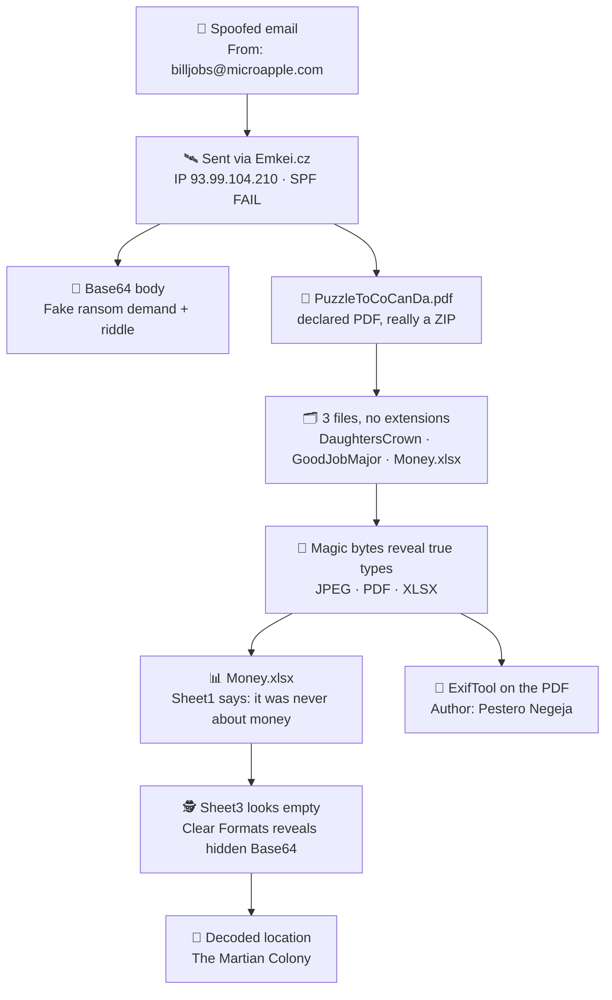

---

## 🛠️ Tool Arsenal

| Tool | Purpose in this investigation |
|---|---|
| **Notepad++** | Read raw `.eml` headers and locate Base64 blocks |
| **CyberChef** (gchq.github.io) | `From Base64`, `To Hex`, and saving the decoded output as a file |
| **VirusTotal** | Reputation check on the Reply-To domain |
| **File-signature (magic number) reference** | Confirm ZIP, JPEG, PDF and OOXML headers |
| **HxD** | Inspect the raw bytes of extension-less files |
| **ExifTool 13.59** (PowerShell 7.6.6) | Pull metadata (author, producer, dimensions) |
| **Windows Explorer / Photos / Browser PDF viewer** | Open the renamed evidence files |
| **Microsoft Excel** | Read the workbook and reveal formatting-hidden data |

---

## 🔍 Investigation Walkthrough

### Phase 1 · Email Header Analysis 🧩

Opened `A Hope to CoCanDa.eml` in Notepad++ and read the headers **bottom-up** (the oldest hop is at the bottom).

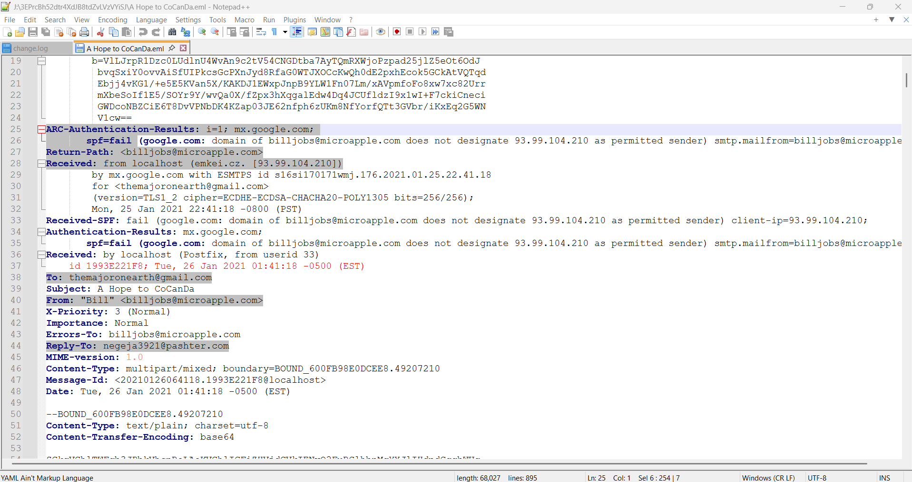

| Header | Value | Why it matters |
|---|---|---|
| `From` | `"Bill" <billjobs@microapple.com>` | Lookalike brand mash-up, used to impersonate a trusted name |
| `To` | `themajoronearth@gmail.com` | The Army Major on Earth |
| `Subject` | `A Hope to CoCanDa` | Emotional bait |
| `Reply-To` | `negeja3921@pashter.com` | **Different domain from `From`**, a classic phishing red flag |
| `Return-Path` / `Errors-To` | `billjobs@microapple.com` | Matches the spoofed sender |
| `Received` (top hop) | `from localhost (emkei.cz. [93.99.104.210])` | Google's reverse DNS resolves the sending IP to **emkei.cz** |
| `Received-SPF` | `fail`: *domain of billjobs@microapple.com does not designate 93.99.104.210 as permitted sender* | **Sender spoofing confirmed** |
| `Received` (origin hop) | `by localhost (Postfix, from userid 33)` | UID 33 is `www-data` on Debian/Ubuntu, meaning mail was submitted by a **web application** |
| `Message-Id` | `<20210126064118.1993E221F8@localhost>` | Generated on `localhost`, not by a real mail provider |
| `Date` | `Tue, 26 Jan 2021 01:41:18 -0500 (EST)` | = 06:41:18 UTC, matches Google's receipt stamp `Mon, 25 Jan 2021 22:41:18 -0800 (PST)` |
| `Content-Type` | `multipart/mixed` | Body + attachment |

**Verdict:** the email service is **Emkei.cz**, a free online fake-mailer that lets anyone send mail with a forged `From` address. SPF failed, the `Reply-To` points somewhere else, and the origin hop is a web-app user on `localhost`.

---

### Phase 2 · Infrastructure Reputation Check 🌐

Took the `Reply-To` domain, `pashter.com`, to VirusTotal.

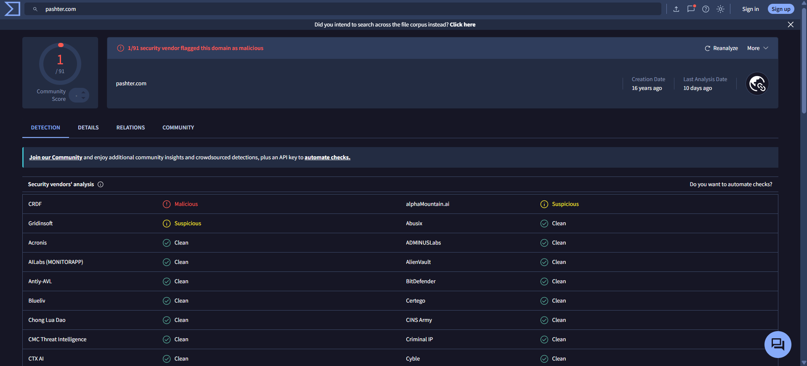

| Finding | Detail |
|---|---|
| Detections | **1 / 91** vendors flag it as malicious |
| Flagging vendors | CRDF → *Malicious* · alphaMountain.ai → *Suspicious* · Gridinsoft → *Suspicious* |
| Domain age | Created ~**16 years ago** |
| Last analysis | ~10 days before the screenshot |

> ⚠️ **Analyst note:** a low detection ratio does not clear a domain. An old domain plus several "suspicious" verdicts, used as a `Reply-To` that mismatches `From`, is still consistent with attacker-controlled infrastructure. Combined with the lab's story, `pashter.com` is the **probable C&C / reply domain**.

---

### Phase 3 · Decoding the Email Body 🔐

The body is `text/plain; charset=utf-8` encoded as **Base64**.

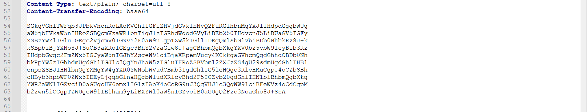

Pasted the block into CyberChef with the **From Base64** recipe:

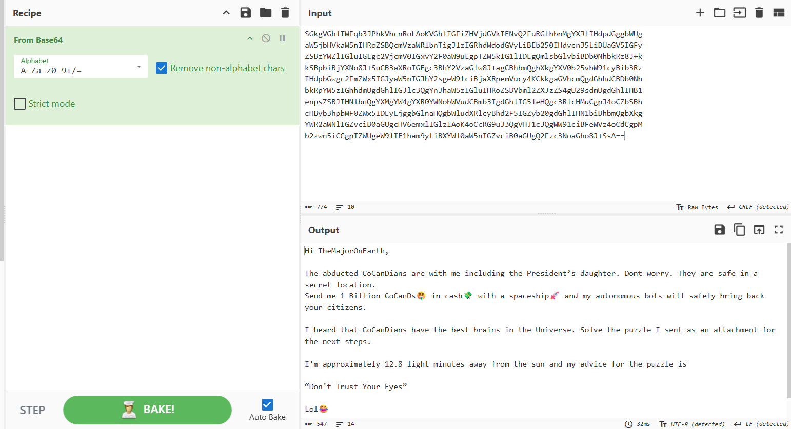

**Decoded message (summarized):** the sender claims the abducted CoCanDians, *including the President's daughter*, are safe at a secret location. They demand **1 Billion CoCanDs in cash, delivered by spaceship**, after which "autonomous bots" will bring the citizens back. The recipient is told to **solve the puzzle in the attachment** for next steps and given two hints:

| Hint | Analysis |
|---|---|
| *"I'm approximately **12.8 light minutes** away from the sun"* | 12.8 × 60 s × 299,792 km/s ≈ **230 million km ≈ 1.54 AU**. That is the orbital neighbourhood of **Mars** (mean orbit ≈ 1.52 AU) |
| *"Don't Trust Your Eyes"* | Warns that **file names and extensions cannot be trusted** and things are hidden in plain sight |

---

### Phase 4 · Carving the Attachment 📎

The second MIME part **claims** to be a PDF:

```
Content-Type: application/pdf; name="PuzzleToCoCanDa.pdf"
Content-Transfer-Encoding: base64
Content-Disposition: attachment; filename="PuzzleToCoCanDa.pdf"
```

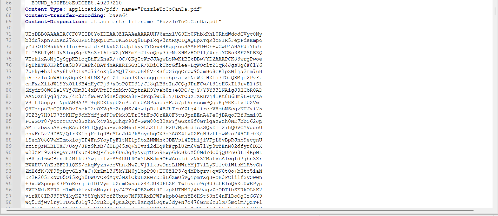

Decoded it in CyberChef (**From Base64 → To Hex**, about 63,964 Base64 characters over 821 lines). The very first bytes gave it away:

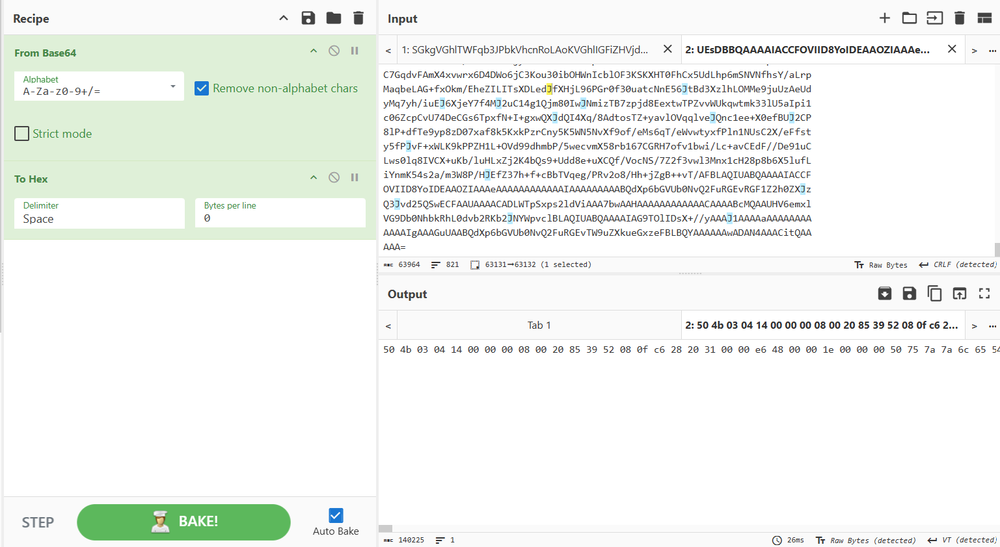

`50 4B 03 04` = ASCII **`PK`**, the **ZIP** signature (Phil Katz, creator of PKZIP). It is **not** a PDF.

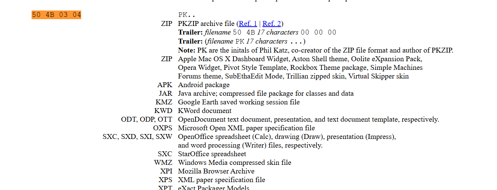

Saved the decoded output as `ATTACHMENT.ZIP`:

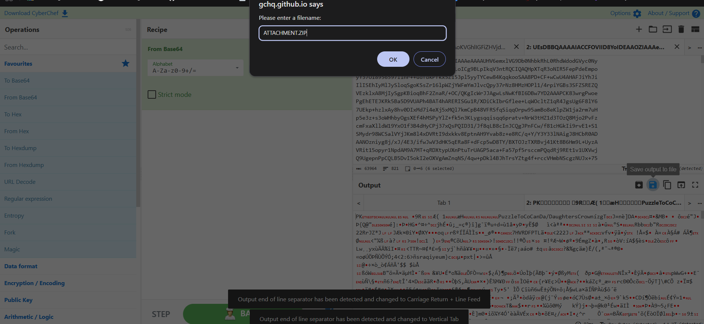

> 🚩 **Red flag:** declared MIME type and extension (`application/pdf`, `.pdf`) do **not** match the real file format (ZIP). This is **file-type masquerading**, used to slip past filters and fool users.

---

### Phase 5 · Unpacking & Header Forensics 🔬

The archive extracts to a folder `PuzzleToCoCanDa` containing **three files**, two of them with **no extension**:

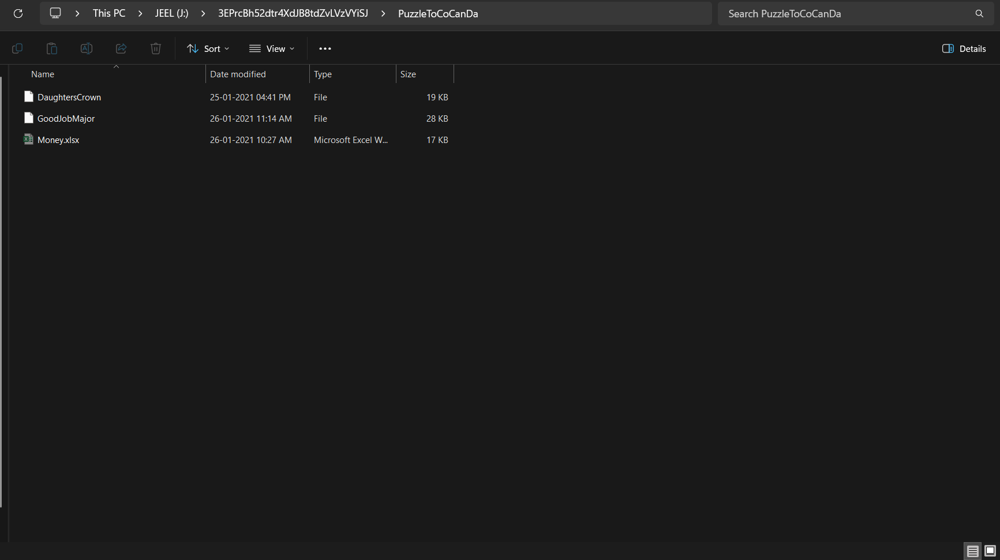

| File | Size | Modified (as stored) |
|---|---|---|
| `DaughtersCrown` | 19 KB | 25-01-2021 04:41 PM |
| `GoodJobMajor` | 28 KB | 26-01-2021 11:14 AM |
| `Money.xlsx` | 17 KB | 26-01-2021 10:27 AM |

Opened `DaughtersCrown` in **HxD**. The header is `FF D8 FF E0 ... 4A 46 49 46`, where `4A 46 49 46` spells **JFIF**:

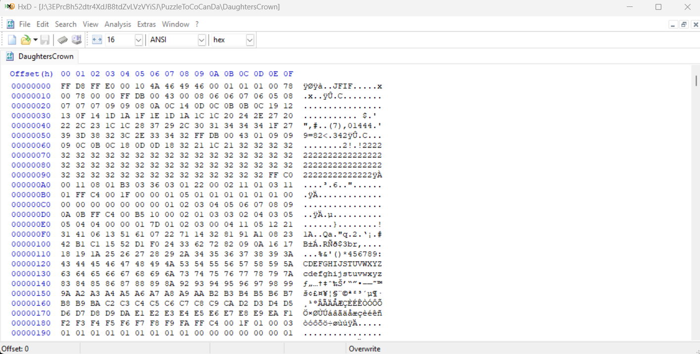

Cross-checked against the signature tables:

| Signature | Meaning | Reference |
|---|---|---|
| `FF D8 FF E0` (+ `JFIF`) | JPEG / JFIF image |  |
| `25 50 44 46` (`%PDF`) | PDF document | 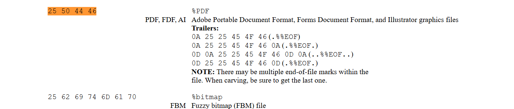 |
| `50 4B 03 04` (in an OOXML container) | DOCX / PPTX / **XLSX** | 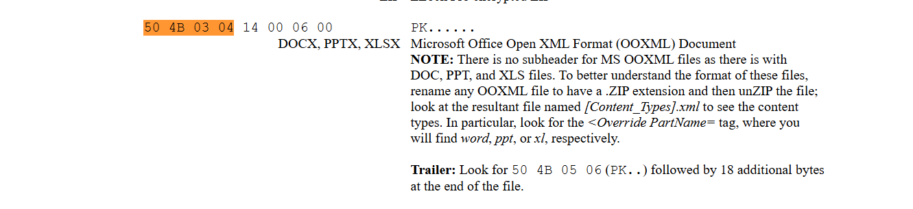 |

Renamed the files to their true extensions:

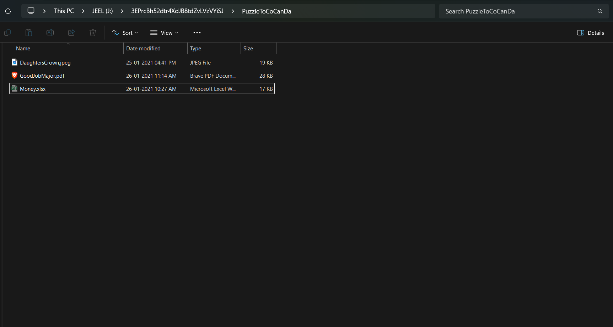

```
DaughtersCrown  ->  DaughtersCrown.jpeg
GoodJobMajor    ->  GoodJobMajor.pdf
Money.xlsx      ->  Money.xlsx  (already correct)
```

---

### Phase 6 · Reading the Evidence Files 📖

**🖼️ `DaughtersCrown.jpeg`**: a crown graphic (the "proof" the attacker claims to hold). It is a generic emoji-style image, **not** verifiable proof of anything.

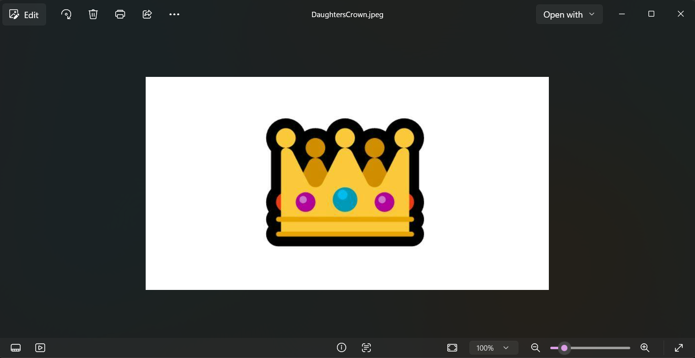

**📄 `GoodJobMajor.pdf`**: a one-page taunt that states *"CoCanDians are Safe"*, *"The proof is in the file named DaughtersCrown"*, and points to **`Money.xlsx`** for the location to send the 1 Billion CoCanDs.

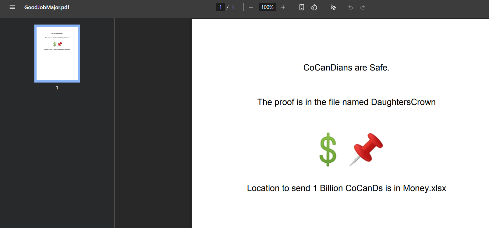

**📊 `Money.xlsx` (Sheet1)**: the twist. Cell `B3` (bold red) reads:

> *"Whatever you have seen or read till now is fake. Our intension [sic] was not for money. It is the beginning of the **WAR WITH CoCanDians**."*

Row 5 has a **`Location`** label, and cell `B8` says *"Find and come ASAP I'm Waiting!"*, but the location value itself is not visible.

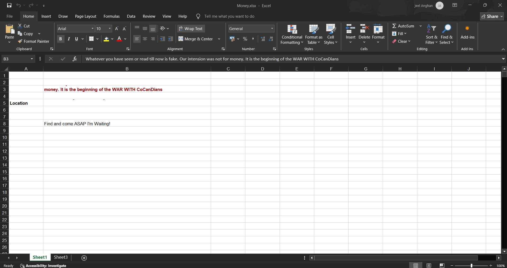

---

### Phase 7 · Uncovering the Hidden Layer 🕵️

The workbook has **Sheet1** and **Sheet3**. Sheet3 looks completely blank:

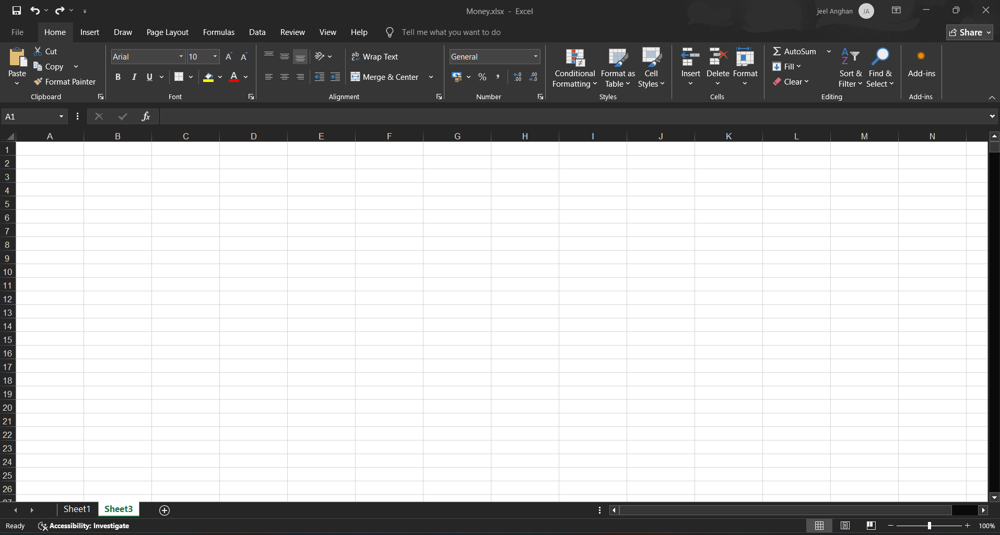

*"Don't trust your eyes."* Selected all cells and used **Home → Clear → Clear Formats**. The text had been hidden by **cell formatting** (most likely font colour matching the background), so stripping the formats exposed it:

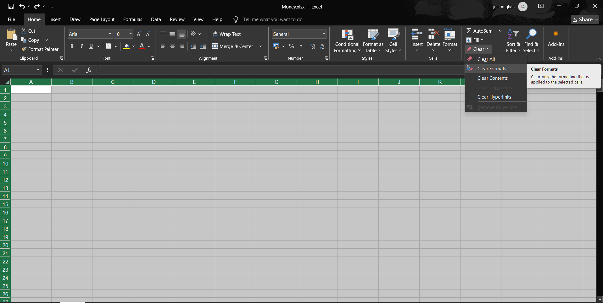

Cell **`C4`** now holds a Base64 string:

```
VGhlIE1hcnRpYW4gQ29sb255LCBCZXNpZGUgSW50ZXJwbGFuZXRhcnkgU3BhY2Vwb3J0Lg==
```

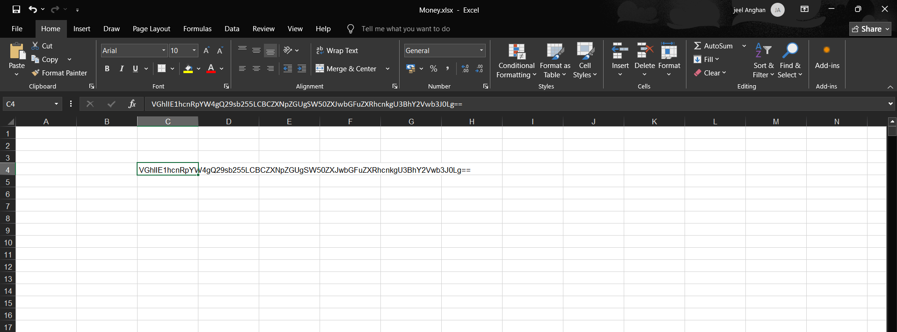

Decoded in CyberChef:

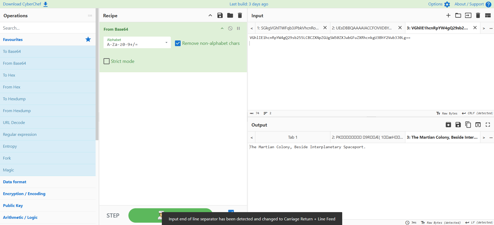

> 📍 **`The Martian Colony, Beside Interplanetary Spaceport.`**

This lines up with the 12.8 light-minute riddle from the email, which pointed at **Mars**.

---

### Phase 8 · Attribution via Metadata 🧾

Ran **ExifTool** over the extracted folder:

```powershell
PS J:\exiftool-13.59_64> & '.\exiftool(-k).exe' J:\...\PuzzleToCoCanDa\*
```

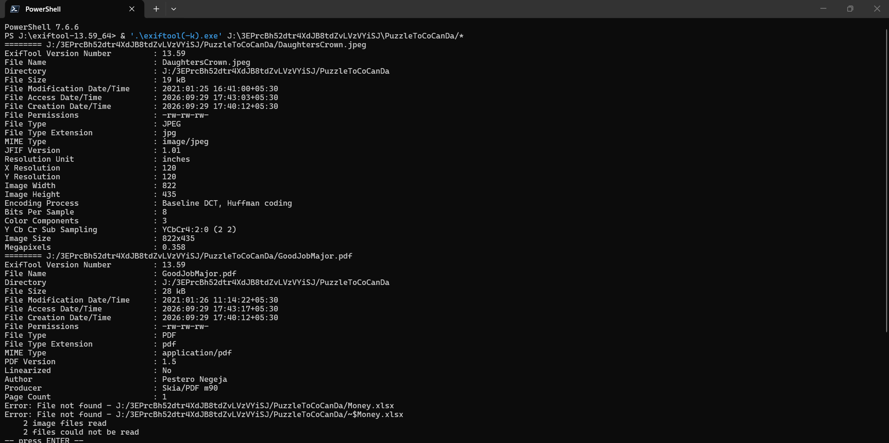

| File | Key metadata |
|---|---|
| `GoodJobMajor.pdf` | **Author: `Pestero Negeja`** · Producer: `Skia/PDF m90` · PDF 1.5 · 1 page · Modified 2021-01-26 11:14:22 |
| `DaughtersCrown.jpeg` | JPEG (JFIF 1.01) · 822 x 435 px · 120 dpi · 0.358 MP · no author or camera data |
| `Money.xlsx` | ExifTool could not read it (the workbook was open in Excel, leaving a `~$Money.xlsx` lock file) |

**Attribution logic:** the PDF's `Author` field gives the actor's name, **Pestero Negeja**. It also matches the `negeja3921` user in the `Reply-To` address, tying the metadata to the email infrastructure. `Skia/PDF` indicates a Chromium-style PDF export (for example Chrome print-to-PDF or Google Docs).

---

### Phase 9 · Challenge Submission ✅


---

## 🏆 Answers & Scoreboard

| # | Question | Answer | Pts |
|---|---|---|:-:|
| 1 | Email service used by the malicious actor? | **Emkei.cz** | 1 |
| 2 | Reply-To email address? | **negeja3921@pashter.com** | 2 |
| 3 | Filetype of the attachment that helped continue the investigation? | **.zip** | 1 |
| 4 | Name of the malicious actor? | **Pestero Negeja** | 2 |
| 5 | Location of the attacker in this Universe? | **The Martian Colony, Beside Interplanetary Spaceport** | 2 |
| 6 | Probable C&C domain controlling the attacker's autonomous bots? | **pashter.com** | 2 |
| | **Total** | | **10 / 10** |

---

## ⚠️ Threat Assessment

| Aspect | Assessment |
|---|---|
| **Stated goal** | Ransom: 1 Billion CoCanDs "in cash, with a spaceship" |
| **Real goal** | Per `Money.xlsx`: *the ransom was a decoy*, and the operation is the start of a **war** against CoCanDians |
| **Sophistication** | Low to medium: free spoofing service, Base64 encoding, extension masquerading, formatting-based hiding |
| **Social engineering** | High emotional pressure (missing child, national crisis) plus a brand-lookalike sender |
| **Evasion techniques** | Wrong MIME type and extension, Base64-wrapped payload, extension-less files, invisible cell text, Base64 inside a cell |
| **Attribution confidence** | Actor name: **medium** (single metadata field). Infrastructure: **medium** (Reply-To domain, weak reputation signal) |
| **Malware present?** | None observed. The files were a JPEG, a PDF and a workbook with no macros seen. This is a **social-engineering / information-hiding** exercise |

---

## 🚨 Indicators of Compromise (IOCs)

| Type | Indicator | Notes |
|---|---|---|
| Email (From) | `billjobs@microapple.com` | Spoofed, lookalike brand |
| Email (Reply-To) | `negeja3921@pashter.com` | Attacker's reply channel |
| Domain | `pashter.com` | VT 1/91 malicious (CRDF), 2 suspicious; probable C&C |
| Domain | `emkei.cz` | Free fake-mailer service used to send |
| IPv4 | `93.99.104.210` | Sending IP, SPF fail |
| Subject | `A Hope to CoCanDa` | |
| Message-ID | `<20210126064118.1993E221F8@localhost>` | Generated on `localhost` |
| MIME boundary | `BOUND_600FB98E0DCEE8.49207210` | |
| Attachment (declared) | `PuzzleToCoCanDa.pdf` (`application/pdf`) | **Really a ZIP** (`50 4B 03 04`) |
| Extracted files | `DaughtersCrown` (JPEG), `GoodJobMajor` (PDF), `Money.xlsx` | |
| Metadata | PDF Author `Pestero Negeja`, Producer `Skia/PDF m90` | Attribution pivot |
| Hidden string | `VGhlIE1hcnRpYW4gQ29sb255LCBCZXNpZGUgSW50ZXJwbGFuZXRhcnkgU3BhY2Vwb3J0Lg==` | Base64 in `Money.xlsx` C4 |

> 📝 **Hashes:** file hashes were not captured in the screenshots. Compute them on your own copy and add them here:
>
> ```powershell
> Get-FileHash .\ATTACHMENT.ZIP, .\DaughtersCrown.jpeg, .\GoodJobMajor.pdf, .\Money.xlsx -Algorithm SHA256
> ```

---

## 🧭 MITRE ATT&CK Mapping

*(analyst-assessed mapping for this scenario)*

| Tactic | Technique | Evidence |
|---|---|---|
| Initial Access | **T1566.001** Phishing: Spearphishing Attachment | Targeted email to the Army Major with a ZIP attachment |
| Defense Evasion | **T1036.008** Masquerading: Masquerade File Type | ZIP delivered as `PuzzleToCoCanDa.pdf` (`application/pdf`) |
| Defense Evasion | **T1027** Obfuscated Files or Information | Base64 body and attachment, Base64 string hidden in a cell |
| Defense Evasion | **T1672** Email Spoofing | Forged `From` via Emkei.cz, SPF fail |
| Defense Evasion / Social Engineering | **T1656** Impersonation | Brand-lookalike sender "Bill" |

---

## ⏱️ Timeline

| When | Event |
|---|---|
| 25 Jan 2021, 04:41 PM | `DaughtersCrown` last-modified time inside the ZIP |
| 26 Jan 2021, 10:27 AM | `Money.xlsx` last-modified time |
| 26 Jan 2021, 11:14 AM | `GoodJobMajor.pdf` last-modified time (PDF metadata: 11:14:22 +05:30) |
| **26 Jan 2021, 01:41:18 EST (06:41:18 UTC)** | Email created on the spoofing host |
| **25 Jan 2021, 22:41:18 PST (06:41:18 UTC)** | Google MX receives the message (same instant) |

> ⏳ ZIP archives store local time **without a timezone**. Read alongside the `+05:30` offset ExifTool reports for the PDF, the three files were prepared **before** the email left at 12:11 IST.

---

## 🛡️ Detection & Defense Recommendations

**Email gateway**
- ✅ Enforce **SPF, DKIM and DMARC** (`p=quarantine` or `p=reject`) so spoofed mail like this is rejected instead of delivered.
- ✅ Alert on **`Reply-To` domain different from `From` domain**.
- ✅ Flag or block mail from known **fake-mailer services** such as `emkei.cz`, and add sending IP `93.99.104.210` to blocklists.
- ✅ Use **true file-type detection (magic bytes)** and quarantine attachments whose MIME type or extension disagrees with their content.

**Endpoint / user layer**
- ✅ Show file extensions in Windows Explorer; the extension-less files here were an easy trap.
- ✅ Open unknown attachments only in a sandbox or VM, never on a production workstation.
- ✅ Train staff that **urgent, emotional, high-stakes emails** are the ones to slow down on.

**Analyst habits**
- ✅ Always read headers **bottom-up**, and trust `Received` and SPF results over the display name.
- ✅ Verify file type by **magic bytes**, not by extension.
- ✅ In spreadsheets, check hidden sheets and formatting (`Clear Formats`, white-on-white text, hidden rows and columns).
- ✅ Treat metadata (`Author`, `Producer`, timestamps) as an attribution pivot, not as proof.

---

## 🤖 Automate It: Python Triage Script

A small script that reproduces the manual workflow: prints key headers, decodes the body, carves attachments, and reports the **real** file type.

> ⚠️ Run it inside a VM. It extracts attacker-supplied archives.

```python
#!/usr/bin/env python3
"""Email triage: show key headers, decode body, carve attachments, sniff real file type."""
import email, io, sys, zipfile
from email import policy
from pathlib import Path

MAGIC = {
    b"PK\x03\x04": "ZIP / OOXML container",
    b"\xff\xd8\xff": "JPEG image",
    b"%PDF": "PDF document",
}

def sniff(data: bytes) -> str:
    return next((n for sig, n in MAGIC.items() if data.startswith(sig)), "unknown")

with open(sys.argv[1], "rb") as fh:
    msg = email.message_from_binary_file(fh, policy=policy.default)

for h in ("From", "To", "Reply-To", "Return-Path", "Subject", "Date", "Message-ID", "Received-SPF"):
    print(f"{h:13}: {msg[h]}")

print("\n--- BODY ---")
print(msg.get_body(preferencelist=("plain",)).get_content())

out = Path("carved"); out.mkdir(exist_ok=True)
for part in msg.iter_attachments():
    name = Path(part.get_filename() or "unnamed.bin").name
    data = part.get_payload(decode=True)
    print(f"[+] {name}: declared={part.get_content_type()} | real={sniff(data)}")
    (out / name).write_bytes(data)
    if data.startswith(b"PK\x03\x04"):
        with zipfile.ZipFile(io.BytesIO(data)) as z:
            z.extractall(out / "unzipped")
            for i in z.infolist():
                print(f"    {i.filename} ({i.file_size} bytes)")
```

```bash
python3 triage.py "A Hope to CoCanDa.eml"
```

---

## 🧠 Skills Demonstrated

- 📨 Email header forensics (SPF results, Received-chain analysis, Reply-To mismatch)
- 🔐 Base64 decoding and encoding in CyberChef
- 🔬 File-signature (magic number) analysis with hex editors
- 🗂️ Detecting file-type masquerading and recovering true formats
- 🧾 Metadata extraction and attribution with ExifTool
- 📊 Uncovering formatting-hidden data in Office documents
- 🌐 Domain and IP reputation checks with VirusTotal
- 🧭 IOC extraction and MITRE ATT&CK mapping
- ✍️ Professional incident write-up and reporting

---

## 🗃️ Evidence Index

| # | File | What it shows |
|:-:|---|---|
| 01 | [`01_email_headers_notepad.png`](images/01_email_headers_notepad.png) | Raw headers: SPF fail, Emkei.cz, Reply-To |
| 02 | [`02_virustotal_pashter_com.png`](images/02_virustotal_pashter_com.png) | VirusTotal result for `pashter.com` |
| 03 | [`03_email_body_base64.png`](images/03_email_body_base64.png) | Base64-encoded email body |
| 04 | [`04_cyberchef_decode_email_body.png`](images/04_cyberchef_decode_email_body.png) | Decoded ransom message and riddle |
| 05 | [`05_attachment_base64_PuzzleToCoCanDa_pdf.png`](images/05_attachment_base64_PuzzleToCoCanDa_pdf.png) | Attachment Base64 (declared PDF) |
| 06 | [`06_cyberchef_base64_to_hex.png`](images/06_cyberchef_base64_to_hex.png) | Decoded bytes start with `50 4B 03 04` |
| 07 | [`07_magic_bytes_zip_PK.png`](images/07_magic_bytes_zip_PK.png) | Signature reference: ZIP |
| 08 | [`08_cyberchef_save_ATTACHMENT_zip.png`](images/08_cyberchef_save_ATTACHMENT_zip.png) | Saving output as `ATTACHMENT.ZIP` |
| 09 | [`09_extracted_files_no_extension.png`](images/09_extracted_files_no_extension.png) | Three extracted files, two without extension |
| 10 | [`10_hxd_DaughtersCrown_jpeg_header.png`](images/10_hxd_DaughtersCrown_jpeg_header.png) | HxD showing the JFIF header |
| 11 | [`11_magic_bytes_jpeg.png`](images/11_magic_bytes_jpeg.png) | Signature reference: JPEG |
| 12 | [`12_magic_bytes_pdf.png`](images/12_magic_bytes_pdf.png) | Signature reference: PDF |
| 13 | [`13_magic_bytes_ooxml_xlsx.png`](images/13_magic_bytes_ooxml_xlsx.png) | Signature reference: OOXML / XLSX |
| 14 | [`14_files_renamed_with_extensions.png`](images/14_files_renamed_with_extensions.png) | Files renamed to true extensions |
| 15 | [`15_DaughtersCrown_jpeg_image.png`](images/15_DaughtersCrown_jpeg_image.png) | The crown image |
| 16 | [`16_GoodJobMajor_pdf.png`](images/16_GoodJobMajor_pdf.png) | The taunt PDF |
| 17 | [`17_Money_xlsx_sheet1_hidden_message.png`](images/17_Money_xlsx_sheet1_hidden_message.png) | Sheet1: "It is the beginning of the WAR" |
| 18 | [`18_Money_xlsx_sheet3_blank.png`](images/18_Money_xlsx_sheet3_blank.png) | Sheet3 appears empty |
| 19 | [`19_Money_xlsx_clear_formats.png`](images/19_Money_xlsx_clear_formats.png) | Clear Formats used to reveal hidden text |
| 20 | [`20_Money_xlsx_C4_base64_string.png`](images/20_Money_xlsx_C4_base64_string.png) | Hidden Base64 string in cell C4 |
| 21 | [`21_cyberchef_decode_attacker_location.png`](images/21_cyberchef_decode_attacker_location.png) | Decoded location: The Martian Colony |
| 22 | [`22_exiftool_metadata_author.png`](images/22_exiftool_metadata_author.png) | ExifTool: Author Pestero Negeja |
| 23 | [`23_btlo_challenge_scenario.png`](images/23_btlo_challenge_scenario.png) | BTLO scenario and lab info |
| 24 | [`24_btlo_challenge_answers.png`](images/24_btlo_challenge_answers.png) | Submitted answers |

---

<div align="center">

### 🛰️ `TRANSMISSION COMPLETE` 🛰️

*The ransom was a decoy, the PDF was a ZIP, the blank sheet wasn't blank, and the attacker was on Mars.*

**Author:** `YOUR NAME` · [LinkedIn](https://www.linkedin.com/in/YOUR-HANDLE) · [GitHub](https://github.com/YOUR-HANDLE)

*Lab created by [Blue Team Labs Online](https://blueteamlabs.online). This write-up is for educational purposes.*

</div>
