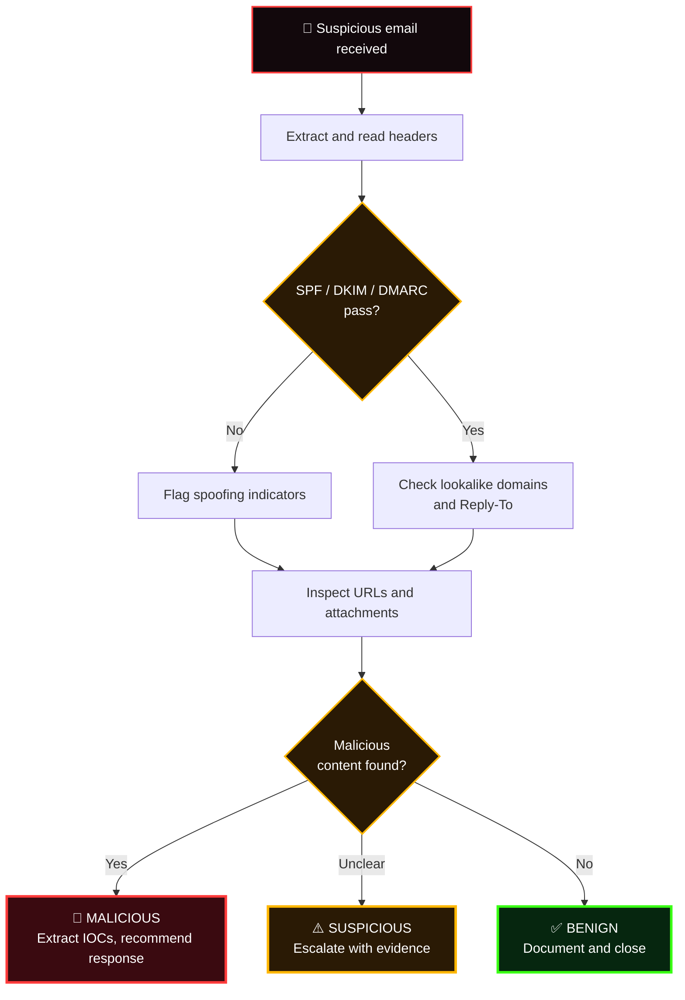

<div align="center">



<br>


<br>

### *"Most breaches begin with one email."*

[`BRIEF`](#-triage-brief) &nbsp;·&nbsp; [`TEARDOWN`](#-the-4-layer-teardown) &nbsp;·&nbsp; [`AUTH`](#-authentication-decoder) &nbsp;·&nbsp; [`FLOW`](#-decision-flow) &nbsp;·&nbsp; [`CASES`](#-case-files) &nbsp;·&nbsp; [`VERDICTS`](#-verdict-scale)


</div>

## 📨 TRIAGE BRIEF

Phishing is the front door of modern attacks, and the human layer is where defenses are thinnest. In this directory, suspicious messages are **dissected end to end** and classified with evidence, not instinct.

Every case answers four questions:

```text
  WHO really sent it?   WHERE does it point?   WHAT does it carry?   WHAT do we do next?
```

<div align="center"></div>

## 🧪 THE 4-LAYER TEARDOWN

| Layer | What I inspect | Tools |
|:--|:--|:--|
| 📬 **Headers** | Sender path, `Received` chain, `Reply-To` and `Return-Path` mismatches, SPF / DKIM / DMARC results | Header analysis |
| 🔗 **URLs** | Lookalike domains, redirects, shortened links, final destination | VirusTotal |
| 📎 **Attachments** | File type, hashes, embedded scripts or macros, reputation | VirusTotal |
| 🌍 **Infrastructure** | Sending IPs and domains, reputation, abuse history | AbuseIPDB · VirusTotal |

<div align="center"></div>

## 🔐 AUTHENTICATION DECODER

| Check | What it proves | A failure suggests |
|:--:|:--|:--|
| **SPF** | The sending server is allowed to send for that domain | Spoofed or unauthorised sender |
| **DKIM** | The message was signed by the domain and not altered in transit | Tampering or forged domain |
| **DMARC** | SPF/DKIM align with the visible `From` domain, per the owner's policy | Domain impersonation |

> ⚠️ Passing all three does **not** make an email safe. Attackers also send from domains they own, so URLs, attachments, and context still decide the verdict.

<div align="center"></div>

## 🧭 DECISION FLOW



<div align="center"></div>

## 🪤 COMMON RED FLAGS

- 🎭 Display name says one thing, the actual address says another
- ↩️ `Reply-To` points to a different domain than `From`
- ⏰ Urgency or threats: "act within 24 hours or lose access"
- 🔗 Link text that doesn't match the real destination
- 🔡 Lookalike domains (`rn` for `m`, `0` for `o`, extra hyphens)
- 📎 Unexpected attachments, especially archives, macros, and scripts

> 🧼 **Safe handling:** indicators are written *defanged* in reports, e.g. `hxxps://secure-login[.]example`, so a stray click can't detonate anything.

<div align="center"></div>

## 🗂️ CASE FILES

<div align="center">

| No. | Case | Platform | Output | Status |
|:--:|:--|:--|:--|:--:|
| `01` | 🎣 [**PhishStrike**](./01-CyberDefender-PhishStrike) | CyberDefenders | Verdict · IOCs · response |  |
| `02` | 🪐 [**The Planets Prestige**](./02-BTLO-ThePlanetsPrestige) | Blue Team Labs Online | Verdict · IOCs · response |  |

</div>

<details>
<summary><b>🎣 &nbsp;Case 01 · PhishStrike</b> &nbsp;<code>// CyberDefenders</code></summary>
<br>

A phishing investigation where a suspicious message is dissected and classified with evidence.

- Analyse headers and trace the sender path
- Inspect URLs and any attachments
- Extract IOCs and check their reputation
- Deliver a verdict with recommended actions

</details>

<details>
<summary><b>🪐 &nbsp;Case 02 · The Planets Prestige</b> &nbsp;<code>// Blue Team Labs Online</code></summary>
<br>

A Blue Team Labs Online phishing challenge: work through the email artifacts to uncover how the attack was built.

- Break down the message structure and headers
- Examine links and payloads
- Collect IOCs and validate them with threat intel
- Document findings and impact

</details>

<div align="center"></div>

## ⚖️ VERDICT SCALE

| Verdict | Meaning | Action |
|:--:|:--|:--|
| 🚨 **Malicious** | Confirmed bad: spoofing plus a harmful link or payload | Block IOCs, purge from mailboxes, notify affected users |
| ⚠️ **Suspicious** | Warning signs but no confirmed payload | Escalate, monitor, gather more evidence |
| ✅ **Benign** | Legitimate after full analysis | Document and close |

## 📁 REPORT FORMAT

```text
📁 Case-Folder/
 ├── 🧭 Scenario          the email and the context
 ├── 📬 Header Analysis   path, auth results, mismatches
 ├── 🔗 URL / File Review reputation and behaviour
 ├── 🧪 IOCs              senders · domains · IPs · hashes
 ├── 🎯 Verdict           malicious · suspicious · benign
 └── 🛡️ Response          impact assessment and recommended actions
```

## 🗺️ FOLDER MAP

```text
04-Phising-Email-Analysis/
├── assets/                          banner & divider graphics
├── 01-CyberDefender-PhishStrike/    Case 01
├── 02-BTLO-ThePlanetsPrestige/      Case 02
└── README.md                        you are here
```

<div align="center">


```text
┌──────────────────────────────────────────────┐
│  READ THE HEADERS.                           │
│  TRUST NO LINK.                              │
│  PROVE THE VERDICT.                          │
└──────────────────────────────────────────────┘
```

</div>
