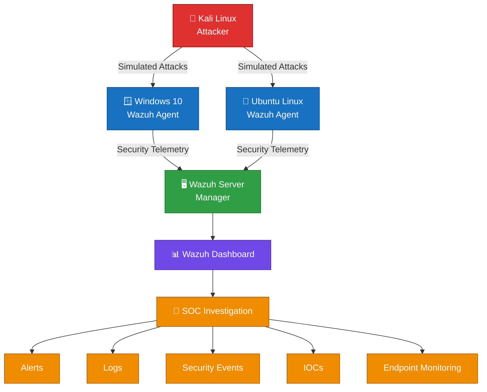

# 🛡️ SOC Home Lab


A hands-on Security Operations Center (SOC) home lab built to practice real-world blue team workflows: security monitoring, attack simulation, detection engineering, log analysis, and incident response — all powered by **Wazuh**.

This project simulates a small enterprise environment where a Kali Linux attacker machine generates real attack telemetry against Windows and Linux endpoints, which is then collected, correlated, and investigated through a centralized SOC pipeline. It's designed to demonstrate practical skills in endpoint monitoring, log analysis, custom rule writing, and MITRE ATT&CK-mapped incident response.

---

## 📑 Table of Contents

- [Objectives](#-objectives)
- [Lab Architecture](#️-lab-architecture)
- [Lab Requirements](#️-lab-requirements)
- [Technologies & Tools](#-technologies--tools)
- [SOC Workflow](#-soc-workflow)
- [Project Structure](#-project-structure)
- [Lab Environment](#️-lab-environment)
- [Security Detection Labs](#-security-detection-labs)
- [Sample Investigation](#-sample-investigation)
- [Evidence](#-evidence)
- [Skills Demonstrated](#-skills-demonstrated)
- [Roadmap](#️-roadmap)
- [Disclaimer](#️-disclaimer)

---

## 🎯 Objectives

- Build a practical SOC monitoring environment
- Monitor Windows and Linux endpoints
- Simulate controlled security attacks
- Collect and analyze security logs
- Create and test custom Wazuh detection rules
- Investigate security alerts
- Map detections to MITRE ATT&CK
- Practice incident response
- Document attack and defense workflows

---

## 🏗️ Lab Architecture



---

## 🖥️ Lab Requirements

| Component | Spec (minimum) |
|---|---|
| Hypervisor | VMware Workstation / VirtualBox / Proxmox |
| Wazuh Server | 2 vCPU, 4 GB RAM, 50 GB disk |
| Windows 10 Endpoint | 2 vCPU, 4 GB RAM, 60 GB disk |
| Ubuntu/Linux Endpoint | 1 vCPU, 2 GB RAM, 25 GB disk |
| Kali Linux Attacker | 2 vCPU, 4 GB RAM, 40 GB disk |
| Network | Isolated internal/host-only network (no bridged access to production) |
| Wazuh Version | 4.x _(pin exact version once finalized)_ |

> ⚠️ All machines run on an isolated virtual network with no internet-facing exposure, to safely contain attack simulations.

---


## 🔧 Technologies & Tools

| Category | Technologies |
|---|---|
| SIEM / XDR | Wazuh |
| Operating Systems | Windows 10, Linux, Kali Linux |
| Log Sources | Windows Event Logs, Linux Logs, Sysmon |
| Attack Simulation | Kali Linux |
| Detection | Wazuh Rules & Custom Rules |
| Endpoint Monitoring | Wazuh Agent |
| Threat Intelligence | VirusTotal, AbuseIPDB |
| Framework | MITRE ATT&CK |
| Network Analysis | Wireshark |
| Scripting | PowerShell, Bash, Python |

---

## 🔍 SOC Workflow

```text
Attack Simulation
       ↓
Log Generation
       ↓
Wazuh Agent
       ↓
Wazuh Server
       ↓
Security Alert
       ↓
Investigation
       ↓
Detection Engineering
       ↓
Response
       ↓
Incident Documentation
```

---

## 📂 Project Structure

```text
SOC-Home-Lab/
│
├── 00-Lab-Architecture/
│   ├── README.md
│   └── screenshots/
│
├── 01-Windows-Security-Monitoring/
│
├── 02-Linux-Security-Monitoring/
│
├── 03-Wazuh-Detection-Engineering/
│
├── 04-Windows-User-Account-Management/
│
└── README.md
```

- [`00-Lab-Architecture/`](./SOC-Home-Lab/00-Lab-Architecture) — network diagram, VM specs, and build notes
- [`01-Windows-Security-Monitoring/`](./SOC-Home-Lab/01-Windows-Security-Monitoring) — Windows Event Log analysis, Sysmon config, brute-force & PowerShell detections
- [`02-Linux-Security-Monitoring/`](./SOC-Home-Lab/02-Linux-Security-Monitoring) — SSH attack detection, suspicious command monitoring
- [`03-Wazuh-Detection-Engineering/`](./SOC-Home-Lab/03-Wazuh-Detection-Engineering) — custom rule development and testing
- [`04-Windows-User-Account-Management/`](./SOC-Home-Lab/04-Windows-User-Account-Management) — account creation/modification monitoring and related detections

---

## 🖥️ Lab Environment

### Wazuh Server
- Linux
- Wazuh Manager
- Wazuh Dashboard
- Centralized security monitoring

### Windows Endpoint
- Windows 10
- Wazuh Agent
- Sysmon
- Windows Security Event Logs
- Endpoint security monitoring

### Attacker Machine
- Kali Linux
- Controlled attack simulations

### Linux Endpoint
- Ubuntu/Linux Wazuh Agent
- Linux attack detection
- Custom Wazuh detection rules

---

## 🚨 Security Detection Labs

Practical security scenarios documented in this repository include:

- Windows authentication attacks
- Brute-force detection
- Suspicious PowerShell activity
- File integrity monitoring
- Windows Event Log analysis
- Linux SSH attacks
- Suspicious Linux commands
- Custom Wazuh detection rules
- IOC investigation
- Incident response

---

## 🔬 Sample Investigation


**Scenario:** SSH Brute-Force Attempt Against Linux Endpoint
**MITRE ATT&CK:** [T1110 – Brute Force](https://attack.mitre.org/techniques/T1110/)

| Step | Detail |
|---|---|
| Trigger | Repeated failed SSH logins from Kali attacker IP |
| Detection | Wazuh rule `5716` (SSHD authentication failure) correlated across threshold |
| Alert Level | 10 |
| Response | IP blocked via `active-response`, account lockout verified |
| Evidence | `screenshots/ssh-bruteforce-alert.png` |

---

## 📊 Evidence

Each investigation folder contains supporting evidence such as:

- Attacker machine screenshots
- Target machine screenshots
- Wazuh alerts
- Event logs
- Detection rules
- Investigation findings
- MITRE ATT&CK mapping
- Incident reports

---

## 🧠 Skills Demonstrated

- SIEM deployment and configuration (Wazuh Manager, Dashboard, Agents)
- Windows and Linux log analysis
- Custom detection rule authoring and testing
- Attack simulation and controlled adversary emulation
- Alert triage and investigation
- MITRE ATT&CK technique mapping
- Incident response documentation
- Scripting for automation (PowerShell, Bash, Python)

---

## 🗺️ Roadmap

- [ ] Complete Windows Security Monitoring write-ups
- [ ] Complete Linux Security Monitoring write-ups
- [ ] Publish custom Wazuh detection rule library
- [ ] Add File Integrity Monitoring (FIM) lab
- [ ] Add threat intel enrichment (VirusTotal / AbuseIPDB integration)

---

## ⚠️ Disclaimer

All attack simulations documented in this repository are performed in an isolated home lab environment for educational and defensive security research purposes.
