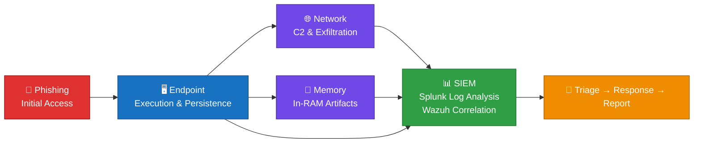

<div align="center">

# 🛡️ SOC-PORTFOLIO
### `> detect. investigate. respond. document._`

**Jeel Anghan** · Aspiring SOC Analyst · Blue Team · Detection Engineering · DFIR


*Five disciplines. One analyst mindset. Every project is hands-on, evidence-backed, and mapped to how real SOC teams work.*

</div>

---

## 🧭 MISSION BRIEF

A SOC analyst doesn't just watch alerts. They **hunt through logs, see the attack on the wire, find it in memory, catch it in the inbox, and build the detection that stops it next time.**

This portfolio is built around exactly that. It moves through the full investigation surface of a modern SOC:

| Layer | Question it answers | Where |
|---|---|---|
| 📊 **Log Analysis & SIEM** | *What do the logs say happened, and can I prove it with a query?* | [01-Splunk-SIEM-Investigations](./01-Splunk-SIEM-Investigations) |
| 🌐 **Network** | *What did the attacker send across the wire?* | [02-PCAP-Analysis](./02-PCAP-Analysis) |
| 🧠 **Memory** | *What is hiding where disk forensics can't see?* | [03-Memory-Forensics](./03-Memory-Forensics) |
| 📧 **Email** | *How did they get in through the front door?* | [04-Phising-Email-Analysis](./04-Phising-Email-Analysis) |
| 🖥️ **Endpoint & Detection** | *What is happening on my machines right now, and how do I alert on it?* | [SOC-Home-Lab](./SOC-Home-Lab) |

---

## 🗺️ THE INVESTIGATION MAP


```mermaid
flowchart LR
    P["📧 Phishing<br/>Initial Access"] --> E["🖥️ Endpoint<br/>Execution & Persistence"]
    E --> N["🌐 Network<br/>C2 & Exfiltration"]
    E --> M["🧠 Memory<br/>In-RAM Artifacts"]
    N --> S["📊 SIEM<br/>Splunk Log Analysis<br/>Wazuh Correlation"]
    M --> S
    E --> S
    S --> R["🚨 Triage → Response → Report"]

    classDef a fill:#e03131,color:#fff,stroke:#900;
    classDef b fill:#1971c2,color:#fff,stroke:#0b4a86;
    classDef c fill:#7048e8,color:#fff,stroke:#4c2d99;
    classDef d fill:#2f9e44,color:#fff,stroke:#1b6e2f;
    classDef f fill:#f08c00,color:#fff,stroke:#a35d00;
    class P a;
    class E b;
    class N,M c;
    class S d;
    class R f;
```

> Each folder covers one stage of a real attack chain, so together they read as one story, from **the first click to the final report**.

---

## 📦 PROJECT MODULES

### 📊 [01 · Splunk SIEM Investigations](./01-Splunk-SIEM-Investigations) `// log analysis · SPL · threat hunting`
Where the investigation starts for most SOC analysts: the SIEM. Raw logs are ingested, searched, and turned into a clear story of what happened.
- Log analysis using **Splunk** and **SPL** (Search Processing Language)
- Searching, filtering, and correlating events to find suspicious activity
- Building timelines and identifying indicators of compromise from log data
- Documenting findings as investigation write-ups

**Tools:** `Splunk` `SPL` `Log Analysis`

---

### 🌐 [02 · PCAP Analysis](./02-PCAP-Analysis) `// network forensics`
Reading the network like a crime scene. Packet captures are analyzed to reconstruct what happened, who talked to whom, and what left the building.
- Traffic triage and protocol analysis
- Identifying suspicious hosts, connections, and payloads
- Extracting IOCs (IPs, domains, file hashes) from traffic
- Timeline reconstruction of network-based incidents

**Tools:** `Wireshark` `Threat Intel Lookups` `IOC Extraction`

---

### 🧠 [03 · Memory Forensics](./03-Memory-Forensics) `// volatile evidence`
Attackers can avoid the disk, but they can't avoid RAM. Memory images are examined for evidence of malicious activity that leaves little or no trace elsewhere.
- Process and network-connection analysis from memory dumps
- Hunting for suspicious or injected processes
- Recovering artifacts and indicators from volatile memory
- Documenting findings as an investigation report

**Tools:** `Memory Analysis Frameworks` `Command-Line Forensics`

---

### 📧 [04 · Phishing Email Analysis](./04-Phising-Email-Analysis) `// human-layer defense`
Most breaches begin with one email. Suspicious messages are dissected end to end and classified with evidence.
- Email header analysis (sender path, SPF/DKIM/DMARC results)
- URL and attachment inspection
- IOC extraction and reputation checks
- Verdict, impact assessment, and recommended response actions

**Tools:** `Header Analysis` `VirusTotal` `AbuseIPDB`

---

### 🖥️ [SOC Home Lab](./SOC-Home-Lab) `// endpoint monitoring · SIEM · detection engineering`
A small simulated enterprise: **Kali** attacks, **Windows 10** and **Ubuntu** endpoints report to a central **Wazuh** server.
- Wazuh Manager, Dashboard, and Agents deployed on an isolated network
- Windows Event Logs and Sysmon telemetry, plus Linux log monitoring
- Attack simulation: brute force, suspicious PowerShell, SSH attacks
- Custom Wazuh detection rules mapped to MITRE ATT&CK
- Alert triage, IOC investigation, and incident documentation

**Tools:** `Wazuh` `Sysmon` `Kali Linux` `PowerShell` `Bash`

---

## 🎯 MITRE ATT&CK COVERAGE

| Tactic | Technique | Explored In |
|---|---|---|
| Initial Access | [T1566 – Phishing](https://attack.mitre.org/techniques/T1566/) | Phishing Email Analysis |
| Execution | [T1059.001 – PowerShell](https://attack.mitre.org/techniques/T1059/001/) | SOC Home Lab |
| Credential Access | [T1110 – Brute Force](https://attack.mitre.org/techniques/T1110/) | SOC Home Lab |
| Command & Control | [T1071 – Application Layer Protocol](https://attack.mitre.org/techniques/T1071/) | PCAP Analysis |
| Defense Evasion | [T1055 – Process Injection](https://attack.mitre.org/techniques/T1055/) | Memory Forensics |

*The table grows as new investigations are documented.*

---

## 🧰 ARSENAL

| Domain | Stack |
|---|---|
| **SIEM / XDR** | Splunk (SPL searches, log investigation), Wazuh (Manager, Dashboard, Agents) |
| **Endpoint Telemetry** | Sysmon, Windows Event Logs, Linux Logs |
| **Network** | Wireshark |
| **Threat Intel** | VirusTotal, AbuseIPDB |
| **Offensive Simulation** | Kali Linux |
| **Automation** | PowerShell, Bash, Python |
| **Framework** | MITRE ATT&CK |

---

## 🧠 SKILLS DEMONSTRATED

```text
[■■■■■■■■■■] SIEM deployment & configuration
[■■■■■■■■■□] Splunk log analysis & SPL searching
[■■■■■■■■■■] Log analysis (Windows / Linux)
[■■■■■■■■■□] Custom detection rule engineering
[■■■■■■■■■□] Network traffic & PCAP analysis
[■■■■■■■■□□] Memory forensics
[■■■■■■■■■□] Phishing triage & IOC extraction
[■■■■■■■■■□] MITRE ATT&CK mapping
[■■■■■■■■■□] Incident response documentation
```

---

## 🔄 HOW I WORK

Every investigation follows the same repeatable workflow:

```text
 COLLECT ──► TRIAGE ──► ANALYZE ──► CORRELATE ──► DETECT ──► RESPOND ──► REPORT
```

Each write-up ships with **evidence** (screenshots, logs, captures), **IOCs**, **MITRE mapping**, and **findings**, so any reviewer can follow the reasoning, not just the conclusion.

---

## 🗂️ REPOSITORY STRUCTURE

```text
SOC-Portfolio/
│
├── 01-Splunk-SIEM-Investigations/  → Log analysis & threat hunting with Splunk
├── 02-PCAP-Analysis/               → Network forensics & traffic investigation
├── 03-Memory-Forensics/            → Volatile memory analysis
├── 04-Phising-Email-Analysis/      → Email threat investigation
├── SOC-Home-Lab/                   → Wazuh SIEM, endpoint monitoring, custom rules
└── README.md                       → You are here
```

---

## 🚀 ROADMAP

- [x] Splunk SIEM log analysis investigations
- [x] PCAP analysis investigations
- [x] Memory forensics investigations
- [x] Phishing email analysis
- [x] Wazuh SOC home lab (Windows + Linux + Kali)
- [ ] Publish custom Wazuh detection rule library
- [ ] File Integrity Monitoring lab
- [ ] Threat-intel enrichment (VirusTotal / AbuseIPDB integration)
- [ ] Threat hunting with ELK
- [ ] Full end-to-end incident response case study

---

## 📡 CONNECT

<div align="center">

[](https://github.com/JeelAnghanSec)
[](https://www.linkedin.com/in/jeel-anghan-3b443534a/)
[](mailto:YOUR-EMAIL@example.com)

**Open to SOC Analyst (L1) and Blue Team opportunities.**

</div>

---

## ⚠️ DISCLAIMER

All work in this repository is performed in isolated lab environments or on sanitized samples, strictly for **educational and defensive security purposes**. No real systems, networks, or individuals were targeted.

<div align="center">

`> stay curious. stay defensive. keep hunting._`

</div>
