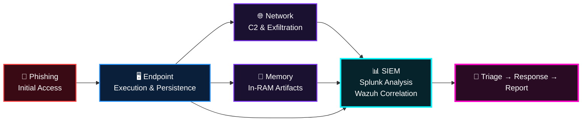

<div align="center">


<a href="https://git.io/typing-svg"></a>

<br>


<br>

**[ Mission ](#-mission-brief) · [ Kill Chain ](#-the-investigation-map) · [ Modules ](#-project-modules) · [ ATT&CK ](#-mitre-attck-coverage) · [ Roadmap ](#-roadmap) · [ Connect ](#-connect)**

<br>

*Five disciplines. One analyst mindset.*
*Every project is hands-on, evidence-backed, and mapped to how real SOC teams work.*

</div>

---

## 🛰️ MISSION BRIEF

> **"A SOC analyst doesn't just watch alerts."**
> They hunt through logs, see the attack on the wire, find it in memory, catch it in the inbox, and build the detection that stops it next time.

This portfolio walks the **full investigation surface of a modern SOC**:

<table align="center">
<tr>
<td align="center" width="20%"><h2>📊</h2><b>LOGS & SIEM</b><br><sub><i>What do the logs say happened?</i></sub><br><br><a href="./01-Splunk-SIEM-Investigations"><code>01 · Splunk</code></a></td>
<td align="center" width="20%"><h2>🌐</h2><b>NETWORK</b><br><sub><i>What crossed the wire?</i></sub><br><br><a href="./02-PCAP-Analysis"><code>02 · PCAP</code></a></td>
<td align="center" width="20%"><h2>🧠</h2><b>MEMORY</b><br><sub><i>What hides where disk can't see?</i></sub><br><br><a href="./03-Memory-Forensics"><code>03 · RAM</code></a></td>
<td align="center" width="20%"><h2>📧</h2><b>EMAIL</b><br><sub><i>How did they get in the front door?</i></sub><br><br><a href="./04-Phising-Email-Analysis"><code>04 · Phishing</code></a></td>
<td align="center" width="20%"><h2>🖥️</h2><b>ENDPOINT</b><br><sub><i>What's happening on my machines now?</i></sub><br><br><a href="./SOC-Home-Lab"><code>05 · Home Lab</code></a></td>
</tr>
</table>

---

## 🧬 THE INVESTIGATION MAP

> Each folder covers one stage of a real attack chain, so together they read as one story: **from the first click to the final report.**


```mermaid
flowchart LR
    P["📧 Phishing<br/>Initial Access"] --> E["🖥️ Endpoint<br/>Execution & Persistence"]
    E --> N["🌐 Network<br/>C2 & Exfiltration"]
    E --> M["🧠 Memory<br/>In-RAM Artifacts"]
    N --> S["📊 SIEM<br/>Splunk Analysis<br/>Wazuh Correlation"]
    M --> S
    E --> S
    S --> R["🚨 Triage → Response → Report"]

    classDef phish fill:#3a0a14,stroke:#ff3b3b,stroke-width:2px,color:#fff;
    classDef endp fill:#0a1f3a,stroke:#1e90ff,stroke-width:2px,color:#fff;
    classDef intel fill:#1a1030,stroke:#7b2ff7,stroke-width:2px,color:#fff;
    classDef siem fill:#06222b,stroke:#00f5ff,stroke-width:3px,color:#fff;
    classDef resp fill:#2a0b24,stroke:#ff00c8,stroke-width:3px,color:#fff;
    class P phish;
    class E endp;
    class N,M intel;
    class S siem;
    class R resp;
```

---

## 🚀 PROJECT MODULES

<div align="center">

| ID | MODULE | DOMAIN | TOOLS | STATUS |
|:--:|:--|:--|:--|:--:|
| `01` | 📊 [**Splunk SIEM Investigations**](./01-Splunk-SIEM-Investigations) | Log analysis · SPL · threat hunting | `Splunk` `SPL` |  |
| `02` | 🌐 [**PCAP Analysis**](./02-PCAP-Analysis) | Network forensics | `Wireshark` `IOC Extraction` |  |
| `03` | 🧠 [**Memory Forensics**](./03-Memory-Forensics) | Volatile evidence | `Memory Frameworks` `CLI Forensics` |  |
| `04` | 📧 [**Phishing Email Analysis**](./04-Phising-Email-Analysis) | Human-layer defense | `Header Analysis` `VirusTotal` `AbuseIPDB` |  |
| `05` | 🖥️ [**SOC Home Lab**](./SOC-Home-Lab) | Endpoint monitoring · detection engineering | `Wazuh` `Sysmon` `Kali` `PowerShell` `Bash` |  |

</div>

<details>
<summary><b>📊 &nbsp;01 · Splunk SIEM Investigations</b> &nbsp;<code>// log analysis · SPL · threat hunting</code></summary>
<br>

Where the investigation starts for most SOC analysts: the SIEM. Raw logs are ingested, searched, and turned into a clear story of what happened.

- Log analysis using **Splunk** and **SPL** (Search Processing Language)
- Searching, filtering, and correlating events to find suspicious activity
- Building timelines and identifying indicators of compromise from log data
- Documenting findings as investigation write-ups

</details>

<details>
<summary><b>🌐 &nbsp;02 · PCAP Analysis</b> &nbsp;<code>// network forensics</code></summary>
<br>

Reading the network like a crime scene. Packet captures are analyzed to reconstruct what happened, who talked to whom, and what left the building.

- Traffic triage and protocol analysis
- Identifying suspicious hosts, connections, and payloads
- Extracting IOCs (IPs, domains, file hashes) from traffic
- Timeline reconstruction of network-based incidents

</details>

<details>
<summary><b>🧠 &nbsp;03 · Memory Forensics</b> &nbsp;<code>// volatile evidence</code></summary>
<br>

Attackers can avoid the disk, but they can't avoid RAM. Memory images are examined for evidence of malicious activity that leaves little or no trace elsewhere.

- Process and network-connection analysis from memory dumps
- Hunting for suspicious or injected processes
- Recovering artifacts and indicators from volatile memory
- Documenting findings as an investigation report

</details>

<details>
<summary><b>📧 &nbsp;04 · Phishing Email Analysis</b> &nbsp;<code>// human-layer defense</code></summary>
<br>

Most breaches begin with one email. Suspicious messages are dissected end to end and classified with evidence.

- Email header analysis (sender path, SPF / DKIM / DMARC results)
- URL and attachment inspection
- IOC extraction and reputation checks
- Verdict, impact assessment, and recommended response actions

</details>

<details>
<summary><b>🖥️ &nbsp;05 · SOC Home Lab</b> &nbsp;<code>// endpoint monitoring · SIEM · detection engineering</code></summary>
<br>

A small simulated enterprise: **Kali** attacks, **Windows 10** and **Ubuntu** endpoints report to a central **Wazuh** server.

- Wazuh Manager, Dashboard, and Agents deployed on an isolated network
- Windows Event Logs and Sysmon telemetry, plus Linux log monitoring
- Attack simulation: brute force, suspicious PowerShell, SSH attacks
- Custom Wazuh detection rules mapped to MITRE ATT&CK
- Alert triage, IOC investigation, and incident documentation

</details>

---

## 🎯 MITRE ATT&CK COVERAGE

| TACTIC | TECHNIQUE | EXPLORED IN |
|:--|:--|:--|
| 🚪 Initial Access | [T1566 · Phishing](https://attack.mitre.org/techniques/T1566/) | Phishing Email Analysis |
| ⚙️ Execution | [T1059.001 · PowerShell](https://attack.mitre.org/techniques/T1059/001/) | SOC Home Lab |
| 🔑 Credential Access | [T1110 · Brute Force](https://attack.mitre.org/techniques/T1110/) | SOC Home Lab |
| 📡 Command & Control | [T1071 · Application Layer Protocol](https://attack.mitre.org/techniques/T1071/) | PCAP Analysis |
| 🥷 Defense Evasion | [T1055 · Process Injection](https://attack.mitre.org/techniques/T1055/) | Memory Forensics |

<sub>*The table grows as new investigations are documented.*</sub>

---

## 🧰 ARSENAL

<div align="center">


</div>

| DOMAIN | STACK |
|:--|:--|
| **SIEM / XDR** | Splunk (SPL, log investigation) · Wazuh (Manager, Dashboard, Agents) |
| **Endpoint Telemetry** | Sysmon · Windows Event Logs · Linux Logs |
| **Network** | Wireshark |
| **Threat Intel** | VirusTotal · AbuseIPDB |
| **Offensive Simulation** | Kali Linux |
| **Automation** | PowerShell · Bash · Python |
| **Framework** | MITRE ATT&CK |

---

## 🧠 SKILL MATRIX

```text
SIEM deployment & configuration     ▰▰▰▰▰▰▰▰▰▰  
Log analysis (Windows / Linux)      ▰▰▰▰▰▰▰▰▰▰  
Splunk log analysis & SPL           ▰▰▰▰▰▰▰▰▰▱  
Custom detection rule engineering   ▰▰▰▰▰▰▰▰▰▱  
Network traffic & PCAP analysis     ▰▰▰▰▰▰▰▰▰▱  
Phishing triage & IOC extraction    ▰▰▰▰▰▰▰▰▰▱  
MITRE ATT&CK mapping                ▰▰▰▰▰▰▰▰▰▱  
Incident response documentation     ▰▰▰▰▰▰▰▰▰▱  
Memory forensics                    ▰▰▰▰▰▰▰▰▱▱  
```

---

## 🔄 HOW I WORK

Every investigation follows the same repeatable workflow:

```text
 ┌─────────┐   ┌────────┐   ┌─────────┐   ┌───────────┐   ┌────────┐   ┌─────────┐   ┌────────┐
 │ COLLECT │─▶│ TRIAGE │─▶│ ANALYZE │─▶│ CORRELATE │─▶│ DETECT │─▶│ RESPOND │─▶│ REPORT │
 └─────────┘   └────────┘   └─────────┘   └───────────┘   └────────┘   └─────────┘   └────────┘
```

Each write-up ships with **evidence** (screenshots, logs, captures), **IOCs**, **MITRE mapping**, and **findings**, so any reviewer can follow the reasoning, not just the conclusion.

---

## 🗂️ REPOSITORY STRUCTURE

```text
SOC-Portfolio/
│
├── 01-Splunk-SIEM-Investigations/   → Log analysis & threat hunting with Splunk
├── 02-PCAP-Analysis/                → Network forensics & traffic investigation
├── 03-Memory-Forensics/             → Volatile memory analysis
├── 04-Phising-Email-Analysis/       → Email threat investigation
├── SOC-Home-Lab/                    → Wazuh SIEM, endpoint monitoring, custom rules
└── README.md                        → You are here
```

---

## 🛣️ ROADMAP

- [x] Splunk SIEM log analysis investigations
- [x] PCAP analysis investigations
- [x] Memory forensics investigations
- [x] Phishing email analysis
- [x] Wazuh SOC home lab (Windows + Linux + Kali)
- [ ] Publish custom Wazuh detection rule library
- [ ] File Integrity Monitoring lab
- [ ] Threat-intel enrichment (VirusTotal / AbuseIPDB integration)
- [ ] Threat hunting with ELK
- [ ] Full end-to-end incident response case study

---

## 📡 CONNECT

<div align="center">

[](https://github.com/JeelAnghanSec)
[](https://www.linkedin.com/in/jeel-anghan-3b443534a/)
[](mailto:YOUR-EMAIL@example.com)

### 🟢 Open to SOC Analyst (L1) and Blue Team opportunities

</div>

---

## ⚠️ DISCLAIMER

All work in this repository is performed in isolated lab environments or on sanitized samples, strictly for **educational and defensive security purposes**. No real systems, networks, or individuals were targeted.

<div align="center">

```text
╔══════════════════════════════════════════════════╗
║   > ALERTS TRIAGED ............. ∞               ║
║   > BLIND SPOTS ................ 0               ║
║   > OPERATOR STATUS ............ LEARNING 24/7   ║
╚══════════════════════════════════════════════════╝
```

### ⚡ *stay curious. stay defensive. keep hunting.* ⚡


</div>
