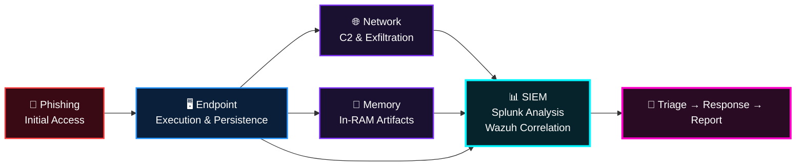

<div align="center">



<br>


<br>

**[Mission](#-mission-brief) · [Attack Chain](#-the-investigation-map) · [Modules](#-project-modules) · [Home Lab](#-soc-home-lab-in-detail) · [ATT&CK](#-mitre-attck-coverage) · [Roadmap](#-roadmap) · [Connect](#-connect)**

<br>

*Five disciplines. One analyst mindset.*
*Every project is hands-on, evidence-backed and mapped to how real SOC teams work.*

</div>


## 🛰️ MISSION BRIEF

> **"A SOC analyst doesn't just watch alerts."**
> They hunt through logs, see the attack on the wire, find it in memory, catch it in the inbox, and build the detection that stops it next time.

This portfolio walks the **full investigation surface of a modern SOC**:

<table align="center">
<tr>
<td align="center" width="20%"><h2>📊</h2><b>LOGS & SIEM</b><br><sub><i>What do the logs say happened?</i></sub><br><br><a href="./01-Splunk-SIEM-Investigations"><code>01 · Splunk</code></a></td>
<td align="center" width="20%"><h2>🌐</h2><b>NETWORK</b><br><sub><i>What crossed the wire?</i></sub><br><br><a href="./02-PCAP-Analysis"><code>02 · PCAP</code></a></td>
<td align="center" width="20%"><h2>🧠</h2><b>MEMORY</b><br><sub><i>What hides where disk can't see?</i></sub><br><br><a href="./03-Memory-Forensics"><code>03 · RAM</code></a></td>
<td align="center" width="20%"><h2>📧</h2><b>EMAIL</b><br><sub><i>How did they get in the front door?</i></sub><br><br><a href="./04-Phishing-Email-Analysis"><code>04 · Phishing</code></a></td>
<td align="center" width="20%"><h2>🖥️</h2><b>ENDPOINT</b><br><sub><i>What's happening on my machines now?</i></sub><br><br><a href="./SOC-Home-Lab"><code>05 · Home Lab</code></a></td>
</tr>
</table>


## 🧬 THE INVESTIGATION MAP

> Each folder covers one stage of a real attack chain, so together they read as one story: **from the first click to the final report.**


```mermaid
flowchart LR
    P["📧 Phishing<br/>Initial Access"] --> E["🖥️ Endpoint<br/>Execution & Persistence"]
    E --> N["🌐 Network<br/>C2 & Exfiltration"]
    E --> M["🧠 Memory<br/>In-RAM Artifacts"]
    N --> S["📊 SIEM<br/>Splunk Analysis<br/>Wazuh Correlation"]
    M --> S
    E --> S
    S --> R["🚨 Triage → Response → Report"]

    classDef phish fill:#3a0a14,stroke:#ff3b3b,stroke-width:2px,color:#fff;
    classDef endp fill:#0a1f3a,stroke:#1e90ff,stroke-width:2px,color:#fff;
    classDef intel fill:#1a1030,stroke:#7b2ff7,stroke-width:2px,color:#fff;
    classDef siem fill:#06222b,stroke:#00f5ff,stroke-width:3px,color:#fff;
    classDef resp fill:#2a0b24,stroke:#ff00c8,stroke-width:3px,color:#fff;
    class P phish;
    class E endp;
    class N,M intel;
    class S siem;
    class R resp;
```


## 🚀 PROJECT MODULES

<div align="center">

| ID | MODULE | DOMAIN | TOOLS | STATUS |
|:--:|:--|:--|:--|:--:|
| `01` | 📊 [**Splunk SIEM Investigations**](./01-Splunk-SIEM-Investigations) | Log analysis · SPL · threat hunting | `Splunk` `SPL` |  |
| `02` | 🌐 [**PCAP Analysis**](./02-PCAP-Analysis) | Network forensics | `Wireshark` `IOC Extraction` |  |
| `03` | 🧠 [**Memory Forensics**](./03-Memory-Forensics) | Volatile evidence | `Memory Frameworks` `CLI Forensics` |  |
| `04` | 📧 [**Phishing Email Analysis**](./04-Phishing-Email-Analysis) | Human-layer defense | `Header Analysis` `VirusTotal` `AbuseIPDB` |  |
| `05` | 🖥️ [**SOC Home Lab**](./SOC-Home-Lab) | Endpoint monitoring · detection engineering | `Wazuh` `Sysmon` `Kali` `PowerShell` `Bash` |  |

</div>

<details>
<summary><b>📊 &nbsp;01 · Splunk SIEM Investigations</b> &nbsp;<code>// log analysis · SPL · threat hunting</code></summary>
<br>

Where most SOC investigations start: raw logs ingested, searched and turned into a clear story of what happened.

- [Hack The Box: Unit42](./01-Splunk-SIEM-Investigations/01-Hack-The-Box-Unit42)
- [Hack The Box: LogJammer](./01-Splunk-SIEM-Investigations/02-Hack-The-Box-%20LogJammer)
- Searching, filtering and correlating events with **SPL**, building timelines and extracting IOCs

</details>

<details>
<summary><b>🌐 &nbsp;02 · PCAP Analysis</b> &nbsp;<code>// network forensics</code></summary>
<br>

Reading the network like a crime scene: who talked to whom, and what left the building.

- [Network Analysis](./02-PCAP-Analysis/01-Network%20Analysis)
- [CyberDefenders: Tomcat](./02-PCAP-Analysis/02-CyberDefenders-Tomcat)
- Protocol analysis, suspicious host and payload identification, IOC extraction

</details>

<details>
<summary><b>🧠 &nbsp;03 · Memory Forensics</b> &nbsp;<code>// volatile evidence</code></summary>
<br>

Attackers can avoid the disk, but not RAM. Memory images are examined for activity that leaves little trace elsewhere.

- [CyberDefenders: Reveal Lab](./03-Memory-Forensics/01-CyberDefenders-Reveal-Lab)
- [CyberDefenders: RedLine Lab](./03-Memory-Forensics/02-CyberDefenders-RedLine-Lab)
- Process and network-connection analysis, injected process hunting, artifact recovery

</details>

<details>
<summary><b>📧 &nbsp;04 · Phishing Email Analysis</b> &nbsp;<code>// human-layer defense</code></summary>
<br>

Most breaches begin with one email. Suspicious messages are dissected end to end and classified with evidence.

- [CyberDefenders: PhishStrike](./04-Phishing-Email-Analysis/01-CyberDefender-PhishStrike)
- [BTLO: The Planets Prestige](./04-Phishing-Email-Analysis/02-BTLO-ThePlanetsPrestige)
- Header analysis (SPF / DKIM / DMARC), URL and attachment inspection, reputation checks, verdict and response actions

</details>

<details>
<summary><b>🖥️ &nbsp;05 · SOC Home Lab</b> &nbsp;<code>// endpoint monitoring · detection engineering</code></summary>
<br>

A small simulated enterprise: **Kali** attacks, **Windows 10** and **Ubuntu** endpoints report to a central **Wazuh** server. Full breakdown in the next section.

</details>


## 🖥️ SOC HOME LAB IN DETAIL

An isolated lab where attacks are simulated, detected, investigated and documented, the same loop a real SOC runs every day.

```text
   ┌──────────────┐      attacks      ┌─────────────────────────┐
   │  Kali Linux  │ ────────────────▶ │ Windows 10  │  Ubuntu   │
   │  (attacker)  │                   │ Sysmon+Agent│  Agent    │
   └──────────────┘                   └────────────┬────────────┘
                                                   │ telemetry
                                         ┌─────────▼─────────┐
                                         │ Wazuh Manager +   │
                                         │ Dashboard (SIEM)  │
                                         └───────────────────┘
```

| # | LAB MODULE | WHAT IT COVERS |
|:--:|:--|:--|
| `00` | [**Lab Architecture**](./SOC-Home-Lab/00-Lab-Architecture) | Network design, VM roles, Wazuh Manager / Dashboard / Agent deployment |
| `01` | [**Windows Security Monitoring**](./SOC-Home-Lab/01-Windows-Security-Monitoring) | Windows Event Logs and Sysmon telemetry, suspicious PowerShell, brute force detection |
| `02` | [**Linux Security Monitoring**](./SOC-Home-Lab/02-Linux-Security-Monitoring) | Linux log monitoring, SSH attack detection and investigation |
| `03` | [**Wazuh Detection Engineering**](./SOC-Home-Lab/03-Wazuh-Detection-Engineering) | Custom Wazuh rules mapped to MITRE ATT&CK |
| `04` | [**Windows User Account Management**](./SOC-Home-Lab/04-Windows-User-Account-Management) | Monitoring account creation, changes and privilege activity |
| `05` | [**Wazuh File Integrity Monitoring**](./SOC-Home-Lab/05-Wazuh-File-Integrity-Monitoring) | Detecting unauthorized file changes on monitored endpoints |


## 🎯 MITRE ATT&CK COVERAGE

| TACTIC | TECHNIQUE | EXPLORED IN |
|:--|:--|:--|
| 🚪 Initial Access | [T1566 · Phishing](https://attack.mitre.org/techniques/T1566/) | Phishing Email Analysis |
| ⚙️ Execution | [T1059.001 · PowerShell](https://attack.mitre.org/techniques/T1059/001/) | SOC Home Lab |
| 🔑 Credential Access | [T1110 · Brute Force](https://attack.mitre.org/techniques/T1110/) | SOC Home Lab |
| 📡 Command & Control | [T1071 · Application Layer Protocol](https://attack.mitre.org/techniques/T1071/) | PCAP Analysis |
| 🥷 Defense Evasion | [T1055 · Process Injection](https://attack.mitre.org/techniques/T1055/) | Memory Forensics |

<sub>*The table grows as new investigations are documented.*</sub>


## 🧰 ARSENAL

<div align="center">


</div>

| DOMAIN | STACK |
|:--|:--|
| **SIEM / XDR** | Splunk (SPL) · Wazuh (Manager, Dashboard, Agents, FIM) |
| **Endpoint Telemetry** | Sysmon · Windows Event Logs · Linux Logs |
| **Network** | Wireshark |
| **Threat Intel** | VirusTotal · AbuseIPDB |
| **Offensive Simulation** | Kali Linux |
| **Automation** | PowerShell · Bash · Python |
| **Framework** | MITRE ATT&CK |


## 🔄 HOW I WORK

Every investigation follows the same repeatable workflow:

```text
COLLECT ─▶ TRIAGE ─▶ ANALYZE ─▶ CORRELATE ─▶ DETECT ─▶ RESPOND ─▶ REPORT
```

Each write-up ships with **evidence** (screenshots, logs, captures), **IOCs**, **MITRE mapping** and **findings**, so any reviewer can follow the reasoning, not just the conclusion.

## 🗂️ REPOSITORY STRUCTURE

```text
SOC-Portfolio/
├── 01-Splunk-SIEM-Investigations/   → Unit42 · LogJammer
├── 02-PCAP-Analysis/                → Network Analysis · Tomcat
├── 03-Memory-Forensics/             → Reveal · RedLine
├── 04-Phishing-Email-Analysis/       → PhishStrike · The Planets Prestige
├── SOC-Home-Lab/                    → Architecture · Windows · Linux · Detection Rules · Accounts · FIM
├── assets/                          → banner and divider
└── README.md                        → You are here
```


## 🛣️ ROADMAP

- [x] Splunk SIEM log analysis investigations
- [x] PCAP analysis investigations
- [x] Memory forensics investigations
- [x] Phishing email analysis
- [x] Wazuh SOC home lab (Windows + Linux + Kali)
- [x] Custom Wazuh detection engineering
- [x] File Integrity Monitoring lab
- [ ] Threat-intel enrichment (VirusTotal / AbuseIPDB integration)
- [ ] Threat hunting with ELK
- [ ] Full end-to-end incident response case study

## 📡 CONNECT

<div align="center">

[](https://github.com/JeelAnghanSec)
[](https://www.linkedin.com/in/jeel-anghan-3b443534a/)
[](mailto:YOUR-EMAIL@example.com)

### 🟢 Open to SOC Analyst (L1) and Blue Team opportunities

</div>

## ⚠️ DISCLAIMER

All work in this repository is performed in isolated lab environments or on sanitized samples, strictly for **educational and defensive security purposes**. No real systems, networks or individuals were targeted.

<div align="center">


### ⚡ *stay curious. stay defensive. keep hunting.* ⚡

</div>
