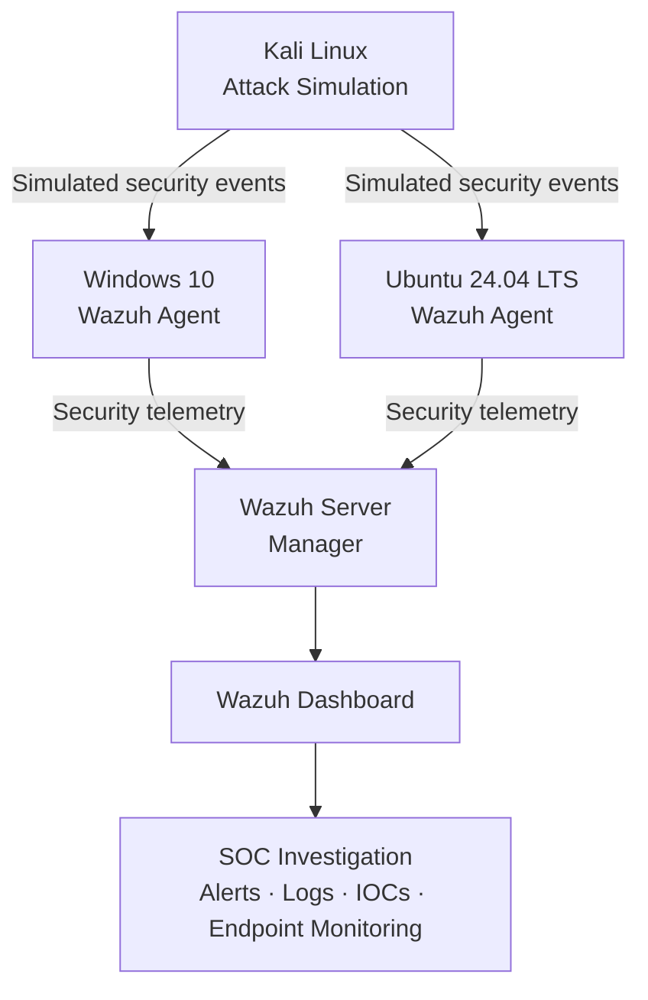
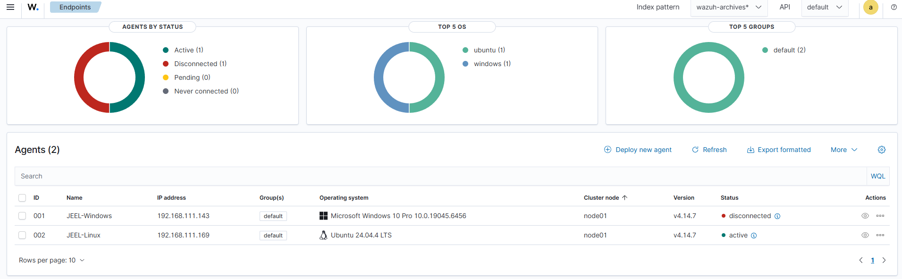
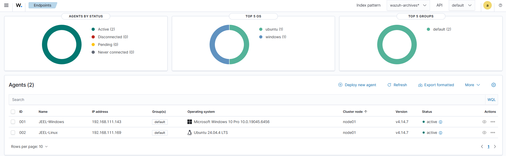
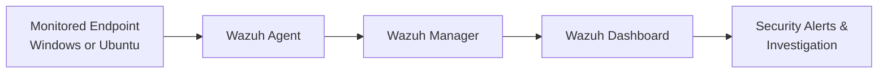

# 🏗️ SOC Home Lab — Architecture & Endpoint Monitoring

## Overview

This document covers the architecture of my Security Operations Center (SOC) home lab, built to practice centralized log collection, endpoint monitoring, and security event investigation using **Wazuh**. The lab simulates a small enterprise environment with monitored Windows and Linux endpoints, an attacker machine for generating security events, and a central SIEM/XDR platform for detection and analysis.

## Lab Components

| System            | Role                              | Platform              |
|-------------------|------------------------------------|------------------------|
| Wazuh Server      | SIEM / XDR (central manager)      | Linux                 |
| Windows Endpoint  | Monitored endpoint (Wazuh Agent)  | Windows 10             |
| Ubuntu Endpoint   | Monitored endpoint (Wazuh Agent)  | Ubuntu 24.04.4 LTS     |
| Kali Linux        | Attack simulation                 | Kali Linux             |

## Architecture

Kali Linux generates simulated attack traffic against both endpoints. Each endpoint runs a Wazuh Agent that forwards security telemetry to the central Wazuh Server, which correlates events and surfaces them in the Wazuh Dashboard for investigation.

---

## 📸 Lab Evidence

### Wazuh Server

The Wazuh server provides centralized security monitoring and collects security telemetry from all connected endpoints.

**Evidence:**
- Wazuh manager deployed and running
- Receiving telemetry from Windows and Ubuntu agents
- Central point for alerting, log analysis, and investigation

---

## 🖥️ Windows Endpoint Monitoring

Configuration and monitoring setup for the Windows 10 endpoint via the Wazuh Agent.

### Wazuh Agent Service

**Evidence:**
- Wazuh Agent installed and running as a Windows service
- Agent configured to communicate with the Wazuh Server
- Endpoint prepared for centralized security monitoring

---

## 🐧 Ubuntu Endpoint Monitoring

Configuration and monitoring setup for the Ubuntu 24.04 LTS endpoint via the Wazuh Agent.

### Wazuh Agent

The Wazuh Agent is installed and configured on the Ubuntu endpoint, which is actively connected to the Wazuh Server and sending security telemetry.

**Evidence:**
- Wazuh Agent installed and running
- Agent configured to communicate with the Wazuh Server
- Endpoint prepared for centralized security monitoring

---

### 🛡️ Wazuh Dashboard — Registered Endpoints

The Wazuh Dashboard provides centralized visibility into all registered endpoints and their security telemetry.

**Evidence:**
- Windows endpoint registered with Wazuh
- Agent communication established and active
- Endpoint monitored through the Wazuh Dashboard
- Security events available for investigation

---

## 🔄 Endpoint-to-Dashboard Data Flow

