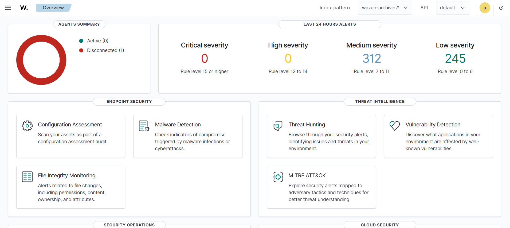
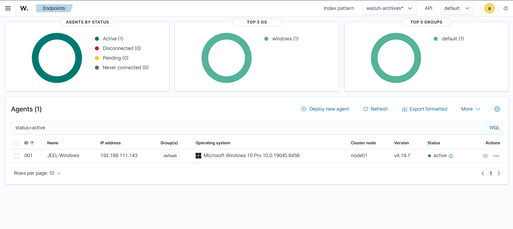

# 🏗️ SOC Home Lab Architecture

## Overview

This section documents the architecture and components of my SOC home lab.

## Lab Components

| System | Role | Platform |
|---|---|---|
| Wazuh Server | SIEM / XDR | Linux |
| Windows Endpoint | Monitored Target | Windows 10 |
| Kali Linux | Attack Simulation | Kali Linux |

## Architecture

```text
                  ┌─────────────────┐
                  │   Kali Linux    │
                  │    ATTACKER     │
                  └────────┬────────┘
                           │
                    Attack Simulation
                           │
                           ▼
                  ┌─────────────────┐
                  │    Windows 10   │
                  │   Wazuh Agent   │
                  │     TARGET      │
                  └────────┬────────┘
                           │
                      Security Logs
                           │
                           ▼
                  ┌─────────────────┐
                  │   Wazuh Server  │
                  │      Linux      │
                  │    SIEM / XDR   │
                  └─────────────────┘

```
---

## 📸 Lab Evidence

### Wazuh Server

The Wazuh server provides centralized security monitoring and collects security telemetry from connected endpoints.



---


# 🖥️ Windows Security Monitoring

This section documents the configuration and monitoring of a Windows 10 endpoint using the Wazuh Agent.


## ⚙️ Windows Wazuh Agent Service

The Wazuh Agent service is installed and configured on the Windows 10 endpoint.


### Evidence

- Wazuh Agent service installed
- Wazuh Agent service configured
- Windows endpoint prepared for centralized security monitoring

---

## 🛡️ Wazuh Dashboard — Windows Endpoint

The Wazuh Dashboard provides centralized visibility into the Windows endpoint and its security telemetry.



### Evidence

- Windows endpoint registered with Wazuh
- Wazuh Agent communication established
- Endpoint monitored through Wazuh Dashboard
- Security events available for investigation

---

## 🔄 Monitoring Flow

```text
Windows 10
    │
    ▼
Wazuh Agent
    │
    ▼
Wazuh Manager
    │
    ▼
Wazuh Dashboard
    │
    ▼
Security Alerts & Investigation
