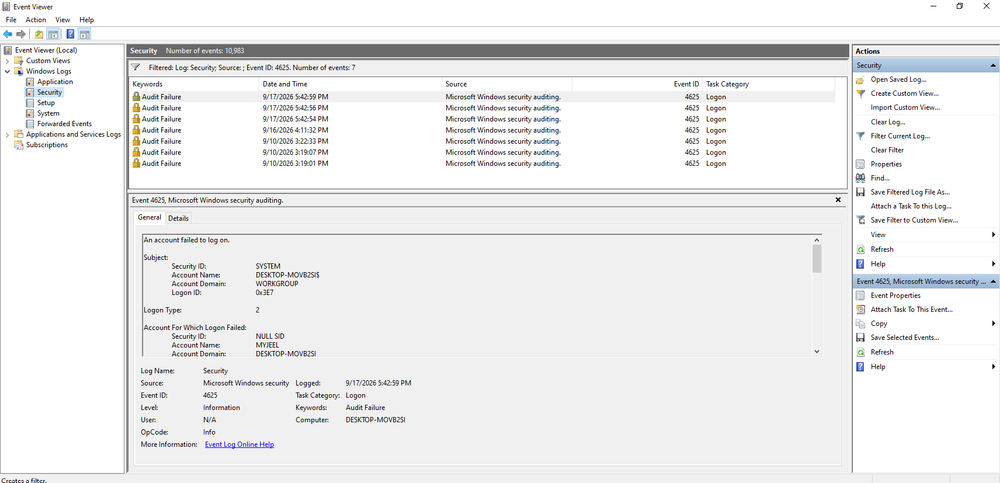
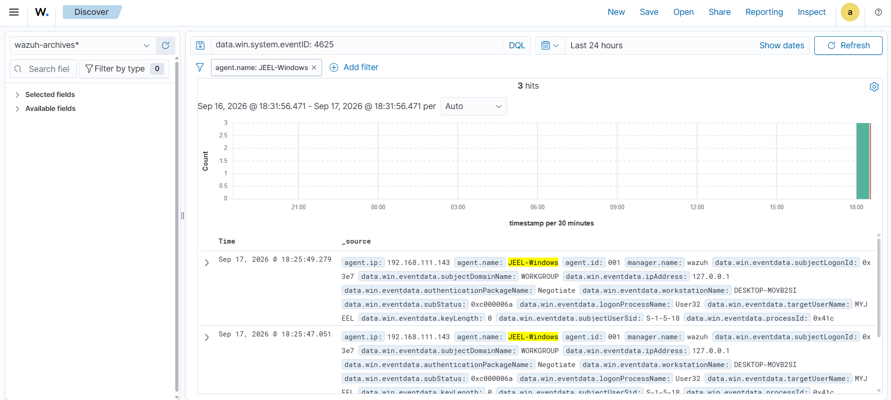
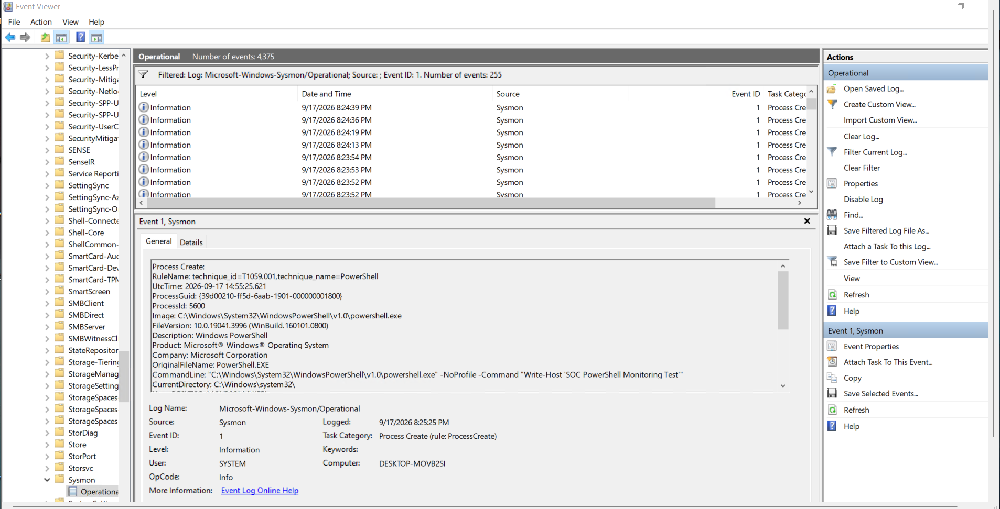
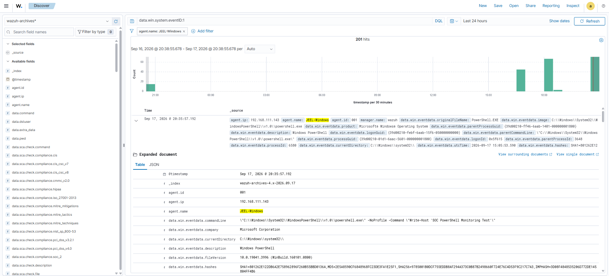

# 🪟 Windows Security Monitoring

This project documents the deployment and security monitoring of a **Windows 10 endpoint** using **Wazuh Agent, Windows Event Logs, and Sysmon**.

The objective is to collect endpoint telemetry, detect suspicious activity, investigate security alerts, and document findings from a **SOC analyst perspective**.

---

## 🎯 Objectives

- Monitor Windows 10 endpoint activity
- Deploy and configure Wazuh Agent
- Collect Windows Security Event Logs
- Deploy and configure Sysmon
- Monitor authentication activity
- Detect failed login attempts
- Investigate brute-force activity
- Monitor PowerShell execution
- Analyze process creation events
- Monitor file and system activity
- Investigate Wazuh security alerts
- Map relevant detections to MITRE ATT&CK

---

## 🏗️ Monitoring Architecture

```text
                    Windows 10 Endpoint
                           │
              ┌────────────┴────────────┐
              │                         │
        Windows Event Logs           Sysmon
              │                         │
              └────────────┬────────────┘
                           │
                      Wazuh Agent
                           │
                           ▼
                    Wazuh Manager
                           │
                           ▼
                    Wazuh Dashboard
                           │
                           ▼
                  Alert Investigation
```

---

## 🔧 Technologies & Tools

| Category | Technology |
|---|---|
| SIEM / XDR | Wazuh |
| Endpoint | Windows 10 |
| Endpoint Agent | Wazuh Agent |
| Log Sources | Windows Event Logs |
| System Monitoring | Sysmon |
| Attack Simulation | Kali Linux |
| Investigation | Wazuh Dashboard |
| Detection | Wazuh Rules |
| Threat Framework | MITRE ATT&CK |
| Scripting | PowerShell |

---

## 🖥️ Lab Environment

### Windows 10 Endpoint

- Windows 10
- Wazuh Agent
- Sysmon
- Windows Security Event Logs
- Endpoint telemetry collection

### Wazuh Server

- Wazuh Manager
- Wazuh Dashboard
- Centralized log collection
- Alert analysis and investigation

### Kali Linux

- Controlled attack simulation
- Security event generation
- Detection testing

---

## 📋 Monitoring Components

### Wazuh Agent

The Wazuh Agent is installed on the Windows 10 endpoint and forwards security and system telemetry to the Wazuh Manager for centralized analysis.

### Windows Event Logs

Windows Security Event Logs provide authentication and system activity telemetry that can be analyzed for suspicious behavior.

### Sysmon

Sysmon provides detailed endpoint telemetry such as process creation, network connections, and other system activity that can support security investigations.

---

## 🔍 Security Investigations

The following investigations will be performed as part of this project:

### 1. Windows Authentication Monitoring

Analyze successful and failed authentication events to identify suspicious login activity.

### 2. Brute-Force Detection

Generate controlled failed authentication attempts and investigate the resulting Wazuh alerts.

### 3. PowerShell Monitoring

Monitor PowerShell execution and investigate suspicious or unusual command activity.

### 4. Process Monitoring

Analyze process creation events using Sysmon and investigate potentially suspicious execution patterns.

### 5. File Integrity Monitoring

Monitor selected files and directories for unauthorized modifications.

### 6. Windows Event Log Analysis

Analyze Windows Security and Sysmon events to understand endpoint activity and support incident investigation.

---

## 📸 Lab Evidence

### ⚙️ Windows Wazuh Agent Service

The Wazuh Agent service is installed and running on the Windows 10 endpoint, enabling the system to forward security telemetry to the Wazuh Manager.


---

### 🛡️ Wazuh Dashboard — Windows Endpoint

The Windows 10 endpoint is registered with the Wazuh Manager and is visible through the Wazuh Dashboard for centralized security monitoring.


---

### 🔍 Sysmon Service

Sysmon is installed and running on the Windows 10 endpoint as a Windows service. It provides detailed endpoint telemetry that can be used for security monitoring and investigation.


---

### 📋 Sysmon Event Logs

The Sysmon Operational log contains endpoint telemetry generated by Sysmon. These events provide visibility into activities such as process creation, image loading, and registry changes.

The captured events can be analyzed by the SOC to identify unusual or potentially suspicious activity on the Windows endpoint.


---

### 🔐 Windows Authentication Event

Windows Security Event Logs provide authentication telemetry that can be used to identify failed login attempts. In this lab, a controlled failed authentication attempt generated **Event ID 4625**, indicating that an account failed to log on.

This event provides useful information such as the timestamp, affected account, logon type, workstation, and authentication details for further investigation.



---

### 🚨 Wazuh Authentication Event

The Windows authentication event was successfully collected by the **Wazuh Agent** and indexed in the Wazuh platform. Searching for **Event ID 4625** allows the SOC analyst to identify failed authentication activity from the monitored Windows endpoint.

The captured Wazuh telemetry includes the Windows agent name, agent IP address, timestamp, Event ID, and authentication-related fields.



---

### ⚡ PowerShell Process Creation

Sysmon captured a **Process Create (Event ID 1)** event for PowerShell on the Windows 10 endpoint. The event provides detailed process telemetry, including the executable path, command line, process ID, and MITRE ATT&CK mapping.

The activity was generated as a controlled PowerShell monitoring test within the SOC home lab.

#### 🔎 Investigation Details

| Field | Value |
|---|---|
| Event ID | `1` — Process Create |
| Process | `powershell.exe` |
| Image | `C:\Windows\System32\WindowsPowerShell\v1.0\powershell.exe` |
| Process ID | `5600` |
| MITRE ATT&CK | `T1059.001` — PowerShell |
| Command Line | `powershell.exe -NoProfile -Command "Write-Host 'SOC PowerShell Monitoring Test'"` |
| Computer | `DESKTOP-MOVB2SI` |

#### 🚩 Indicators of Interest

| Type | Value |
|---|---|
| Process | `powershell.exe` |
| Executable Path | `C:\Windows\System32\WindowsPowerShell\v1.0\powershell.exe` |
| Command | `Write-Host 'SOC PowerShell Monitoring Test'` |
| MITRE Technique | `T1059.001` |

> **Analysis:** The PowerShell execution shown here is a controlled lab activity. The presence of PowerShell alone does not indicate malicious behavior; the command line and surrounding telemetry should be evaluated during an investigation.



---

### 🛡️ Wazuh PowerShell Telemetry

The PowerShell process creation event was successfully collected from the Windows endpoint by the **Wazuh Agent** and indexed in Wazuh. This confirms that Sysmon process telemetry is available for centralized SOC investigation.

The Wazuh record identifies the PowerShell executable and associates the event with the monitored Windows endpoint.

#### 🔎 Wazuh Investigation Details

| Field | Value |
|---|---|
| Agent | `JEEL-Windows` |
| Agent ID | `001` |
| Agent IP | `192.168.111.143` |
| Event ID | `1` — Process Create |
| Original File Name | `PowerShell.EXE` |
| Process Image | `C:\Windows\System32\WindowsPowerShell\v1.0\powershell.exe` |
| Product | `Microsoft® Windows® Operating System` |
| Description | `Windows PowerShell` |
| Manager | `wazuh` |

#### 🚩 Indicators of Interest

| Type | Value |
|---|---|
| Agent | `JEEL-Windows` |
| Agent IP | `192.168.111.143` |
| Process | `PowerShell.EXE` |
| Executable Path | `C:\Windows\System32\WindowsPowerShell\v1.0\powershell.exe` |
| Event ID | `1` |
| MITRE Technique | `T1059.001` — PowerShell |

> **Analysis:** Wazuh successfully received and indexed the Sysmon process telemetry, allowing the SOC analyst to investigate PowerShell execution centrally. The IP address is the Windows lab endpoint address and is documented as host context, not as a malicious IOC.



---

## 🚨 Detection & Investigation Workflow

Each investigation follows a structured SOC workflow:

```text
Activity / Attack
       ↓
Log Generation
       ↓
Wazuh Agent Collection
       ↓
Wazuh Detection
       ↓
Alert Triage
       ↓
Investigation
       ↓
IOC Analysis
       ↓
MITRE ATT&CK Mapping
       ↓
Response
       ↓
Documentation
```

---

## 📊 Investigation Documentation

For each completed investigation, the following information will be documented:

- Activity performed
- Timestamp
- Source and destination information
- Windows Event ID
- Sysmon Event ID
- Wazuh Rule ID
- Alert severity
- Indicators of Compromise (IOCs)
- MITRE ATT&CK technique
- Investigation findings
- Recommended response

---

## ⚠️ Disclaimer

All security testing and attack simulations documented in this repository are performed in an isolated home lab environment for educational and defensive security research purposes.
