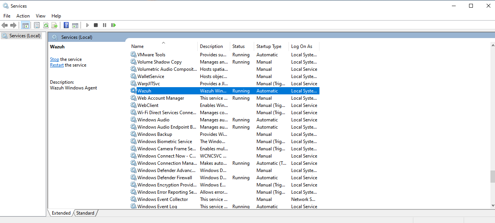
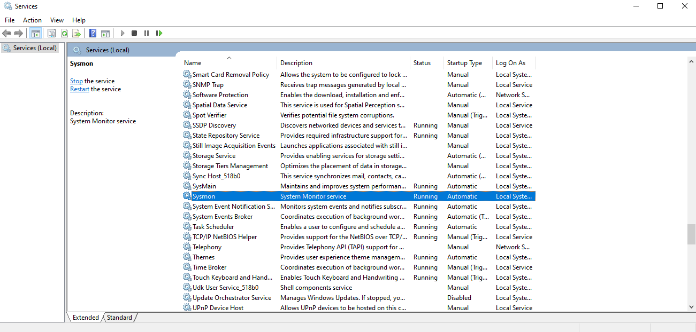
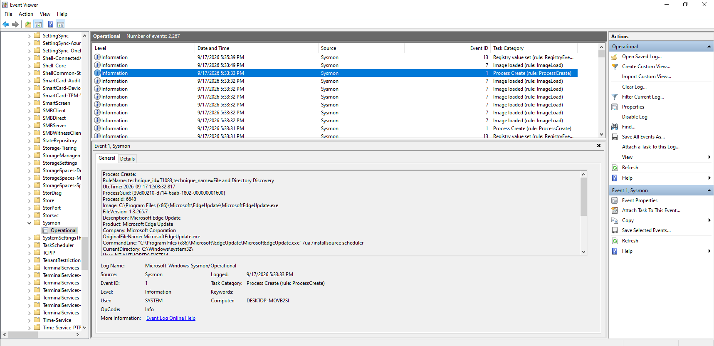

# 🪟 Windows Security Monitoring

This project documents the deployment and security monitoring of a **Windows 10 endpoint** using **Wazuh Agent, Windows Event Logs, and Sysmon**.

The objective is to collect endpoint telemetry, detect suspicious activity, investigate security alerts, and document findings from a **SOC analyst perspective**.

---

## 🎯 Objectives

- Monitor Windows 10 endpoint activity
- Deploy and configure Wazuh Agent
- Collect Windows Security Event Logs
- Deploy and configure Sysmon
- Monitor authentication activity
- Detect failed login attempts
- Investigate brute-force activity
- Monitor PowerShell execution
- Analyze process creation events
- Monitor file and system activity
- Investigate Wazuh security alerts
- Map relevant detections to MITRE ATT&CK

---

## 🏗️ Monitoring Architecture

```text
                    Windows 10 Endpoint
                           │
              ┌────────────┴────────────┐
              │                         │
        Windows Event Logs           Sysmon
              │                         │
              └────────────┬────────────┘
                           │
                      Wazuh Agent
                           │
                           ▼
                    Wazuh Manager
                           │
                           ▼
                    Wazuh Dashboard
                           │
                           ▼
                  Alert Investigation
```

---

## 🔧 Technologies & Tools

| Category | Technology |
|---|---|
| SIEM / XDR | Wazuh |
| Endpoint | Windows 10 |
| Endpoint Agent | Wazuh Agent |
| Log Sources | Windows Event Logs |
| System Monitoring | Sysmon |
| Attack Simulation | Kali Linux |
| Investigation | Wazuh Dashboard |
| Detection | Wazuh Rules |
| Threat Framework | MITRE ATT&CK |
| Scripting | PowerShell |

---

## 🖥️ Lab Environment

### Windows 10 Endpoint

- Windows 10
- Wazuh Agent
- Sysmon
- Windows Security Event Logs
- Endpoint telemetry collection

### Wazuh Server

- Wazuh Manager
- Wazuh Dashboard
- Centralized log collection
- Alert analysis and investigation

### Kali Linux

- Controlled attack simulation
- Security event generation
- Detection testing

---

## 📋 Monitoring Components

### Wazuh Agent

The Wazuh Agent is installed on the Windows 10 endpoint and forwards security and system telemetry to the Wazuh Manager for centralized analysis.

### Windows Event Logs

Windows Security Event Logs provide authentication and system activity telemetry that can be analyzed for suspicious behavior.

### Sysmon

Sysmon provides detailed endpoint telemetry such as process creation, network connections, and other system activity that can support security investigations.

---

## 🔍 Security Investigations

The following investigations will be performed as part of this project:

### 1. Windows Authentication Monitoring

Analyze successful and failed authentication events to identify suspicious login activity.

### 2. Brute-Force Detection

Generate controlled failed authentication attempts and investigate the resulting Wazuh alerts.

### 3. PowerShell Monitoring

Monitor PowerShell execution and investigate suspicious or unusual command activity.

### 4. Process Monitoring

Analyze process creation events using Sysmon and investigate potentially suspicious execution patterns.

### 5. File Integrity Monitoring

Monitor selected files and directories for unauthorized modifications.

### 6. Windows Event Log Analysis

Analyze Windows Security and Sysmon events to understand endpoint activity and support incident investigation.

---

## 📸 Lab Evidence

### ⚙️ Windows Wazuh Agent Service

The Wazuh Agent service is installed and running on the Windows 10 endpoint, enabling the system to forward security telemetry to the Wazuh Manager.



---

### 🛡️ Wazuh Dashboard — Windows Endpoint

The Windows 10 endpoint is registered with the Wazuh Manager and is visible through the Wazuh Dashboard for centralized security monitoring.


---

---

### 🔍 Sysmon Service

Sysmon is installed and running on the Windows 10 endpoint as a Windows service. It provides detailed endpoint telemetry that can be used for security monitoring and investigation.



---

### 📋 Sysmon Event Logs

The Sysmon Operational log contains endpoint telemetry generated by Sysmon. These events provide visibility into activities such as process creation, image loading, and registry changes.

The captured events can be analyzed by the SOC to identify unusual or potentially suspicious activity on the Windows endpoint.



---

## 🚨 Detection & Investigation Workflow

Each investigation follows a structured SOC workflow:

```text
Activity / Attack
       ↓
Log Generation
       ↓
Wazuh Agent Collection
       ↓
Wazuh Detection
       ↓
Alert Triage
       ↓
Investigation
       ↓
IOC Analysis
       ↓
MITRE ATT&CK Mapping
       ↓
Response
       ↓
Documentation
```

---

## 📊 Investigation Documentation

For each completed investigation, the following information will be documented:

- Activity performed
- Timestamp
- Source and destination information
- Windows Event ID
- Sysmon Event ID
- Wazuh Rule ID
- Alert severity
- Indicators of Compromise (IOCs)
- MITRE ATT&CK technique
- Investigation findings
- Recommended response

---

## ⚠️ Disclaimer

All security testing and attack simulations documented in this repository are performed in an isolated home lab environment for educational and defensive security research purposes.
