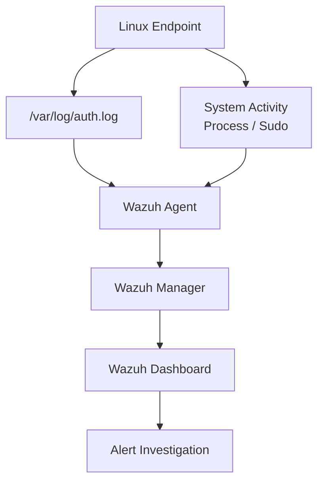
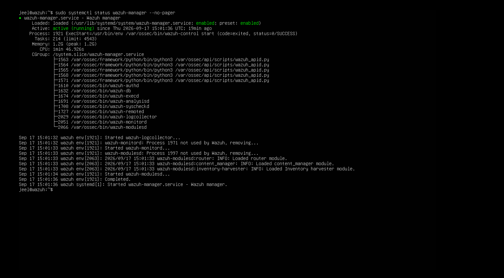
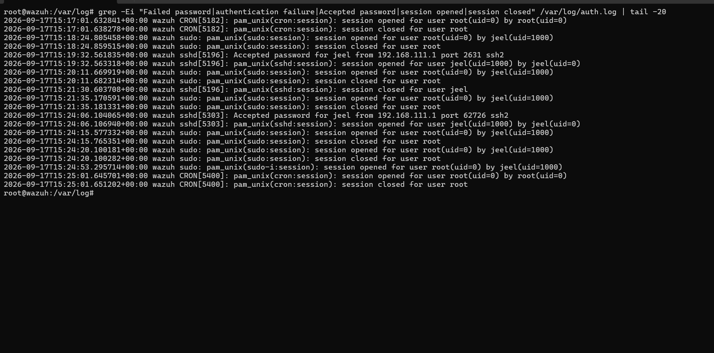
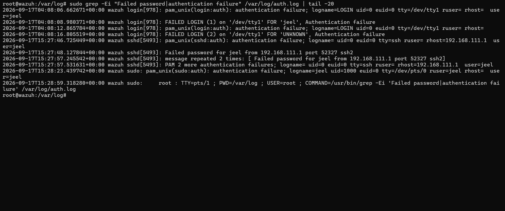
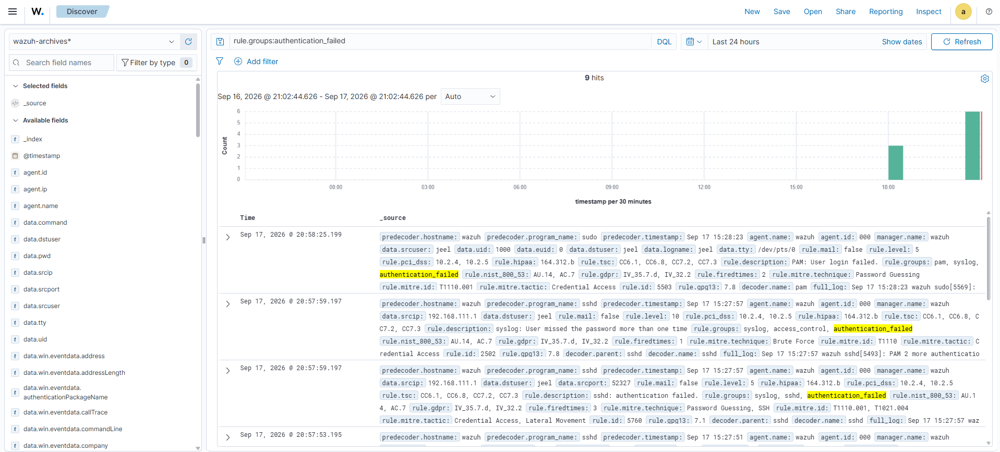
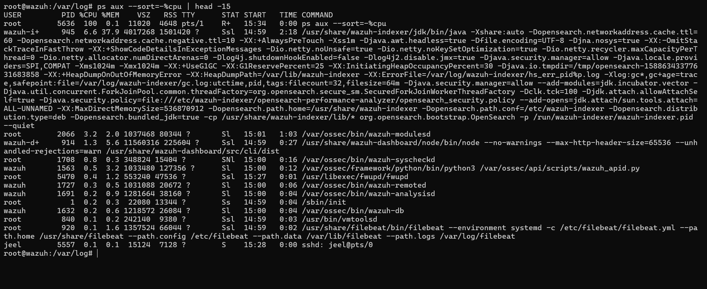
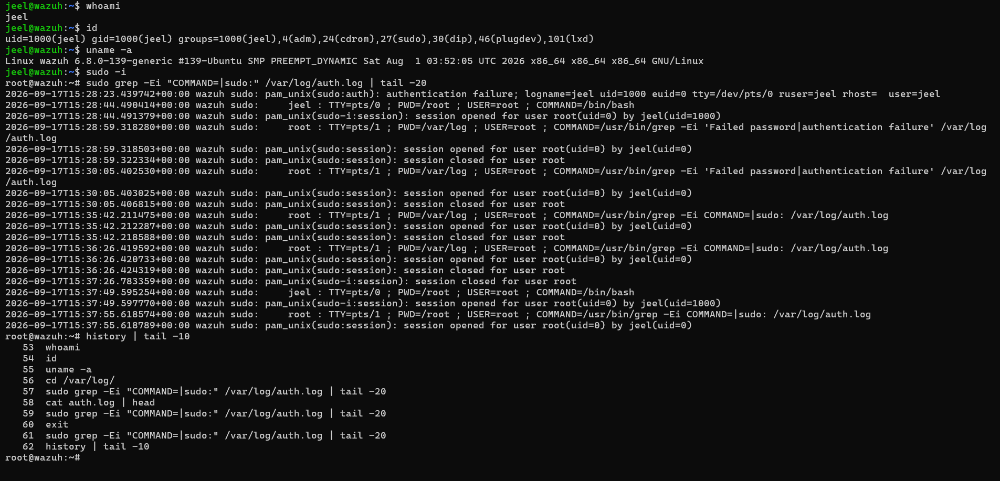
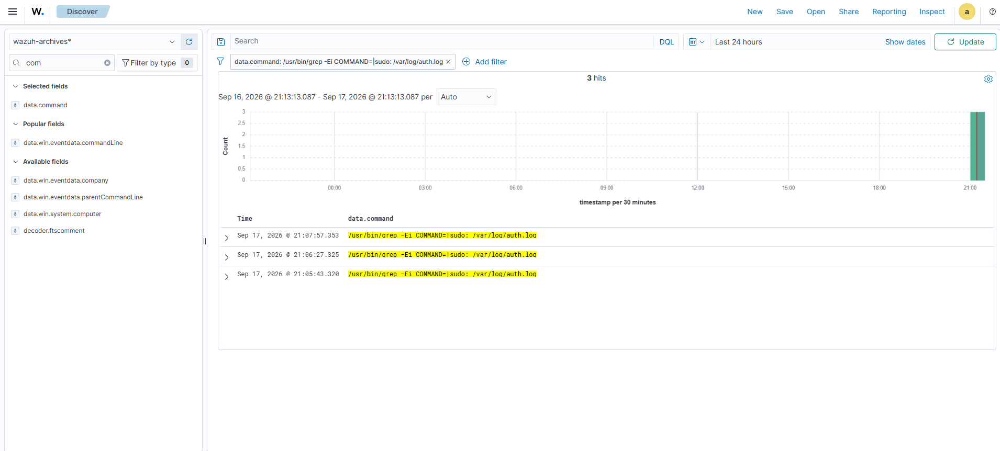
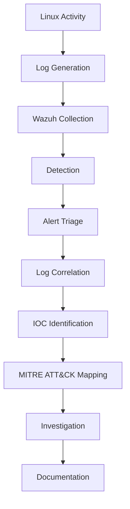

# 🐧 Linux Security Monitoring

This project documents Linux endpoint security monitoring using **Wazuh, Linux authentication logs, SSH, sudo, and process monitoring**.

The objective is to collect Linux security telemetry, detect authentication failures, monitor privileged activity, investigate system processes, and correlate endpoint activity with Wazuh detections.

---

## 🎯 Objectives

- Monitor Linux endpoint activity
- Verify Wazuh Manager operation
- Analyze Linux authentication logs
- Investigate failed SSH authentication
- Detect authentication failures using Wazuh
- Monitor running Linux processes
- Analyze user and privilege information
- Monitor `sudo` activity
- Investigate command execution telemetry
- Identify important investigation indicators
- Map relevant activity to MITRE ATT&CK

---

## 🏗️ Monitoring Architecture



---

## 🔧 Technologies & Tools

| Category | Technology |
|---|---|
| SIEM / XDR | Wazuh |
| Operating System | Ubuntu Linux |
| Endpoint Agent | Wazuh Agent |
| Authentication Logs | `/var/log/auth.log` |
| Authentication | PAM / SSH |
| Privilege Monitoring | `sudo` |
| Process Monitoring | `ps` |
| Log Analysis | `grep` |
| Investigation | Wazuh Dashboard |
| Threat Framework | MITRE ATT&CK |

---

## 🖥️ Lab Environment

### Linux Endpoint

The Linux system is monitored for:

- Authentication activity
- SSH login attempts
- Failed authentication
- Successful authentication
- `sudo` activity
- Process execution
- User and privilege information

### Wazuh

Wazuh is used to collect and analyze Linux security telemetry and generate alerts for relevant security events.

---

## 🔍 Security Monitoring

### 1. Wazuh Manager Verification

The Wazuh Manager service was verified using:

```bash
sudo systemctl status wazuh-manager --no-pager
```

The service was confirmed to be **active and running**.



---

### 2. Linux Authentication Log Analysis

Linux authentication events were examined from:

```text
/var/log/auth.log
```

The following command was used to inspect the authentication log:

```bash
cat /var/log/auth.log | head
```

This provides visibility into authentication-related events generated by Linux services such as PAM, SSH, login, and `sudo`.



#### 🔎 Authentication Failure Search

To identify failed authentication and login activity, the following command was used:

```bash
sudo grep -Ei "Failed password|authentication failure|Accepted password|session opened|session closed" /var/log/auth.log | tail -20
```

This searches for:

- Failed passwords
- Authentication failures
- Successful password authentication
- Session creation
- Session termination

---

### 3. Failed SSH Authentication Investigation

Failed authentication activity was specifically investigated using:

```bash
sudo grep -Ei "Failed password|authentication failure" /var/log/auth.log | tail -20
```

The captured logs showed failed authentication activity involving the Linux user `jeel`.

The SSH authentication failures included the source address:

```text
192.168.111.1
```



#### 🔎 Observed Authentication Indicators

| Indicator | Observed Value |
|---|---|
| Username | `jeel` |
| Service | `sshd` |
| Source IP | `192.168.111.1` |
| Log Source | `/var/log/auth.log` |
| Event Type | Failed authentication |

> This IP address is part of the controlled home-lab environment and is documented here as investigation evidence.

---

### 4. Wazuh SSH Authentication Detection

The authentication failures were correlated with events collected by Wazuh.

The following Wazuh filter was used:

```text
rule.groups:authentication_failed
```

This query returned authentication failure events detected by Wazuh.



#### 🔎 Detection Details

Observed Wazuh events included:

| Field | Observed Value |
|---|---|
| Rule Group | `authentication_failed` |
| User | `jeel` |
| Source IP | `192.168.111.1` |
| Service | `sshd` |
| Event Type | Authentication failure |

The Wazuh events also included detections related to repeated SSH authentication failures and password-guessing activity.

---

### 5. Linux Process Monitoring

Running Linux processes were analyzed using:

```bash
ps aux --sort=-%cpu | head -15
```

This command sorts processes by CPU utilization and displays the highest-consuming processes.



#### 🔎 Process Investigation

The captured process information provided visibility into:

- Process ID
- CPU utilization
- Memory utilization
- Running services
- Executable paths
- Command-line arguments

Important Wazuh-related processes observed included:

```text
wazuh-indexer
wazuh-modulesd
wazuh-dashboard
wazuh-syscheckd
wazuh-remoted
wazuh-analysisd
wazuh-db
filebeat
```

Process monitoring provides useful endpoint context when investigating abnormal resource usage or unexpected process execution.

---

### 6. Linux User, Privilege & Command Activity

Linux user and system information was examined using:

```bash
whoami
id
uname -a
```

These commands provide information about:

- Current user
- User ID
- Group membership
- Privileged groups
- Linux kernel and system information



#### Sudo Activity Analysis

Privileged command execution was investigated through `/var/log/auth.log`.

The following command was used:

```bash
sudo grep -Ei "COMMAND=|sudo:" /var/log/auth.log | tail -20
```

This searches for `sudo` activity and commands executed through privilege escalation.

The investigation showed `sudo` activity involving the lab user and root sessions.

---

### 7. Wazuh Sudo Detection

The corresponding `sudo` activity was investigated in the Wazuh Dashboard.

The following Wazuh filter was used:

```text
data.command:/usr/bin/grep -Ei COMMAND=\|sudo: /var/log/auth.log
```

This filter was used to locate the command execution event collected by Wazuh.



#### 🔎 Detection Details

The observed Wazuh event contained:

| Field | Observed Value |
|---|---|
| Rule ID | `5402` |
| Rule Level | `3` |
| Rule Description | Successful sudo to ROOT executed |
| Rule Groups | `syslog, sudo` |
| Source User | `root` |
| Destination User | `root` |
| TTY | `pts/1` |
| Working Directory | `/root` |
| Log Source | `journald` |
| MITRE ATT&CK ID | `T1548.003` |
| Technique | Sudo and Sudo Caching |
| Tactic | Privilege Escalation / Defense Evasion |

#### 🧩 Investigation Note

The detected command was part of the local log-analysis activity performed during this lab.

Therefore, the presence of the `grep` command alone does **not** indicate malicious activity.

The important security observation is that Wazuh successfully collected and detected the associated privileged `sudo` activity.

---

## 🔎 Indicators of Interest

The following values were observed during the investigation:

| Type | Value | Context |
|---|---|---|
| Username | `jeel` | Linux authentication activity |
| Source IP | `192.168.111.1` | Observed SSH authentication source |
| Service | `sshd` | SSH authentication |
| Log File | `/var/log/auth.log` | Authentication telemetry |
| Privileged Account | `root` | Sudo activity |
| Command | `/usr/bin/grep` | Local log investigation |
| MITRE ATT&CK | `T1548.003` | Sudo and Sudo Caching |

> These indicators belong to the controlled home-lab environment and should be interpreted in the context of the investigation.

---

## 🧪 Investigation Workflow

The Linux security monitoring workflow follows:



---

## 📊 Detection & Investigation Summary

| Activity | Data Source | Detection / Analysis |
|---|---|---|
| Authentication | `/var/log/auth.log` | Authentication log analysis |
| Failed Authentication | `/var/log/auth.log` | `authentication_failed` |
| SSH Activity | SSH / PAM | Wazuh authentication detection |
| Process Activity | Linux process table | `ps aux` |
| User Information | Linux system | `whoami`, `id`, `uname` |
| Privileged Activity | `sudo` / journald | Wazuh sudo detection |
| Command Execution | Wazuh event data | `data.command` filtering |

---

## 📸 Lab Evidence

All screenshots from this investigation are stored in the `images` directory.

```text
images/
├── 01-wazuh-manager-service.png
├── 02-linux-auth-log.png
├── 03-ssh-failed-login.png
├── 04-wazuh-ssh-event.png
├── 05-linux-process-monitoring.png
├── 06-linux-command-execution.png
└── 07-linux-sudo-activity.png
```

---

## 📌 Project Status

| Investigation | Status |
|---|---|
| Wazuh Manager Verification | ✅ Completed |
| Authentication Log Analysis | ✅ Completed |
| Failed SSH Authentication | ✅ Completed |
| Wazuh Authentication Detection | ✅ Completed |
| Linux Process Monitoring | ✅ Completed |
| User & Privilege Analysis | ✅ Completed |
| Sudo Activity Monitoring | ✅ Completed |
| Wazuh Sudo Detection | ✅ Completed |
| IOC Documentation | ✅ Completed |
| MITRE ATT&CK Mapping | ✅ Completed |

---

## 🎓 Skills Demonstrated

- Linux Security Monitoring
- Wazuh SIEM/XDR
- Authentication Log Analysis
- SSH Monitoring
- Failed Login Investigation
- Sudo Monitoring
- Privilege Analysis
- Process Monitoring
- Linux Command-Line Investigation
- Wazuh Querying
- Security Alert Investigation
- IOC Identification
- MITRE ATT&CK Mapping
- SOC Investigation Workflow

---

## ⚠️ Disclaimer

All security testing and attack simulations documented in this repository are performed in an isolated home lab environment for educational and defensive security research purposes.
