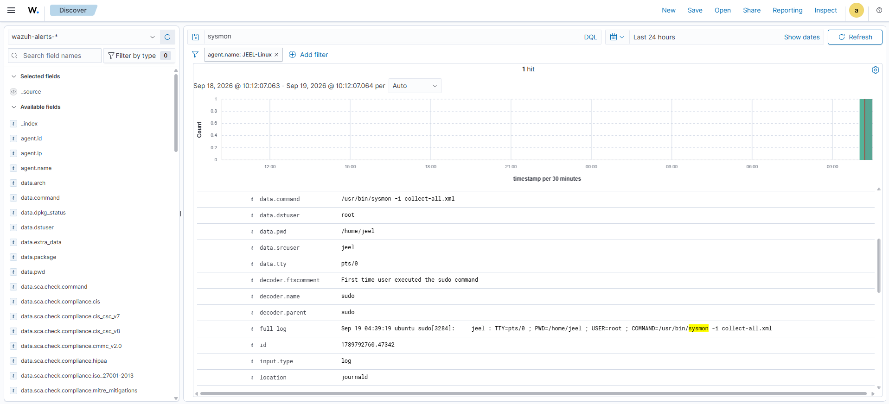
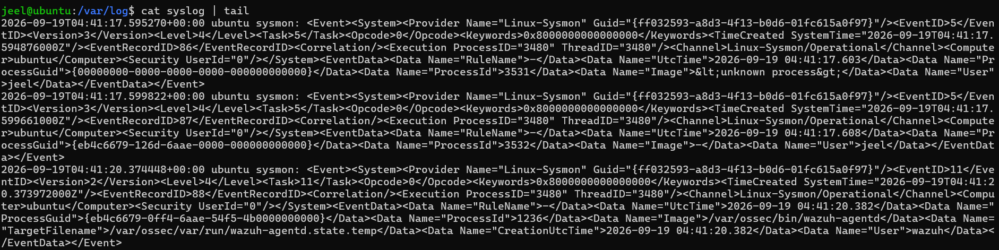
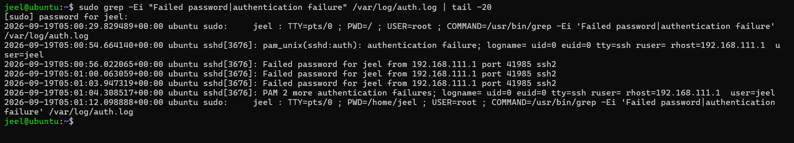
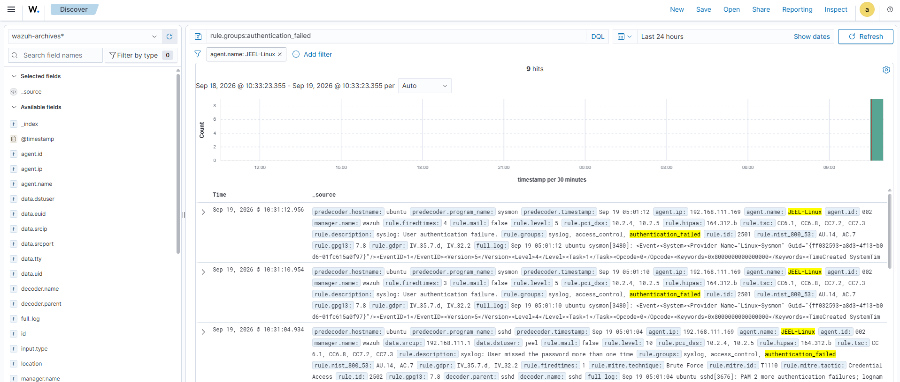
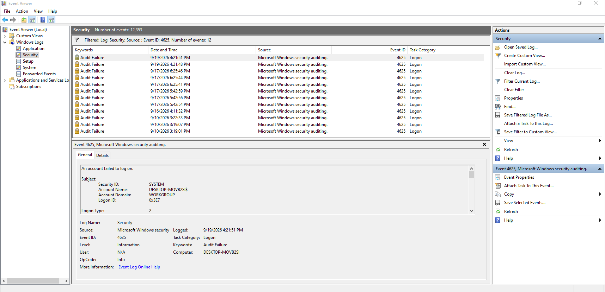
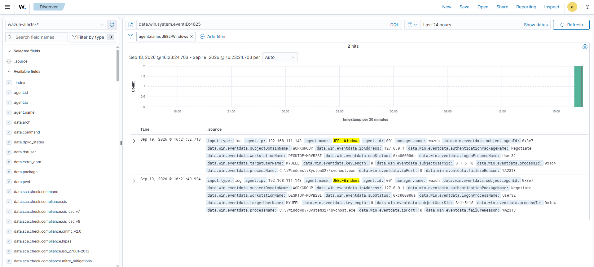

# 🛡️ Wazuh Detection Engineering

This project documents the development, testing, and investigation of security detections using **Wazuh** in a controlled SOC home lab environment.

The objective is to understand how security telemetry is collected, how Wazuh rules identify suspicious activity, and how detection logic can be investigated and improved from a SOC analyst perspective.

---

## 🎯 Objectives

- Understand Wazuh detection rules
- Analyze Wazuh security alerts
- Investigate rule IDs and severity levels
- Understand Wazuh decoders and rule groups
- Analyze Windows and Linux security telemetry
- Identify relevant MITRE ATT&CK mappings
- Develop and test custom Wazuh rules
- Tune detections to reduce false positives
- Validate detection logic using controlled lab activity
- Document detection engineering workflows

---

## 🏗️ Detection Engineering Architecture

```text
      Windows 10 Endpoint
             │
        Wazuh Agent
             │
             │
             ├──────────────┐
             │              │
             ▼              │
       Wazuh Manager ◄──────┤
             │              │
             │        Ubuntu 24.04
             │          Endpoint
             │              │
             │         Wazuh Agent
             │
             ▼
         Decoders
             │
             ▼
           Rules
             │
             ▼
       Wazuh Alert
             │
             ▼
      Wazuh Dashboard
             │
             ▼
      SOC Investigation
             │
             ▼
     MITRE ATT&CK Mapping

        Kali Linux
    Attack Simulation
```
---

## 🖥️ Lab Environment

| Component | Role |
|---|---|
| Wazuh Server | Centralized security monitoring |
| Windows 10 | Windows security telemetry |
| Linux | Linux security telemetry |
| Kali Linux | Controlled attack simulation |

---

# 🐧 Linux Sysmon Deployment & Wazuh Visibility

Linux Sysmon was installed on the Ubuntu 24.04.4 LTS endpoint to provide additional system-level security telemetry.

The Linux Sysmon events were verified locally on the Ubuntu endpoint, while Wazuh was used to monitor the endpoint and investigate activity related to the Sysmon installation and execution.

---

## 🔍 1. Linux Sysmon Events in Wazuh

The Wazuh Dashboard was used to search for Sysmon events generated by the Ubuntu Linux endpoint.

The investigation confirms that the Wazuh Agent named `JEEL-Linux` is sending Linux Sysmon telemetry to the Wazuh Manager.

The event contains information such as:

- Executed command
- Source user
- Destination user
- Working directory
- Sysmon event data
- Decoder information
- Original log entry



---

## 🖥️ 2. Linux Sysmon Event Logs

Linux Sysmon events were verified directly on the Ubuntu endpoint using the system log.

The captured telemetry contains Linux Sysmon events such as:

- **Event ID 5** — Process terminated
- **Event ID 11** — File created

These events provide additional visibility into process and file activity on the Linux endpoint.



---

# 📊 Detection Documentation

Each completed detection will document:

| Field | Description |
|---|---|
| Detection Name | Name of the detection |
| Data Source | Windows / Linux telemetry |
| Event | Activity being detected |
| Rule ID | Wazuh rule identifier |
| Rule Level | Alert severity |
| Rule Group | Associated Wazuh group |
| Decoder | Decoder processing the event |
| MITRE ATT&CK | Associated technique |
| Detection Logic | Logic used for detection |
| Investigation | Analyst findings |
| False Positive | Potential benign activity |
| Tuning | Detection improvements |

---

# 🧩 MITRE ATT&CK Mapping

Relevant Wazuh detections will be mapped to the **MITRE ATT&CK framework** where applicable.

Example:

```text
Wazuh Detection
      ↓
Rule Analysis
      ↓
MITRE ATT&CK Technique
      ↓
Tactic
      ↓
Investigation Context
```

---

# 📸 Lab Evidence

---

# 🔐 Linux SSH Failed Authentication Detection

A controlled SSH authentication failure scenario was investigated on the Ubuntu 24.04.4 LTS endpoint using Wazuh.

The investigation demonstrates how repeated failed SSH authentication attempts are recorded in the Linux authentication logs and detected by Wazuh.

---

## 🔍 1. Linux SSH Authentication Failures

The Ubuntu authentication log was analyzed to identify failed SSH authentication attempts.

The following command was used:

```bash
sudo grep -Ei "Failed password|authentication failure" /var/log/auth.log | tail 
```

---
## 🚨 2. Wazuh SSH Authentication Detection

The same authentication activity was investigated through the Wazuh Dashboard.

The Wazuh query used was:

```text
rule.groups:authentication_failed
```

---
---

# 🪟 Windows Authentication Detection

Windows authentication activity was investigated using Windows Security Event Logs and Wazuh.

The objective is to identify authentication events, analyze the associated Windows Event IDs, and investigate the resulting Wazuh telemetry.

---

## 🔍 3. Windows Authentication Events

Windows Security Event Logs provide authentication telemetry from the Windows 10 endpoint.

Important authentication events include:

| Event ID | Description |
|---|---|
| 4624 | Successful account logon |
| 4625 | Failed account logon |

These events can be investigated to identify:

- Successful logins
- Failed login attempts
- Account names
- Logon types
- Source network information
- Authentication patterns

---

## 🚨 4. Wazuh Windows Authentication Detection

The Windows authentication events are collected by the Wazuh Agent and analyzed by the Wazuh Manager.

The resulting events can be investigated through the Wazuh Dashboard.

The investigation focuses on:

- Windows Event ID
- Username
- Logon type
- Source IP address
- Authentication status
- Wazuh rule ID
- Alert severity
- MITRE ATT&CK mapping

### 📸 Evidence — Windows Authentication Event



---

### 📸 Evidence — Wazuh Windows Authentication Alert



---

## 🔄 Windows Authentication Detection Workflow

```text
Windows Authentication Attempt
            ↓
Windows Security Event Log
            ↓
Wazuh Agent
            ↓
Wazuh Manager
            ↓
Wazuh Detection Rule
            ↓
Wazuh Alert
            ↓
SOC Investigation
            ↓
MITRE ATT&CK Mapping
```
---

# 🎓 Skills Demonstrated

- Wazuh Detection Engineering
- SIEM Alert Analysis
- Wazuh Rule Analysis
- Detection Validation
- False Positive Analysis
- MITRE ATT&CK Mapping
- Security Event Correlation
- SOC Investigation

---

## ⚠️ Disclaimer

All security testing and detection development documented in this repository is performed in an isolated home lab environment for educational and defensive security research purposes.
