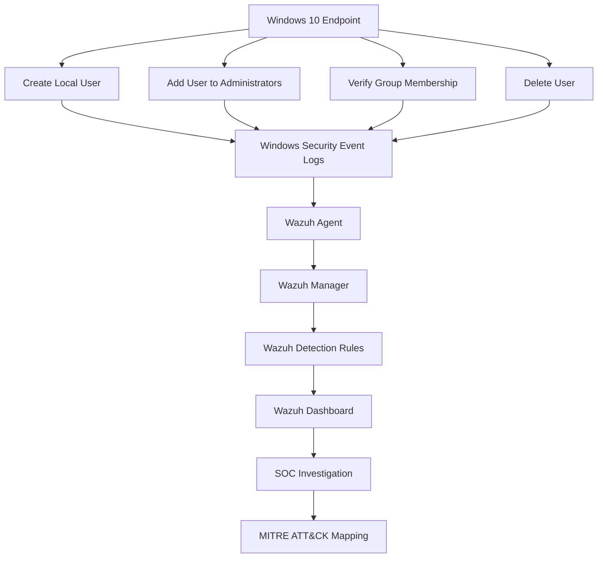
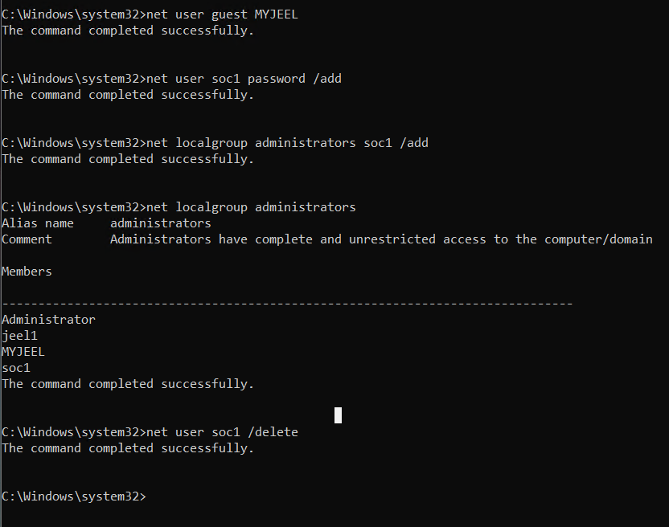
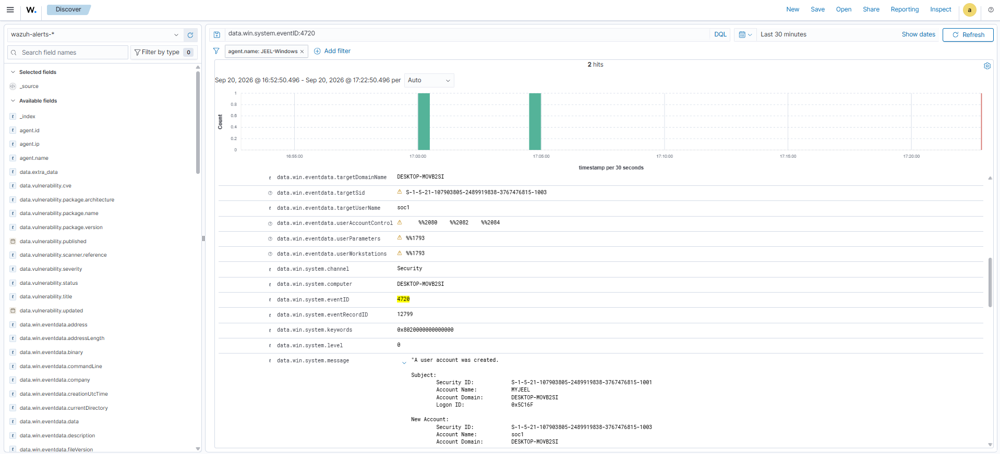
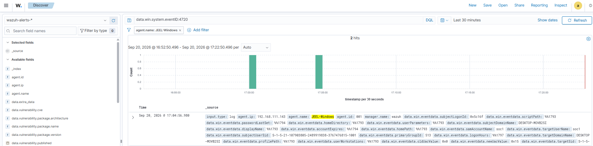
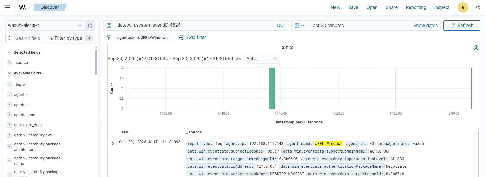
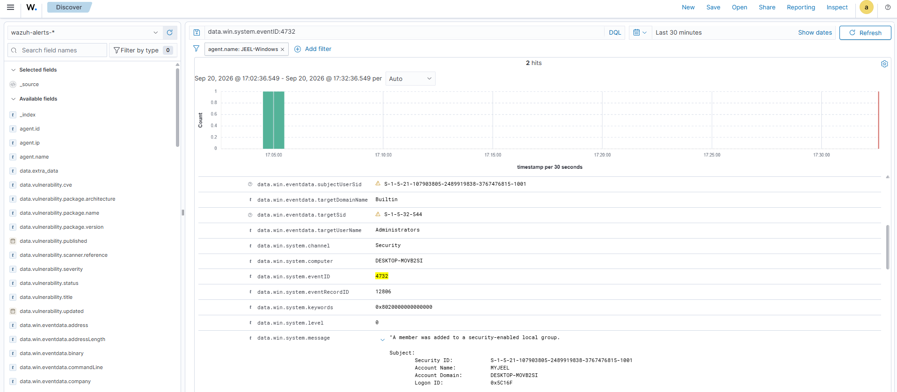
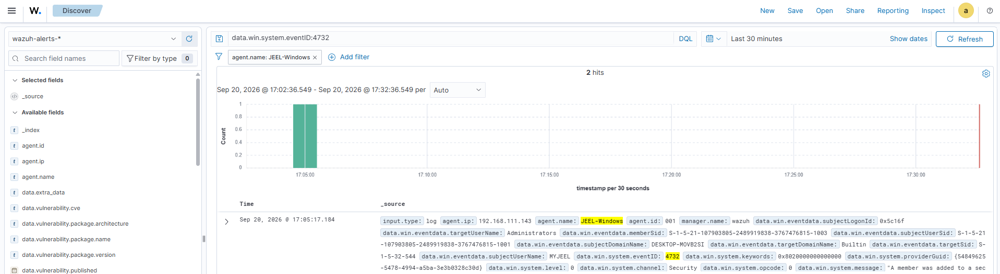
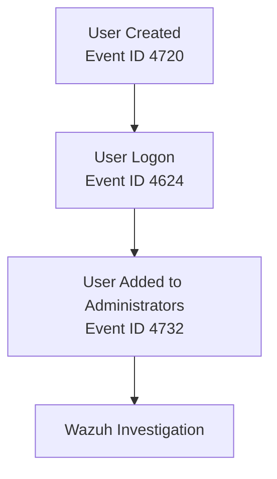
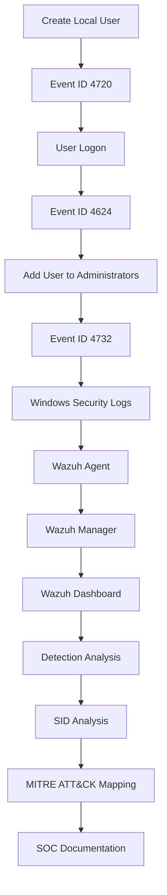

# 👤 Windows User & Group Management Investigation

This project documents a controlled **Windows local user and group management investigation** performed on a Windows 10 endpoint.

The practical demonstrates the creation of a local user account, adding the user to the local Administrators group, verifying group membership, and deleting the temporary account.

The generated Windows Security telemetry was then investigated through **Wazuh** to identify the corresponding Event IDs, account information, Security Identifiers (SIDs), logon activity, group membership changes, and detection context.

---

## 🎯 Objectives

- Create a temporary Windows local user
- Add the user to the local Administrators group
- Verify local group membership
- Delete the temporary user
- Monitor Windows Security Event Logs
- Identify relevant Windows Event IDs
- Analyze Windows Security Identifiers (SIDs)
- Investigate successful logon activity
- Verify account-management events in Wazuh
- Identify relevant Wazuh detection rules
- Analyze security event fields
- Map relevant activity to MITRE ATT&CK
- Document the investigation from a SOC analyst perspective

---

## 🏗️ Investigation Architecture



---

## 🔧 Technologies & Tools

| Category | Technology |
|---|---|
| SIEM / XDR | Wazuh |
| Endpoint | Windows 10 |
| Endpoint Agent | Wazuh Agent |
| Log Source | Windows Security Event Logs |
| Account Management | Windows Local Users & Groups |
| Investigation | Wazuh Dashboard |
| Detection | Wazuh Rules |
| Framework | MITRE ATT&CK |
| Testing Environment | Controlled SOC Home Lab |

---

## 🧪 Windows User & Group Management Practical

The following account-management activities were performed on the Windows 10 endpoint as part of the controlled SOC investigation.

### 1️⃣ Create Local User

A temporary local Windows account named `soc1` was created for the investigation.

```cmd
net user soc1 password /add
```

The command completed successfully and created the local account.

### 2️⃣ Add User to Local Administrators Group

The `soc1` account was added to the local Administrators group.

```cmd
net localgroup administrators soc1 /add
```

The command completed successfully.

### 3️⃣ Verify Local Group Membership

The local Administrators group was queried to verify that the `soc1` account had been successfully added.

```cmd
net localgroup administrators
```

The output confirmed that `soc1` was present in the Administrators group.

### 4️⃣ Delete the Test User

After completing the account-management activity, the temporary `soc1` account was deleted.

```cmd
net user soc1 /delete
```

The command completed successfully and removed the temporary account.

### 📸 Practical Evidence

The screenshot below documents the complete Windows account-management practical, including local user creation, adding the user to the Administrators group, verifying Administrators group membership, and deleting the temporary user.



---

## 🔐 Windows Security Event Investigation

After completing the practical activity, the Windows Security Event Logs were investigated to identify the security telemetry generated by the account-management activities. The Wazuh investigation identified three relevant Windows Security events.

### 👤 1. User Account Creation — Event ID 4720

Windows Security Event ID 4720 indicates that a user account was created.

The Wazuh Dashboard was searched using:

```text
data.win.system.eventID:4720
```

The event was associated with the **JEEL-Windows** Wazuh Agent. The event message reported:

> A user account was created.

The created account was `soc1`.

**📊 Event Details**

| Field | Value |
|---|---|
| Agent | JEEL-Windows |
| Agent ID | 001 |
| Agent IP | 192.168.111.143 |
| Event ID | 4720 |
| Channel | Security |
| Computer | DESKTOP-M0VB2SI |
| Target Account | soc1 |
| Target SID | S-1-5-21-107903805-2489919838-3767476815-1003 |
| Subject Account | MYJEEL |
| Subject SID | S-1-5-21-107903805-2489919838-3767476815-1001 |

The new account received the unique user SID `S-1-5-21-107903805-2489919838-3767476815-1003`.

**📸 Evidence**





**🧩 MITRE ATT&CK:** `T1136.001` — Create Account: Local Account · Tactic: Persistence

---

### 🔑 2. Windows User Logon — Event ID 4624

A successful Windows logon event was also observed for the endpoint.

The Wazuh Dashboard was searched using:

```text
data.win.system.eventID:4624
```

Event ID 4624 represents a successful account logon. The observed event contained information including the subject logon ID, subject domain, target logon ID, authentication package, workstation name, source IP address, and logon type. The observed source address in the event was `127.0.0.1`.

**📊 Logon Details**

| Field | Value |
|---|---|
| Agent | JEEL-Windows |
| Agent ID | 001 |
| Agent IP | 192.168.111.143 |
| Event ID | 4624 |
| Channel | Security |
| Computer | DESKTOP-M0VB2SI |
| Authentication Package | Negotiate |
| Source IP | 127.0.0.1 |
| Workstation | DESKTOP-M0VB2SI |

**🔐 Logon Type Reference**

Event ID 4624 contains a Logon Type field that identifies how the account authenticated. Common values include:

| Logon Type | Meaning |
|---|---|
| 2 | Interactive logon |
| 3 | Network logon |
| 4 | Batch logon |
| 5 | Service logon |
| 7 | Unlock |
| 8 | NetworkCleartext |
| 10 | Remote Interactive / RDP |
| 11 | Cached Interactive |

**📸 Evidence**



**🧩 MITRE ATT&CK:** No dedicated technique — this event serves as correlating/contextual telemetry (confirms interactive access around the time of the account changes) rather than mapping to a technique on its own.

---

### 👥 3. Add User to Administrators Group — Event ID 4732

The Wazuh Dashboard also captured the local group membership change.

The event was searched using:

```text
data.win.system.eventID:4732
```

Event ID 4732 represents a member being added to a security-enabled local group. The event message reported:

> A member was added to a security-enabled local group.

The target group was **Administrators**.

**📊 Group Membership Details**

| Field | Value |
|---|---|
| Agent | JEEL-Windows |
| Agent ID | 001 |
| Agent IP | 192.168.111.143 |
| Event ID | 4732 |
| Channel | Security |
| Computer | DESKTOP-M0VB2SI |
| Target Group | Administrators |
| Target Domain | Builtin |
| Target SID | S-1-5-32-544 |
| Subject Account | MYJEEL |
| Subject SID | S-1-5-21-107903805-2489919838-3767476815-1001 |
| Member Account | soc1 |
| Member SID | S-1-5-21-107903805-2489919838-3767476815-1003 |

The SID `S-1-5-32-544` identifies the built-in local Administrators group. The `soc1` account was associated with the newly created user SID `S-1-5-21-107903805-2489919838-3767476815-1003`.

**📸 Evidence**





**🧩 MITRE ATT&CK:** `T1098.007` — Account Manipulation: Additional Local or Domain Groups · Tactics: Persistence, Privilege Escalation

---

## 🧾 Key Windows Security Event IDs Reference

The table below is a quick reference for Windows Security Event IDs commonly relevant to account and group management investigations. The three marked **✅ Observed** are the ones confirmed in this project; the rest are included as background knowledge for future investigations.

| Event ID | Description | Relevance |
|---|---|---|
| **4720** | A user account was created | ✅ Observed — creation of `soc1` |
| 4722 | A user account was enabled | 📚 Reference — watch for re-enabling of disabled/stale accounts |
| 4725 | A user account was disabled | 📚 Reference |
| 4726 | A user account was deleted | ⏳ Expected for the `soc1` deletion step but not yet located in Wazuh — pending |
| 4738 | A user account was changed | 📚 Reference — flags attribute/permission changes on an existing account |
| 4740 | A user account was locked out | 📚 Reference — can indicate brute-force activity |
| 4728 | A member was added to a security-enabled **global** group | 📚 Reference — domain-scope equivalent of 4732 |
| **4732** | A member was added to a security-enabled **local** group | ✅ Observed — `soc1` added to Administrators |
| 4733 | A member was removed from a security-enabled local group | 📚 Reference |
| **4624** | An account was successfully logged on | ✅ Observed — logon activity for `soc1` |
| 4625 | An account failed to log on | 📚 Reference — key brute-force / credential-stuffing indicator |
| 4672 | Special privileges assigned to new logon | 📚 Reference — flags admin-level logons; useful for privilege-escalation detection |

---

## 🆔 Windows SID Analysis

Security Identifiers (SIDs) are unique identifiers used by Windows to identify security principals such as users and groups. Because usernames can change while a SID remains fixed, SIDs provide a persistent identifier for a security principal throughout an investigation.

| SID | Identified Object |
|---|---|
| S-1-5-21-107903805-2489919838-3767476815-1001 | Subject account `MYJEEL` |
| S-1-5-21-107903805-2489919838-3767476815-1003 | Newly created account `soc1` |
| S-1-5-32-544 | Built-in Administrators group |

The newly created `soc1` account received a unique Relative Identifier (RID) of `1003`, while the built-in Administrators group uses the well-known SID `S-1-5-32-544`.

---

## 🔎 Wazuh Detection Analysis

The account-management activity generated multiple Windows Security events that were successfully collected by the Wazuh Agent and displayed in the Wazuh Dashboard.

| Activity | Event ID | Wazuh Search Query | Evidence |
|---|---|---|---|
| User Account Creation | 4720 | `data.win.system.eventID:4720` | Wazuh Dashboard |
| Successful User Logon | 4624 | `data.win.system.eventID:4624` | Wazuh Dashboard |
| Member Added to Local Group | 4732 | `data.win.system.eventID:4732` | Wazuh Dashboard |

These events provide a timeline of the account-management activity:



---

## 🧩 MITRE ATT&CK Mapping

The observed Windows account-management activity maps to the following MITRE ATT&CK (Enterprise) techniques:

| Activity | Event ID | Technique | Tactic(s) |
|---|---|---|---|
| User Account Creation | 4720 | **T1136.001** — Create Account: Local Account | Persistence |
| Add User to Administrators Group | 4732 | **T1098.007** — Account Manipulation: Additional Local or Domain Groups | Persistence, Privilege Escalation |
| Successful User Logon | 4624 | No dedicated technique — used as correlating/contextual telemetry | — |

**Why these mappings:**
- **T1136.001** covers using tools such as `net user /add` to create a local account to establish or maintain access to a system.
- **T1098.007** covers adding an existing account to a local or domain group (e.g., `net localgroup administrators <user> /add`) to gain or maintain elevated privileges — which directly matches the `soc1` → Administrators group change observed here.

---

## 🔄 Complete Investigation Workflow



---

## 🔎 Investigation Methodology

For each account-management activity:

1. Perform the activity on the Windows endpoint.
2. Capture practical evidence.
3. Identify the corresponding Windows Security Event.
4. Record the Event ID.
5. Identify the affected account or group.
6. Analyze the relevant SID.
7. Verify that Wazuh received the event.
8. Search for the event in the Wazuh Dashboard.
9. Review the event fields.
10. Identify relevant Wazuh detection information.
11. Analyze the logon type when applicable.
12. Map the activity to MITRE ATT&CK where appropriate.
13. Document the investigation.

---

## 📌 Project Status

| Activity | Status |
|---|---|
| Create Local User | ✅ Completed |
| Add User to Administrators | ✅ Completed |
| Verify Group Membership | ✅ Completed |
| Delete Test User | ✅ Completed |
| Event ID 4720 Analysis | ✅ Completed |
| Event ID 4624 Analysis | ✅ Completed |
| Event ID 4732 Analysis | ✅ Completed |
| SID Analysis | ✅ Completed |
| Wazuh Detection | ✅ Completed |
| MITRE ATT&CK Mapping | ✅ Completed |

---

## 🎓 Skills Demonstrated

- Windows User Management
- Windows Local Group Management
- Windows Security Event Analysis
- Windows Event ID Analysis
- Windows SID Analysis
- Logon Type Analysis
- Privileged Group Monitoring
- Wazuh Agent Monitoring
- Wazuh Alert Investigation
- SIEM Investigation
- Detection Engineering
- MITRE ATT&CK Mapping
- SOC Investigation

---

## ⚠️ Disclaimer

All account-management activities documented in this project were performed on an authorized Windows endpoint within an isolated SOC home lab environment for educational and defensive cybersecurity purposes.
