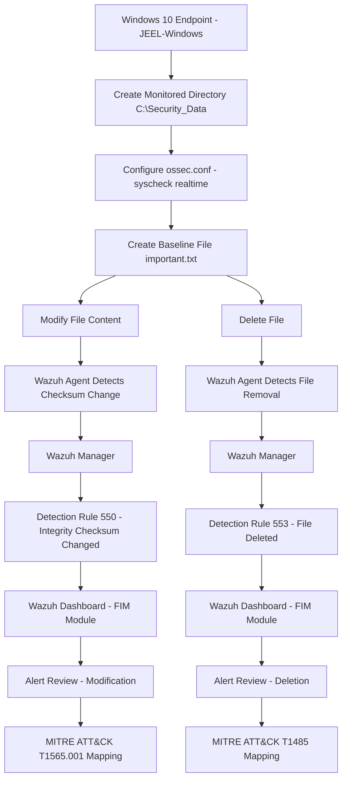
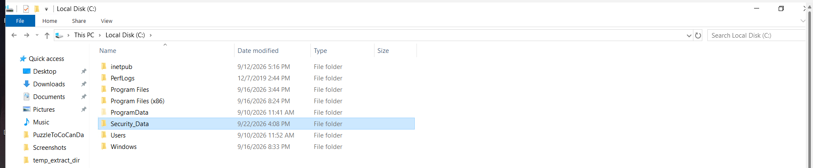
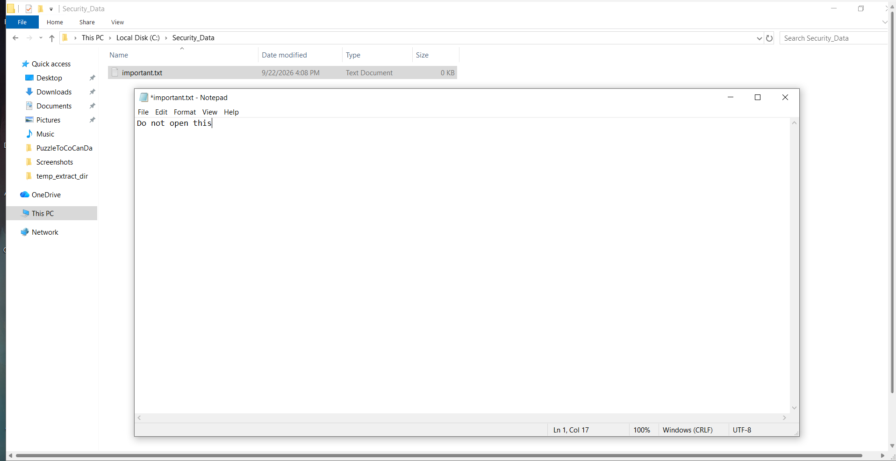
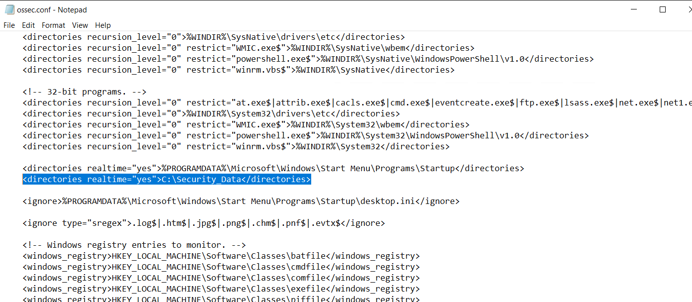
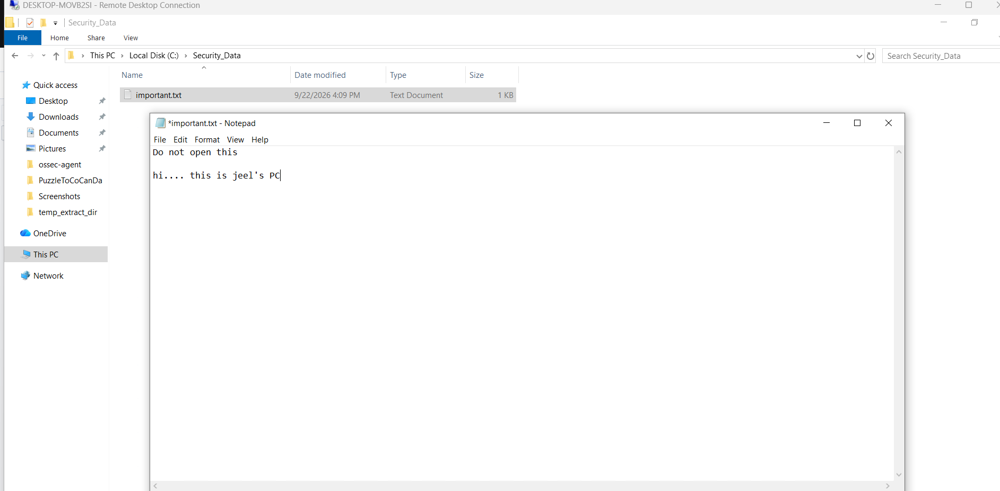
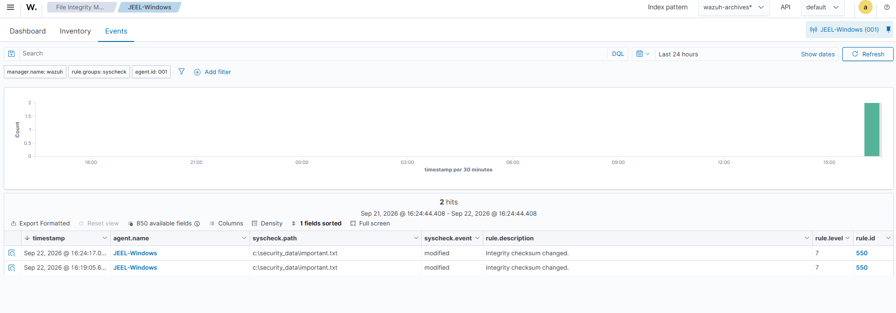
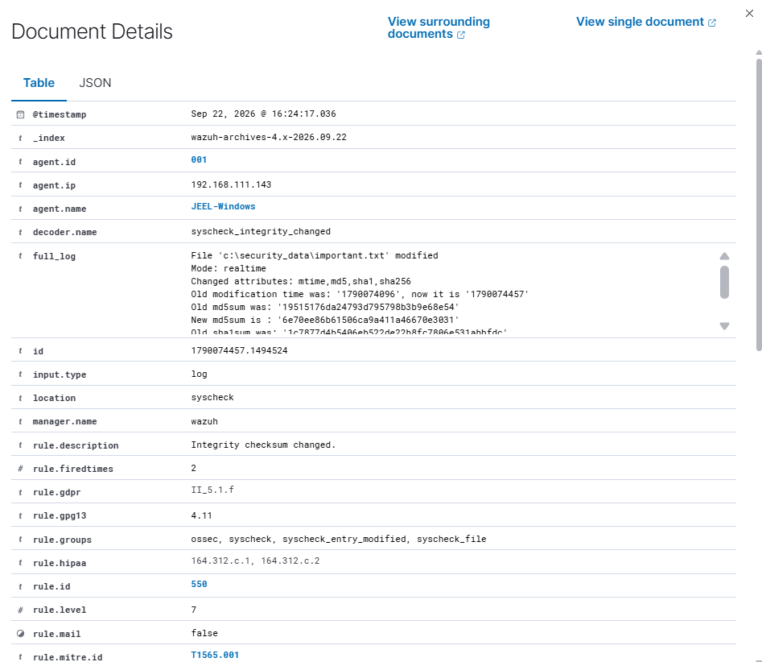
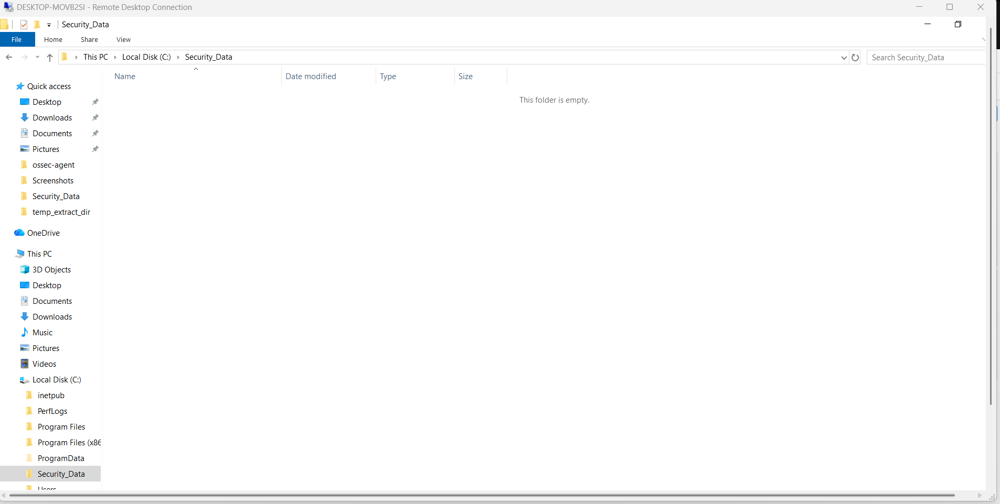
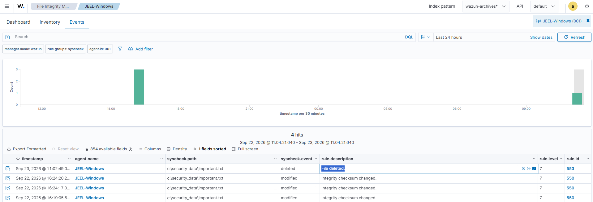

# 🛡️ Wazuh File Integrity Monitoring (FIM) 

This is **Task 05** of my `SOC-Home-Lab` project, focused on implementing and testing **File Integrity Monitoring (FIM)** using **Wazuh** on a Windows 10 endpoint.

The task covers creating a directory to represent a sensitive data location, configuring real-time `syscheck` monitoring for that directory in `ossec.conf`, creating a baseline file, modifying it to trigger a detection, and finally deleting it to trigger a second, distinct detection. The resulting Wazuh alerts are then reviewed to demonstrate the checksum comparison, rule metadata, and MITRE ATT&CK mapping produced by the FIM engine for both **modification** and **deletion** events.

---

## 🎯 Objectives

- Create a dedicated directory to simulate a sensitive data store
- Configure the Wazuh agent to monitor the directory in real time via `syscheck`
- Create a baseline file to establish an integrity checksum
- Modify the file to simulate unauthorized/tampering activity
- Verify Wazuh generates a real-time FIM alert on file modification
- Delete the file to simulate unauthorized removal/destruction of sensitive data
- Verify Wazuh generates a real-time FIM alert on file deletion
- Review the generated alert fields and rule metadata for both event types
- Review cryptographic checksum changes (MD5, SHA1, SHA256)
- Map the detected activity to the MITRE ATT&CK framework
- Review compliance framework mappings (GDPR, HIPAA, GPG13)
- Document the task as part of the SOC Home Lab project

---

## 🏗️ Task Architecture



---

## 🔧 Technologies & Tools

| Category | Technology |
|---|---|
| SIEM / XDR | Wazuh |
| Endpoint | Windows 10 |
| Endpoint Agent | Wazuh Agent |
| Monitoring Method | Syscheck (File Integrity Monitoring) — Real-time |
| Configuration File | `ossec.conf` |
| Review Tool | Wazuh Dashboard (FIM Module) |
| Detection | Wazuh Rule ID 550 (modified), Rule ID 553 (deleted) |
| Framework | MITRE ATT&CK |
| Testing Environment | Controlled SOC Home Lab |

---

## 🧪 Task Walkthrough

### 1️⃣ Create the Monitored Directory

A dedicated folder, `C:\Security_Data`, was created on the endpoint to simulate a sensitive data store that requires integrity monitoring.



---

### 2️⃣ Create a Baseline Test File

A test file, `important.txt`, was created inside the monitored directory with placeholder content. This establishes the baseline checksum (MD5/SHA1/SHA256) that Wazuh will use for future comparison.



---

### 3️⃣ Configure Real-Time FIM in `ossec.conf`

The Wazuh agent configuration was edited to add `C:\Security_Data` as a **real-time monitored directory** under the `<syscheck>` block, alongside the existing default Windows monitoring rules:

```xml
<directories realtime="yes">C:\Security_Data</directories>
```

Real-time mode (as opposed to scheduled scanning) ensures that any file event — creation, modification, or deletion — inside the directory is detected and forwarded to the Wazuh manager immediately.



---

### 4️⃣ Modify the Monitored File

The test file was accessed via a Remote Desktop session (`DESKTOP-MOVB2SI`) and modified by appending new content, simulating an unauthorized or unexpected change to a sensitive file.



---

### 5️⃣ Verify the FIM Alert in Wazuh

Within seconds of the modification, the Wazuh **File Integrity Monitoring** dashboard for agent `JEEL-Windows` (agent ID `001`) recorded the event. The `Events` view confirms the modified path (`c:\security_data\important.txt`), the `modified` syscheck event type, and the triggering detection rule.



---

### 6️⃣ Review the Full Alert Document

Drilling into the raw alert document provides full detail: the exact timestamp, agent metadata, decoder used, and the complete `full_log` showing the old and new modification times and hash values.



---

### 7️⃣ Delete the Monitored File

To extend the test beyond content tampering, `important.txt` was deleted outright from `C:\Security_Data` via the same Remote Desktop session (`DESKTOP-MOVB2SI`), leaving the monitored directory empty. This simulates unauthorized removal or destruction of sensitive data rather than a simple edit.



---

### 8️⃣ Verify the Deletion Alert in Wazuh

The Wazuh FIM **Events** view for agent `JEEL-Windows` (agent ID `001`) immediately logged a new event for the same path (`c:\security_data\important.txt`), this time with a `deleted` syscheck event type, firing a distinct detection rule — **Rule ID 553 ("File deleted")** — separate from the modification rule used earlier.



---

## 🔍 Detection Rule & Alert Analysis

### Modification Alert

| Field | Value |
|---|---|
| **Timestamp** | Sep 22, 2026 @ 16:24:17.036 |
| **Agent Name** | JEEL-Windows |
| **Agent ID** | 001 |
| **Agent IP** | 192.168.111.143 |
| **Decoder** | `syscheck_integrity_changed` |
| **Monitored Path** | `c:\security_data\important.txt` |
| **Syscheck Event** | modified |
| **Changed Attributes** | `mtime`, `md5`, `sha1`, `sha256` |
| **Old MD5** | `19515176da24793d795798b3b9e68e54` |
| **New MD5** | `6e70ee86b61506ca9a411a46670e3031` |
| **Rule ID** | 550 |
| **Rule Level** | 7 |
| **Rule Description** | Integrity checksum changed |
| **Rule Groups** | `ossec`, `syscheck`, `syscheck_entry_modified`, `syscheck_file` |
| **Rule Fired Times** | 2 |

The change in the MD5/SHA1/SHA256 checksums — not just the modification time — confirms that the **actual content** of the file was altered, ruling out a simple metadata-only change (e.g., a touch or permission update).

### Deletion Alert

| Field | Value |
|---|---|
| **Timestamp** | Sep 23, 2026 @ 11:02:49 |
| **Agent Name** | JEEL-Windows |
| **Agent ID** | 001 |
| **Monitored Path** | `c:\security_data\important.txt` |
| **Syscheck Event** | deleted |
| **Rule ID** | 553 |
| **Rule Level** | 7 |
| **Rule Description** | File deleted |

Because the file no longer exists on disk, Wazuh cannot compare checksums — instead the `deleted` event type itself is the indicator, confirming the file was removed rather than modified. This is logged as a **separate rule (553)** from the modification rule (550), letting analysts distinguish tampering from outright removal at a glance.

---

## 🗺️ MITRE ATT&CK Mapping

| Technique ID | Technique Name | Relevance |
|---|---|---|
| **T1565.001** | Data Manipulation: Stored Data Manipulation | The unauthorized modification of file content on disk mirrors adversary behavior where stored data is altered to manipulate business/operational outcomes or conceal malicious activity. Wazuh's real-time checksum comparison provides direct detection coverage for this technique. |
| **T1485** | Data Destruction | The unauthorized deletion of a file within a monitored sensitive directory mirrors adversary behavior aimed at destroying data to disrupt availability, deny recovery, or erase evidence. Wazuh's real-time FIM deletion detection (Rule 553) provides direct detection coverage for this technique. |

---

## 📌 Key Takeaways

- Real-time `syscheck` detected the unauthorized file modification within seconds of the change, with no reliance on scheduled scan intervals.
- The modification alert fired at **rule level 7**, appropriately reflecting a moderate-severity integrity violation rather than a routine, low-priority event.
- Full cryptographic hash comparison (MD5, SHA1, SHA256) gave high-confidence evidence that file **content**, not just metadata, was changed.
- The `full_log` field preserved forensic detail — old vs. new modification time and old vs. new hash values — enough to reconstruct what changed without touching the endpoint directly.
- Deleting the same file produced a **separate, purpose-built rule (553 – File deleted)** rather than reusing the modification rule, showing that Wazuh's FIM engine distinguishes between content tampering and outright file removal.
- Automatic mapping to **MITRE ATT&CK T1565.001** (modification) and **T1485** (deletion), plus GDPR/HIPAA/GPG13 controls, shows how low-level telemetry from a single monitored directory can support both threat detection and compliance reporting across multiple attack behaviors.
- This task highlights FIM's value for monitoring sensitive directories (credential stores, configuration files, financial/PII data folders) where unauthorized changes — or disappearances — should never happen silently.

---

## ✅ Conclusion

This task, as part of my SOC Home Lab project, demonstrates end-to-end configuration and validation of **Wazuh File Integrity Monitoring** — from editing the agent's `ossec.conf` to triggering, detecting, and reviewing both a real-world-style tampering event and a file-deletion event. It builds practical skills in FIM configuration, alert triage across multiple event types, checksum-based analysis, and mapping detections to both the MITRE ATT&CK framework and regulatory compliance controls.

---

## 📁 Folder Structure

```
05-Wazuh-File-Integrity-Monitoring/
├── images/
│   ├── 01-create-fim-monitoring-folder.png
│   ├── 02-create-fim-test-file.png
│   ├── 03-configure-ossec-fim-rule.png
│   ├── 04-modify-monitored-file.png
│   ├── 05-wazuh-fim-alert.png
│   ├── 06-wazuh-fim-file-integrity-details.png
│   ├── 07-delete-monitored-file.png
│   └── 08-wazuh-fim-delete-alert.png
└── README.md
```
