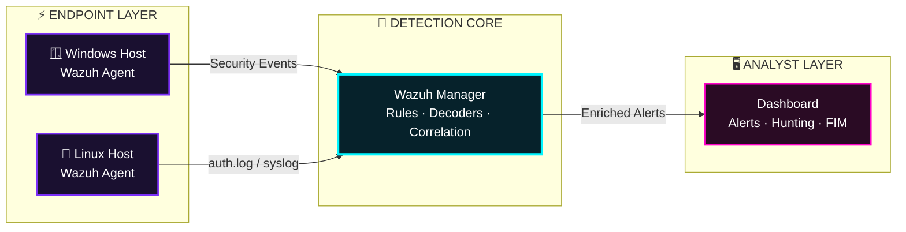

<div align="center">


<a href="https://git.io/typing-svg"></a>

<br>


<br>

**[ Overview ](#-mission-brief) · [ Architecture ](#-grid-architecture) · [ Modules ](#-mission-modules) · [ ATT&CK ](#-threat-coverage) · [ Launch ](#-initialize-sequence)**

</div>

---

## 🛰️ MISSION BRIEF

> **"You can't defend what you can't see."**

This is a fully operational **Security Operations Center** built from the ground up. Endpoints stream live telemetry into **Wazuh**, custom detection logic turns raw logs into high-fidelity alerts, and every scenario is **simulated, detected, and documented**.

<table align="center">
<tr>
<td align="center" width="25%"><h3>🔭</h3><b>VISIBILITY</b><br><sub>Windows + Linux telemetry in a single pane</sub></td>
<td align="center" width="25%"><h3>🎯</h3><b>DETECTION</b><br><sub>Custom rules &amp; decoders, battle-tested</sub></td>
<td align="center" width="25%"><h3>🪪</h3><b>IDENTITY</b><br><sub>Account &amp; privilege change tracking</sub></td>
<td align="center" width="25%"><h3>🧿</h3><b>INTEGRITY</b><br><sub>Real-time file tamper detection</sub></td>
</tr>
</table>

---

## 🧬 GRID ARCHITECTURE



---

## 🚀 MISSION MODULES

<div align="center">

| ID | MODULE | OBJECTIVE | STATUS |
|:--:|:--|:--|:--:|
| `00` | 🏛️ **Lab Architecture** | Network blueprint, components & data flow |  |
| `01` | 🪟 **Windows Security Monitoring** | Event logs, logons & endpoint telemetry |  |
| `02` | 🐧 **Linux Security Monitoring** | Auth logs, SSH activity, brute-force detection |  |
| `03` | 🧠 **Wazuh Detection Engineering** | Custom rules, decoders & alert tuning |  |
| `04` | 👤 **Windows User Account Management** | Rogue accounts, group changes, privilege abuse |  |
| `05` | 🧿 **Wazuh File Integrity Monitoring** | Detect create / modify / delete on critical files |  |

</div>

<details>
<summary><b>📂 &nbsp;Expand repository file system</b></summary>

```bash
SOC-Home-Lab/
├── 00-Lab-Architecture/                 # blueprint & data flow
├── 01-Windows-Security-Monitoring/      # windows telemetry
├── 02-Linux-Security-Monitoring/        # linux auth & syslog
├── 03-Wazuh-Detection-Engineering/      # custom rules & decoders
├── 04-Windows-User-Account-Management/  # identity & privilege tracking
├── 05-Wazuh-File-Integrity-Monitoring/  # FIM configuration
└── README.md
```

</details>

---

## 🎯 THREAT COVERAGE

How the lab's detections line up with the **MITRE ATT&CK** framework:

| TACTIC | TECHNIQUE | COVERED BY |
|:--|:--|:--:|
| 🔑 Credential Access | **T1110** · Brute Force | `02` Linux Monitoring |
| 🚪 Initial Access / Persistence | **T1078** · Valid Accounts | `01` Windows Monitoring |
| 🧷 Persistence | **T1136** · Create Account | `04` Account Management |
| 🔼 Privilege Escalation | **T1098** · Account Manipulation | `04` Account Management |
| 💣 Impact / Defense Evasion | **T1565** · Data Manipulation | `05` File Integrity |

---

## 🔄 DETECTION PIPELINE

```text
  [ EVENT ] ──▶ [ COLLECT ] ──▶ [ DECODE ] ──▶ [ RULE MATCH ] ──▶ [ ALERT ] ──▶ [ TRIAGE ]
   attack        agent ships      parse into      custom logic      severity       analyst
   simulated     raw logs         fields          fires             assigned       validates
```

---

## 🧰 ARSENAL

<div align="center">


</div>

**Skills demonstrated:** `SIEM Operations` · `Log Analysis` · `Threat Detection` · `Detection Engineering` · `Incident Triage` · `Security Documentation`

---

## ⚙️ INITIALIZE SEQUENCE

```bash
# STEP 01 ▸ study the blueprint
cd 00-Lab-Architecture

# STEP 02 ▸ run modules in order, each one builds on the last
# STEP 03 ▸ replay the simulations in your own lab
# STEP 04 ▸ compare your alerts with the documented results
```

---

<div align="center">

```text
╔══════════════════════════════════════════════════╗
║   > ALERTS TRIAGED ............. ∞               ║
║   > BLIND SPOTS ................ 0               ║
║   > OPERATOR STATUS ............ LEARNING 24/7   ║
╚══════════════════════════════════════════════════╝
```

### ⚡ *Built to learn. Documented to prove it.* ⚡


</div>
