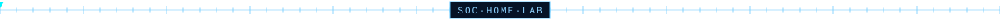
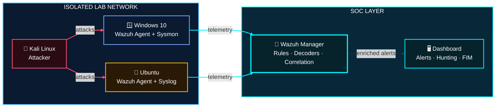

<div align="center">



<br>


<br>

### *"You can't defend what you can't see."*

[`OVERVIEW`](#-sheet-01--overview) &nbsp;·&nbsp; [`TOPOLOGY`](#-sheet-02--topology) &nbsp;·&nbsp; [`MODULES`](#-sheet-03--module-index) &nbsp;·&nbsp; [`DETECTIONS`](#-sheet-04--detection-map) &nbsp;·&nbsp; [`BOM`](#-sheet-05--bill-of-materials) &nbsp;·&nbsp; [`REPLICATE`](#-sheet-06--replicate)



</div>

## 📐 SHEET 01 — OVERVIEW

A fully operational **Security Operations Center** built from the ground up. Endpoints stream live telemetry into **Wazuh**, custom detection logic turns raw logs into high-fidelity alerts, and every scenario is **simulated, detected, and documented**.

<table align="center">
<tr>
<td align="center" width="25%"><h3>🔭</h3><b>VISIBILITY</b><br><sub>Windows + Linux telemetry in a single pane</sub></td>
<td align="center" width="25%"><h3>🎯</h3><b>DETECTION</b><br><sub>Custom rules &amp; decoders, battle-tested</sub></td>
<td align="center" width="25%"><h3>🪪</h3><b>IDENTITY</b><br><sub>Account &amp; privilege change tracking</sub></td>
<td align="center" width="25%"><h3>🧿</h3><b>INTEGRITY</b><br><sub>Real-time file tamper detection</sub></td>
</tr>
</table>

<div align="center"></div>

## 🧭 SHEET 02 — TOPOLOGY



<div align="center"></div>

## 🧩 SHEET 03 — MODULE INDEX

| Sheet | Module | What it covers | Status |
|:--:|:--|:--|:--:|
| `00` | 🏛️ [**Lab Architecture**](./00-Lab-Architecture) | Network blueprint, components & data flow |  |
| `01` | 🪟 [**Windows Security Monitoring**](./01-Windows-Security-Monitoring) | Event logs, logons & endpoint telemetry |  |
| `02` | 🐧 [**Linux Security Monitoring**](./02-Linux-Security-Monitoring) | Auth logs, SSH activity, brute-force detection |  |
| `03` | 🧠 [**Wazuh Detection Engineering**](./03-Wazuh-Detection-Engineering) | Custom rules, decoders & alert tuning |  |
| `04` | 👤 [**Windows User Account Management**](./04-Windows-User-Account-Management) | Rogue accounts, group changes, privilege abuse |  |
| `05` | 🧿 [**Wazuh File Integrity Monitoring**](./05-Wazuh-File-Integrity-Monitoring) | Detect create / modify / delete on critical files |  |

<div align="center"></div>

## 🎯 SHEET 04 — DETECTION MAP

How the lab's simulations line up with **MITRE ATT&CK**:

| Simulated activity | Detected in | Technique |
|:--|:--:|:--|
| 🔑 SSH brute force | `02` Linux Monitoring | **T1110** · Brute Force |
| 🚪 Use of valid Windows accounts | `01` Windows Monitoring | **T1078** · Valid Accounts |
| 🧷 Rogue local account created | `04` Account Management | **T1136** · Create Account |
| 🔼 Group / privilege change | `04` Account Management | **T1098** · Account Manipulation |
| 💣 Tampering with critical files | `05` File Integrity | **T1565** · Data Manipulation |

> Also simulated: **suspicious PowerShell** activity (**T1059.001**).

```text
 [ EVENT ] ─▶ [ COLLECT ] ─▶ [ DECODE ] ─▶ [ RULE MATCH ] ─▶ [ ALERT ] ─▶ [ TRIAGE ]
  attack        agent ships    parse into     custom logic      severity     analyst
  simulated     raw logs       fields         fires             assigned     validates
```

<div align="center"></div>

## 🧰 SHEET 05 — BILL OF MATERIALS

| Component | Role in the lab |
|:--|:--|
| **Wazuh** Manager · Dashboard · Agents | SIEM core: collection, rules, correlation, alerting |
| **Windows 10** + **Sysmon** | Monitored endpoint with rich process and event telemetry |
| **Ubuntu** | Monitored Linux endpoint (auth logs, syslog) |
| **Kali Linux** | Attacker machine for simulations |
| **VMware** | Hypervisor hosting the isolated network |

<div align="center">


</div>

**Skills demonstrated:** `SIEM Operations` · `Log Analysis` · `Threat Detection` · `Detection Engineering` · `Incident Triage` · `Security Documentation`

<div align="center"></div>


<details>
<summary><b>📂 &nbsp;Repository file system</b></summary>

```text
SOC-Home-Lab/
├── assets/                              banner & divider graphics
├── 00-Lab-Architecture/                 blueprint & data flow
├── 01-Windows-Security-Monitoring/      windows telemetry
├── 02-Linux-Security-Monitoring/        linux auth & syslog
├── 03-Wazuh-Detection-Engineering/      custom rules & decoders
├── 04-Windows-User-Account-Management/  identity & privilege tracking
├── 05-Wazuh-File-Integrity-Monitoring/  FIM configuration
└── README.md
```

</details>

<div align="center">


```text
┌──────────────────────────────────────────────────┐
│  DWG   SOC-HOME-LAB          REV   05            │
│  SIEM  WAZUH                 STATUS OPERATIONAL  │
│  BUILT TO LEARN. DOCUMENTED TO PROVE IT.         │
└──────────────────────────────────────────────────┘
```

</div>
